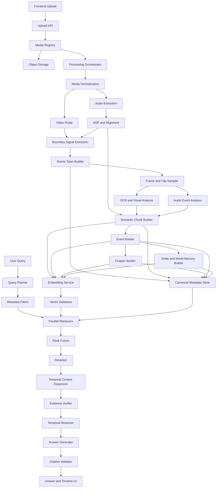

# VideoSceneRAG
## Advanced Video Chunking, Processing, Retrieval, and Reliability Architecture

**Document purpose:** Provide an implementation-ready architecture for building a clean, accurate, scalable, and conflict-resistant video-processing pipeline for VideoSceneRAG.

**Primary goal:** Convert uploaded videos into a hierarchical, timeline-aware, multimodal memory system that supports precise retrieval, temporal reasoning, grounded answers, clickable timestamps, and long-range video understanding.

---

# 1. Executive Summary

VideoSceneRAG should not treat a video as a collection of isolated frames or fixed-length text chunks. It should treat the video as a structured timeline containing:

- speech;
- visual events;
- actions;
- objects;
- people;
- on-screen text;
- non-speech audio;
- semantic events;
- chapters;
- repeated concepts;
- temporal relationships.

The recommended architecture uses four hierarchical time levels:

1. **Atomic spans** — precise, canonical, non-overlapping timeline units.
2. **Semantic chunks** — small coherent ideas or actions built from atomic spans.
3. **Events** — complete explanations, interactions, or activities.
4. **Chapters** — broad topics or narrative sections.

The system should retrieve the smallest useful evidence first, then dynamically expand around it based on the query. This avoids duplicate storage, broken context, and inaccurate citations.

The core design principle is:

> Store canonical timeline units once, preserve all modality-specific evidence, and construct query-dependent context at retrieval time.

---

# 2. System Objectives

The system must support the following capabilities.

## 2.1 Functional objectives

- Upload and process videos reliably.
- Preserve an immutable source manifest for every video.
- Extract synchronized audio, transcript, frames, clips, OCR, objects, actions, and scene information.
- Create accurate timeline boundaries using multiple signals.
- Group timeline spans into semantic chunks, events, and chapters.
- Track recurring entities and concepts across the video.
- Store multiple modality-specific embeddings.
- Retrieve exact, visual, spoken, semantic, temporal, and long-range evidence.
- Generate grounded answers with verified timestamps.
- Return clickable timeline intervals and supporting evidence.
- Support conversational follow-up questions.

## 2.2 Reliability objectives

- Every pipeline stage must be idempotent.
- Failed stages must be retryable without corrupting existing output.
- Intermediate artifacts must be versioned.
- Every derived record must trace back to source timestamps and source media.
- Duplicate chunks and duplicate vectors must be prevented.
- Processing must resume after interruption.
- Model and pipeline versions must be stored with every artifact.
- Invalid or weak evidence must lower answer confidence.

## 2.3 Accuracy objectives

- Do not rely on only fixed-duration chunks.
- Do not rely on only visual scene cuts.
- Do not merge all modalities into one generated caption.
- Do not send raw top-k vector results directly to the answer model.
- Do not use one retrieval strategy for every query type.
- Do not treat overlapping chunks as independent evidence.

---

# 3. High-Level Architecture



---

# 4. Core Architectural Principles

## 4.1 Canonical time units

Atomic spans are the source of truth for the processed timeline.

They should normally be:

- non-overlapping;
- ordered;
- gap-free after normalization;
- immutable after a pipeline version is finalized;
- traceable to exact source timestamps.

## 4.2 Hierarchical representation

Every semantic chunk must reference atomic spans.

Every event must reference semantic chunks.

Every chapter must reference events.

```text
Chapter
  -> Event
      -> Semantic Chunk
          -> Atomic Span
              -> Frames, Clip, Transcript, OCR, Audio Events
```

## 4.3 Dynamic context expansion

Store canonical units without unnecessary overlap.

When a query retrieves an anchor span, fetch its neighbours dynamically.

```text
retrieved anchor
    + previous atoms
    + next atoms
    + parent semantic chunk
    + parent event
    + parent chapter when required
```

## 4.4 Modality preservation

Maintain separate evidence fields and embeddings for:

- transcript;
- OCR;
- visual descriptions;
- raw visual embeddings;
- action descriptions;
- non-speech audio events;
- entities;
- event summaries;
- chapter summaries.

## 4.5 Evidence-first answer generation

The answer model must receive a structured evidence packet, not an unstructured block of concatenated retrieval results.

## 4.6 Idempotent processing

Every stage must be safe to rerun.

Before writing output, the stage must check:

- source hash;
- stage version;
- model version;
- configuration hash;
- existing successful artifact.

---

# 5. Recommended Technology Stack

## 5.1 Core backend

- Python 3.11+
- FastAPI
- Pydantic
- SQLAlchemy
- Alembic
- PostgreSQL

## 5.2 Media processing

- FFmpeg
- FFprobe
- OpenCV
- PySceneDetect
- MoviePy only when convenient, not as the primary source of media metadata

## 5.3 Audio and speech

- Faster-Whisper
- Voice Activity Detection
- WhisperX or another forced-alignment system
- Optional speaker diarization
- Optional audio event classifier

## 5.4 Vision and multimodal understanding

- OCR engine
- object detector;
- segmentation model;
- image-text embedding model;
- video-text embedding model;
- optional Video-Language Model for second-stage analysis.

## 5.5 Storage

- PostgreSQL for canonical metadata and job state
- MinIO or S3-compatible object storage for videos, audio, clips, and frames
- ChromaDB for the initial MVP
- Qdrant as a future multi-vector and hybrid retrieval upgrade

## 5.6 Background processing

Recommended production options:

- Celery + Redis;
- Dramatiq + Redis;
- Temporal;
- Prefect;
- Apache Airflow for offline batch orchestration.

For the first production-quality implementation, Celery or Dramatiq is sufficient.

## 5.7 Observability

- structured JSON logs;
- OpenTelemetry;
- Prometheus metrics;
- Grafana dashboards;
- Sentry for exception tracking.

---

# 6. Repository Structure

```text
VideoSceneRAG/
|
|-- app/
|   |-- api/
|   |   |-- routes_upload.py
|   |   |-- routes_query.py
|   |   |-- routes_jobs.py
|   |   `-- dependencies.py
|   |
|   |-- core/
|   |   |-- config.py
|   |   |-- logging.py
|   |   |-- ids.py
|   |   |-- hashing.py
|   |   `-- exceptions.py
|   |
|   |-- domain/
|   |   |-- manifests.py
|   |   |-- timeline.py
|   |   |-- chunks.py
|   |   |-- events.py
|   |   |-- chapters.py
|   |   |-- entities.py
|   |   |-- evidence.py
|   |   `-- queries.py
|   |
|   |-- pipelines/
|   |   |-- orchestrator.py
|   |   |-- stages/
|   |   |   |-- probe_media.py
|   |   |   |-- normalize_media.py
|   |   |   |-- extract_audio.py
|   |   |   |-- transcribe.py
|   |   |   |-- align_transcript.py
|   |   |   |-- extract_boundaries.py
|   |   |   |-- build_atoms.py
|   |   |   |-- sample_frames.py
|   |   |   |-- build_clips.py
|   |   |   |-- run_ocr.py
|   |   |   |-- analyze_visuals.py
|   |   |   |-- analyze_audio_events.py
|   |   |   |-- build_semantic_chunks.py
|   |   |   |-- build_events.py
|   |   |   |-- build_chapters.py
|   |   |   |-- build_entities.py
|   |   |   |-- build_world_memory.py
|   |   |   |-- generate_embeddings.py
|   |   |   `-- publish_indexes.py
|   |   `-- contracts/
|   |       |-- stage_input.py
|   |       `-- stage_output.py
|   |
|   |-- retrieval/
|   |   |-- planner.py
|   |   |-- filters.py
|   |   |-- retrievers/
|   |   |   |-- exact_time.py
|   |   |   |-- dense_text.py
|   |   |   |-- sparse_text.py
|   |   |   |-- ocr.py
|   |   |   |-- visual.py
|   |   |   |-- clip.py
|   |   |   |-- entity.py
|   |   |   |-- event.py
|   |   |   `-- chapter.py
|   |   |-- fusion.py
|   |   |-- reranker.py
|   |   |-- deduplication.py
|   |   |-- temporal_expansion.py
|   |   `-- evidence_builder.py
|   |
|   |-- reasoning/
|   |   |-- evidence_verifier.py
|   |   |-- temporal_reasoner.py
|   |   |-- answer_generator.py
|   |   |-- citation_validator.py
|   |   `-- confidence.py
|   |
|   |-- storage/
|   |   |-- postgres/
|   |   |-- object_store/
|   |   |-- vector_store/
|   |   `-- repositories/
|   |
|   |-- workers/
|   |   |-- tasks.py
|   |   `-- queues.py
|   |
|   `-- main.py
|
|-- config/
|   |-- pipeline.yaml
|   |-- chunking_profiles.yaml
|   |-- retrieval.yaml
|   |-- models.yaml
|   `-- logging.yaml
|
|-- migrations/
|-- tests/
|   |-- unit/
|   |-- integration/
|   |-- retrieval/
|   |-- pipeline/
|   |-- fixtures/
|   `-- benchmarks/
|
|-- scripts/
|   |-- process_video.py
|   |-- rebuild_indexes.py
|   |-- evaluate_retrieval.py
|   `-- inspect_timeline.py
|
|-- data/
|   |-- local_object_store/
|   |-- fixtures/
|   `-- evaluation/
|
|-- docs/
|   |-- architecture.md
|   |-- data_contracts.md
|   |-- retrieval.md
|   |-- operations.md
|   `-- evaluation.md
|
|-- docker/
|-- docker-compose.yml
|-- pyproject.toml
|-- alembic.ini
|-- README.md
`-- .env.example
```

---

# 7. Media Manifest

Every upload must create an immutable media manifest before processing begins.

## 7.1 Manifest example

```json
{
  "video_id": "video_20260722_000001",
  "source_filename": "lecture.mp4",
  "source_uri": "s3://videos/raw/video_20260722_000001.mp4",
  "source_sha256": "...",
  "uploaded_at": "2026-07-22T09:30:00+05:30",
  "duration_ms": 12100432,
  "fps": 29.97,
  "width": 1920,
  "height": 1080,
  "video_codec": "h264",
  "audio_codec": "aac",
  "audio_sample_rate": 48000,
  "has_audio": true,
  "language_hint": null,
  "pipeline_version": "2.0.0",
  "processing_status": "PENDING",
  "created_by": "user_id",
  "access_scope": "private"
}
```

## 7.2 Manifest rules

- The source video must never be overwritten.
- The source hash must be calculated once.
- Derived files must reference `video_id` and source hash.
- A new pipeline version creates new derived artifacts, not destructive replacements.
- Processing state must not be inferred from file presence alone.

---

# 8. Processing Job State Machine

```text
PENDING
  -> VALIDATING
  -> NORMALIZING
  -> TRANSCRIBING
  -> ALIGNING
  -> SEGMENTING
  -> EXTRACTING_MEDIA
  -> ANALYZING
  -> GROUPING
  -> EMBEDDING
  -> INDEXING
  -> VALIDATING_OUTPUT
  -> READY
```

Failure states:

```text
FAILED_RETRYABLE
FAILED_PERMANENT
CANCELLED
PARTIALLY_READY
```

Every stage stores:

```json
{
  "job_id": "job_...",
  "video_id": "video_...",
  "stage_name": "build_atoms",
  "stage_version": "2.1.0",
  "configuration_hash": "...",
  "status": "SUCCEEDED",
  "attempt": 1,
  "started_at": "...",
  "finished_at": "...",
  "input_artifact_ids": ["..."],
  "output_artifact_ids": ["..."],
  "error_code": null,
  "error_message": null
}
```

---

# 9. Timeline Normalization

Before transcript alignment or chunking, normalize the media timeline.

## 9.1 Requirements

- Use one canonical time base.
- Store time as integer milliseconds.
- Correct invalid or non-monotonic timestamps.
- Detect variable frame rate.
- Record original and normalized time mapping.
- Ensure audio and video start offsets are accounted for.

## 9.2 Canonical time representation

Use:

```text
start_ms: integer
end_ms: integer
```

Avoid using floating-point seconds as primary database fields.

---

# 10. Transcript Pipeline

```text
Audio extraction
  -> voice activity detection
  -> speech transcription
  -> language detection
  -> forced word alignment
  -> optional diarization
  -> transcript quality validation
```

## 10.1 Transcript word record

```json
{
  "word_id": "word_000421",
  "video_id": "video_...",
  "start_ms": 9676200,
  "end_ms": 9676500,
  "text": "graph",
  "speaker_id": "speaker_01",
  "asr_confidence": 0.94,
  "alignment_confidence": 0.91,
  "language": "en"
}
```

## 10.2 Transcript validation

Flag the following:

- missing audio;
- long untranscribed speech regions;
- repeated hallucinated phrases;
- low confidence spans;
- timestamp inversions;
- words outside media duration;
- language changes.

---

# 11. Advanced Chunking Architecture

# 11.1 Do not use fixed overlapping chunks as canonical storage

Avoid making the following the primary timeline representation:

```text
00:00-00:15
00:12-00:27
00:24-00:39
```

This produces duplicate evidence and unstable citations.

Use canonical non-overlapping atomic spans instead.

# 11.2 Hierarchical time levels

| Level | Typical duration | Primary role |
|---|---:|---|
| Atomic span | 3-12 seconds | precise alignment and evidence anchor |
| Semantic chunk | 8-30 seconds | one coherent idea or action |
| Event | 30 seconds-5 minutes | complete explanation or activity |
| Chapter | 3-30 minutes | broad topic or narrative section |

Durations must be configurable by video type.

# 11.3 Atomic span boundary signals

Calculate candidate boundary signals at regular timestamps and known media events.

Signals:

- transcript sentence boundary;
- long speech pause;
- speaker change;
- shot transition;
- fade transition;
- visual embedding change;
- OCR layout or text change;
- object set change;
- action transition;
- audio event transition;
- topic embedding change;
- forced maximum duration.

## 11.4 Boundary scoring

```text
boundary_score(t) =
    w_shot * shot_change
  + w_sentence * sentence_boundary
  + w_pause * pause_score
  + w_speaker * speaker_change
  + w_ocr * ocr_change
  + w_visual * visual_change
  + w_topic * topic_change
  + w_motion * motion_change
  + w_audio * audio_event_change
```

Create a boundary when:

```text
boundary_score >= adaptive_threshold
and current_duration >= minimum_duration
```

Force a boundary when:

```text
current_duration >= maximum_duration
```

Merge a very short span when:

```text
current_duration < minimum_duration
and neighbouring semantic similarity is high
```

# 11.5 Suggested default values

```yaml
atomic_spans:
  minimum_duration_ms: 3000
  target_duration_ms: 8000
  maximum_duration_ms: 15000
  hard_maximum_duration_ms: 20000

semantic_chunks:
  minimum_duration_ms: 8000
  target_duration_ms: 18000
  maximum_duration_ms: 30000
```

# 11.6 Video-type profiles

## Lecture profile

Prioritize:

- sentence boundaries;
- pauses;
- slide changes;
- OCR changes;
- topic shifts.

## Meeting profile

Prioritize:

- speaker changes;
- question-answer transitions;
- agenda changes;
- pauses.

## Movie profile

Prioritize:

- shot changes;
- character and location changes;
- action changes;
- motion transitions.

## Screen-recording profile

Prioritize:

- OCR changes;
- window changes;
- UI state changes;
- mouse and keyboard interaction events;
- spoken instructions.

## Sports profile

Prioritize:

- play boundaries;
- whistle events;
- scoreboard changes;
- commentary changes;
- high-motion transitions.

# 11.7 Chunking profile configuration

```yaml
profiles:
  lecture:
    weights:
      shot: 0.6
      sentence: 1.4
      pause: 1.2
      speaker: 0.5
      ocr: 1.3
      visual: 0.7
      topic: 1.4
      motion: 0.3
      audio: 0.2

  movie:
    weights:
      shot: 1.5
      sentence: 0.4
      pause: 0.3
      speaker: 0.6
      ocr: 0.2
      visual: 1.2
      topic: 0.8
      motion: 1.3
      audio: 0.7
```

# 11.8 Atomic span schema

```json
{
  "video_id": "video_20260722_000001",
  "atom_id": "atom_000145",
  "start_ms": 9676200,
  "end_ms": 9682400,
  "duration_ms": 6200,
  "previous_atom_id": "atom_000144",
  "next_atom_id": "atom_000146",
  "boundary_start_reasons": ["sentence_boundary", "ocr_change"],
  "boundary_end_reasons": ["pause", "topic_change"],
  "boundary_confidence": 0.89,
  "transcript_word_ids": ["word_..."],
  "source_frame_start": 289993,
  "source_frame_end": 290179,
  "pipeline_version": "2.0.0"
}
```

# 11.9 Chunk conflict prevention

Enforce database constraints:

- unique `(video_id, atom_id, pipeline_version)`;
- no duplicate start/end interval for the same pipeline version;
- `start_ms < end_ms`;
- `start_ms >= 0`;
- `end_ms <= video_duration_ms`;
- monotonic ordering;
- previous and next pointers must be valid;
- atoms should not overlap unless explicitly marked as a temporary candidate.

---

# 12. Frame and Clip Sampling

## 12.1 Adaptive frame sampling

Do not use only a center frame.

For every atomic span or semantic chunk, consider:

- first representative frame;
- center representative frame;
- last representative frame;
- highest-motion frame;
- strongest OCR-change frame;
- strongest visual-change frame;
- highest-quality frame.

## 12.2 Frame quality scoring

Calculate:

- blur score;
- brightness score;
- compression artifact score;
- face visibility;
- text readability;
- occlusion score;
- motion blur.

Do not embed extremely low-quality frames unless they are the only evidence.

## 12.3 Clip generation

Create short clips for selected atomic spans and semantic chunks.

Suggested duration:

```text
4-12 seconds for atomic evidence clips
10-30 seconds for semantic chunks
```

Store clip metadata:

```json
{
  "clip_id": "clip_atom_000145",
  "video_id": "video_...",
  "start_ms": 9676200,
  "end_ms": 9682400,
  "uri": "s3://...",
  "codec": "h264",
  "width": 640,
  "height": 360,
  "fps": 8,
  "sha256": "..."
}
```

---

# 13. Multimodal Analysis

## 13.1 OCR

Store both raw OCR detections and normalized text.

```json
{
  "text": "Feature Comparison",
  "normalized_text": "feature comparison",
  "start_ms": 9676200,
  "end_ms": 9682400,
  "confidence": 0.93,
  "bounding_box": [120, 44, 580, 112],
  "frame_id": "frame_..."
}
```

Deduplicate OCR text across adjacent frames using text similarity and spatial consistency.

## 13.2 Visual understanding

Store structured fields, not only a paragraph.

```json
{
  "objects": ["lecturer", "blue graph", "screen"],
  "actions": ["draws", "points", "compares"],
  "interactions": [
    {
      "subject": "lecturer",
      "predicate": "points_to",
      "object": "blue graph"
    }
  ],
  "scene_type": "lecture_slide",
  "location": "classroom",
  "visual_summary": "The lecturer draws a blue curve and points to its axis.",
  "motion_summary": "The lecturer draws and then points to the graph.",
  "confidence": 0.88
}
```

## 13.3 Non-speech audio events

Store:

- applause;
- music;
- alarm;
- footsteps;
- explosion;
- laughter;
- keyboard typing;
- door closing;
- crowd noise.

Do not create a separate transcript-style collection for speech audio. Speech belongs in transcript retrieval. The audio-event index should represent non-speech information.

## 13.4 Modality confidence

Every generated or detected feature must carry confidence and provenance.

```json
{
  "value": "blue graph",
  "source_model": "visual_model_name",
  "model_version": "1.2.0",
  "confidence": 0.87,
  "source_frame_ids": ["frame_01", "frame_02"]
}
```

---

# 14. Semantic Chunk Construction

Semantic chunks combine adjacent atomic spans that belong to one coherent idea or action.

## 14.1 Merge signals

Merge neighbouring atoms when:

- transcript semantic similarity is high;
- visual state is stable;
- speaker remains the same;
- no major shot or OCR transition occurs;
- combined duration stays below the maximum;
- action continues across the boundary.

## 14.2 Split signals

Split when:

- topic changes sharply;
- speaker changes and the new speaker starts a new idea;
- visual location changes;
- OCR content changes significantly;
- one action ends and another begins;
- maximum duration is reached.

## 14.3 Semantic chunk record

```json
{
  "video_id": "video_...",
  "chunk_id": "chunk_000052",
  "atom_ids": ["atom_000145", "atom_000146", "atom_000147"],
  "start_ms": 9676200,
  "end_ms": 9698000,
  "title": "Introducing the blue comparison graph",
  "transcript": "...",
  "visual_summary": "...",
  "ocr_text": ["Feature Comparison"],
  "objects": ["blue graph"],
  "actions": ["draws", "points"],
  "semantic_coherence_score": 0.91,
  "quality_flags": []
}
```

---

# 15. Event Construction

An event is a complete explanation, interaction, activity, or narrative unit.

Examples:

- a lecturer explains one concept;
- a meeting discusses one agenda item;
- a character enters a room and speaks to another character;
- a sports play begins and ends;
- a tutorial demonstrates one operation.

## 15.1 Event boundaries

Use:

- topic changes;
- action completion;
- location changes;
- speaker and dialogue structure;
- semantic chunk similarity;
- chapter structure;
- repeated entity continuity.

## 15.2 Event record

```json
{
  "event_id": "event_000010",
  "video_id": "video_...",
  "chunk_ids": ["chunk_000050", "chunk_000051", "chunk_000052"],
  "start_ms": 9652000,
  "end_ms": 9802000,
  "title": "Comparing cats and dogs using a blue graph",
  "summary": "The lecturer introduces a blue graph and uses it to explain feature differences.",
  "main_entities": ["entity_blue_graph", "concept_feature_comparison"],
  "event_type": "concept_explanation",
  "event_confidence": 0.90
}
```

---

# 16. Chapter Construction

Chapters group related events into broad topics.

Chapter creation can use:

- transcript topic embeddings;
- slide title transitions;
- long pauses;
- explicit headings;
- repeated event themes;
- visual location changes;
- manually provided chapter metadata.

## 16.1 Chapter record

```json
{
  "chapter_id": "chapter_000003",
  "video_id": "video_...",
  "event_ids": ["event_000008", "event_000009", "event_000010"],
  "start_ms": 9000000,
  "end_ms": 10500000,
  "title": "Feature comparison examples",
  "summary": "This chapter demonstrates several ways of comparing feature representations.",
  "keywords": ["feature comparison", "graph", "classification"],
  "confidence": 0.88
}
```

---

# 17. Entity and World Memory

World memory must contain explicit entities and relationships, not only generated summaries.

## 17.1 Entity types

- person;
- object;
- location;
- organization;
- concept;
- visual element;
- slide;
- tool;
- product;
- event;
- chapter.

## 17.2 Relationship types

- `APPEARS_IN`;
- `SPEAKS_IN`;
- `MENTIONS`;
- `USES`;
- `POINTS_TO`;
- `CAUSES`;
- `BEFORE`;
- `AFTER`;
- `CONTINUES`;
- `RETURNS_TO`;
- `SAME_AS`;
- `LOCATED_IN`;
- `EXPLAINS`;
- `COMPARES_WITH`.

## 17.3 World memory example

```text
Blue Graph
  -> APPEARS_IN -> Event 10
  -> REPRESENTS -> Feature Comparison
  -> RETURNS_TO -> Event 14

Event 10
  -> BEFORE -> Event 11
  -> PART_OF -> Chapter 3
```

## 17.4 First implementation

Use PostgreSQL relationship tables first.

Add a graph database only when graph traversal becomes a real bottleneck or product requirement.

---

# 18. Storage Architecture

# 18.1 PostgreSQL

Store:

- video manifests;
- pipeline jobs;
- artifacts;
- transcript words and segments;
- atomic spans;
- semantic chunks;
- events;
- chapters;
- entities;
- relationships;
- queries;
- retrieval traces;
- answers;
- confidence scores;
- model and pipeline versions.

# 18.2 Object storage

Store:

- original videos;
- normalized videos;
- audio;
- frames;
- clips;
- thumbnails;
- exported answer clips;
- debug artifacts.

# 18.3 Vector database

Store searchable representations only.

The vector database must not be the source of truth for canonical metadata.

# 18.4 Recommended logical vector indexes

```text
timeline_text_dense
timeline_text_sparse
timeline_ocr
timeline_visual_frames
timeline_video_clips
timeline_audio_events
events
chapters
entities
```

Every vector record must include:

```text
video_id
atom_id or chunk_id or event_id
start_ms
end_ms
pipeline_version
embedding_model
embedding_version
quality_score
access_scope
```

---

# 19. Embedding Design

## 19.1 Keep separate embeddings

Do not create one embedding from a single combined caption only.

Maintain:

- transcript dense embedding;
- transcript sparse representation;
- OCR embedding;
- visual frame embedding;
- video clip embedding;
- action embedding;
- audio-event embedding;
- event embedding;
- chapter embedding;
- entity embedding.

## 19.2 Embedding versioning

Every embedding must store:

```json
{
  "embedding_model": "model_name",
  "embedding_version": "v3",
  "dimension": 768,
  "created_at": "...",
  "source_content_hash": "...",
  "normalization": "l2"
}
```

## 19.3 Re-indexing

When an embedding model changes:

- do not overwrite active vectors immediately;
- build a new index version;
- validate it;
- switch the active alias;
- retain rollback support.

---

# 20. Query Understanding

The query planner should classify one or more intents.

Recommended intents:

```text
EXACT_TIMESTAMP
EXACT_QUOTE
VISUAL_MEMORY
OCR_TEXT
ACTION
ENTITY
TOPIC
TEMPORAL_ORDER
CAUSE_EFFECT
COMPARISON
SUMMARY
REPEATED_CONCEPT
FOLLOWUP
UNANSWERABLE_CHECK
```

## 20.1 Planner output

```json
{
  "original_query": "I remember he drew a blue graph but forgot why.",
  "intents": ["VISUAL_MEMORY", "CAUSE_EFFECT"],
  "entities": ["blue graph"],
  "actions": ["draw"],
  "colors": ["blue"],
  "time_constraints": null,
  "required_modalities": ["visual", "ocr", "transcript"],
  "retrieval_levels": ["atom", "event"],
  "context_direction": ["before", "after"],
  "expected_answer_type": "explanation"
}
```

## 20.2 Planner rules

- Exact timestamp queries use metadata lookup before vector search.
- Exact quote queries prioritize sparse and transcript retrieval.
- Visual memory queries prioritize visual, OCR, and entity retrieval.
- Action queries prioritize clip embeddings and action metadata.
- Summary queries retrieve event or chapter summaries, not hundreds of atomic spans.
- Cause-effect queries require before, during, and after context.
- Follow-up queries include resolved references from conversation memory.

---

# 21. Retrieval Pipeline

```text
Query
  -> planner
  -> access and metadata filters
  -> parallel retrievers
  -> candidate normalization
  -> weighted rank fusion
  -> reranking
  -> temporal overlap deduplication
  -> query-dependent context expansion
  -> evidence verification
  -> structured evidence packet
```

# 21.1 Metadata filters

Always filter by:

- `video_id`;
- user access;
- pipeline version;
- active embedding version;
- language when relevant;
- timestamp constraints;
- minimum quality score.

# 21.2 Parallel retrievers

Recommended retrievers:

- exact timestamp retriever;
- transcript dense retriever;
- sparse lexical retriever;
- OCR retriever;
- visual frame retriever;
- video clip retriever;
- audio event retriever;
- entity retriever;
- event retriever;
- chapter retriever.

# 21.3 Candidate contract

Every retriever returns the same internal structure.

```json
{
  "candidate_id": "cand_...",
  "source_type": "atom",
  "source_id": "atom_000145",
  "retriever": "visual_clip",
  "raw_score": 0.84,
  "normalized_score": 0.79,
  "rank": 2,
  "start_ms": 9676200,
  "end_ms": 9682400,
  "matched_fields": ["visual_embedding", "objects"],
  "explanation": "Matches blue graph and drawing action"
}
```

---

# 22. Rank Fusion

Do not add raw similarity scores from unrelated models directly.

Use weighted Reciprocal Rank Fusion first.

```text
RRF(document) = sum(weight_retriever / (k + rank_retriever))
```

## 22.1 Intent-specific weights

### Visual memory

```yaml
visual_clip: 1.6
visual_frame: 1.4
ocr: 1.2
entity: 1.1
transcript_dense: 0.8
sparse: 0.6
event: 0.8
```

### Exact quote

```yaml
sparse: 1.7
transcript_dense: 1.1
ocr: 0.4
visual_clip: 0.2
```

### Cause-effect

```yaml
event: 1.4
transcript_dense: 1.1
visual_clip: 1.0
entity: 0.8
```

---

# 23. Reranking

The first retrieval stage should maximize recall.

The reranker should maximize precision.

```text
top 30-50 candidates
  -> reranker
  -> top 5-10 evidence anchors
```

Use:

- text cross-encoder for text-heavy queries;
- vision-language reranker for visual questions;
- video-text reranker for actions;
- metadata-aware reranker for temporal and exact-time questions.

Reranking features:

- query-transcript relevance;
- query-visual relevance;
- query-OCR relevance;
- object and action match;
- temporal match;
- event completeness;
- source quality;
- modality agreement;
- duplication penalty.

---

# 24. Deduplication and Temporal Merge

Overlapping or near-identical retrieval results must not be sent independently.

Calculate temporal Intersection over Union:

```text
tIoU(A, B) = overlap_duration / union_duration
```

Suggested handling:

```text
if tIoU >= 0.70:
    merge or suppress lower-scoring candidate
elif tIoU >= 0.40:
    keep one anchor and attach the other as supporting context
else:
    treat as separate evidence
```

Also deduplicate by:

- transcript similarity;
- identical OCR text;
- same entity and event;
- same source frame hash;
- same generated summary hash.

---

# 25. Query-Time Context Expansion

Do not store context overlap unnecessarily. Expand at retrieval time.

## 25.1 Exact timestamp

```text
matching atom
+ optional previous atom
+ optional next atom
```

## 25.2 Exact quote

```text
matching atom
+ sentence-completion neighbour
```

## 25.3 Why or cause-effect question

```text
2 atoms before
+ anchor
+ 2-4 atoms after
+ parent event
```

## 25.4 What happened next

```text
anchor
+ next semantic chunk
+ next event when required
```

## 25.5 Summary

```text
chapter or event summaries
+ representative supporting chunks
```

## 25.6 Repeated concept

```text
entity occurrences
+ event summaries for each occurrence
+ temporal relationship chain
```

---

# 26. Evidence Verification

The verifier must test each candidate against the query.

Checks:

- Does the transcript support the claim?
- Does OCR support the visual memory?
- Does visual evidence actually contain the object or action?
- Is the timestamp valid?
- Is the answer using evidence from the correct video?
- Are there contradictory candidates?
- Are multiple interpretations possible?
- Is the evidence complete enough for the requested answer?

## 26.1 Evidence status

```text
SUPPORTED
PARTIALLY_SUPPORTED
AMBIGUOUS
CONTRADICTED
INSUFFICIENT
```

Unsupported evidence must not be used to create a confident answer.

---

# 27. Temporal Reasoning

Build a structured temporal context.

```json
{
  "before": [
    {
      "start_ms": 9652000,
      "summary": "The lecturer introduces cats and dogs as two classes."
    }
  ],
  "during": [
    {
      "start_ms": 9676200,
      "summary": "The lecturer draws a blue graph."
    }
  ],
  "after": [
    {
      "start_ms": 9690000,
      "summary": "He explains that the graph visualizes feature differences."
    }
  ],
  "later_related": [
    {
      "start_ms": 10720000,
      "summary": "He returns to the same comparison during the conclusion."
    }
  ]
}
```

The temporal reasoner should not invent relationships. It should use explicit ordering, entity links, event membership, and retrieved evidence.

---

# 28. Structured Evidence Packet

The answer generator should receive a packet such as:

```json
{
  "query": "Why did he draw the blue graph?",
  "query_plan": {
    "intents": ["VISUAL_MEMORY", "CAUSE_EFFECT"]
  },
  "evidence": [
    {
      "evidence_id": "ev_01",
      "source_type": "event",
      "source_id": "event_000010",
      "start_ms": 9652000,
      "end_ms": 9802000,
      "transcript": "We can visualize the difference between these classes...",
      "visual_summary": "The lecturer draws a blue curve and points to its axis.",
      "ocr_text": ["Feature Comparison"],
      "objects": ["blue graph"],
      "actions": ["draws", "points"],
      "retrieval_score": 0.91,
      "reranker_score": 0.93,
      "verification_status": "SUPPORTED",
      "verification_score": 0.90
    }
  ],
  "temporal_context": {
    "before": "He introduced cats and dogs as comparison classes.",
    "during": "He drew the blue graph.",
    "after": "He explained how the graph represents feature differences."
  }
}
```

---

# 29. Answer Generation Rules

The answer generator must:

- use only supplied evidence;
- cite evidence IDs;
- distinguish direct evidence from inference;
- mention uncertainty when evidence is weak;
- return exact timestamps from backend fields;
- avoid fabricating scene names or timestamps;
- return related moments only when verified;
- support unanswerable responses.

## 29.1 Example output contract

```json
{
  "answer": "The moment is around 02:41:16. He drew the blue graph to show how the feature differences between cats and dogs could be visualized.",
  "citations": [
    {
      "evidence_id": "ev_01",
      "start_ms": 9676200,
      "end_ms": 9802000,
      "label": "02:41:16-02:43:22"
    }
  ],
  "confidence": {
    "level": "HIGH",
    "overall": 0.91,
    "retrieval": 0.92,
    "visual_support": 0.88,
    "transcript_support": 0.95,
    "temporal_support": 0.89,
    "grounding": 0.91
  },
  "related_moments": []
}
```

---

# 30. Citation Validation

Before returning an answer:

- verify every cited evidence ID exists;
- verify timestamp interval belongs to the selected video;
- verify the answer does not cite unsupported evidence;
- verify cited interval contains the relevant evidence;
- verify no citation extends beyond video duration;
- verify backend generated the timestamp label.

Never allow the language model to generate final timestamps from memory.

---

# 31. Confidence Architecture

Use interpretable confidence components.

```text
retrieval confidence
reranker confidence
visual support
transcript support
OCR support
temporal support
verification confidence
answer grounding
ambiguity penalty
conflict penalty
```

## 31.1 Overall confidence

```text
overall = calibrated_model(component_scores)
```

Start with a weighted formula only as a baseline. Later calibrate using labeled evaluation data.

## 31.2 Confidence labels

```text
HIGH: strong multimodal support and low ambiguity
MEDIUM: sufficient evidence but one modality is weak or multiple matches exist
LOW: partial evidence, weak alignment, or unresolved conflict
```

Do not display excessive decimal precision to users.

---

# 32. Conflict Prevention

## 32.1 Processing conflicts

Use database locks or advisory locks for:

```text
video_id + pipeline_version + stage_name
```

Only one worker should publish the same stage output.

## 32.2 Artifact conflicts

Every artifact has:

- deterministic logical key;
- immutable artifact ID;
- source hash;
- configuration hash;
- model version;
- stage version.

## 32.3 Vector conflicts

Vector IDs should be deterministic.

Example:

```text
{video_id}:{pipeline_version}:{source_type}:{source_id}:{embedding_version}
```

Use upsert only after canonical metadata commit succeeds.

## 32.4 Publish pattern

```text
write temporary artifacts
  -> validate artifacts
  -> commit canonical metadata transaction
  -> publish vectors
  -> mark stage successful
```

If vector publishing fails, the stage remains retryable.

---

# 33. Idempotency Strategy

Each stage calculates an execution fingerprint.

```text
execution_fingerprint = hash(
    source_artifact_hashes
    + stage_version
    + model_versions
    + normalized_configuration
)
```

If a successful output already exists for that fingerprint, reuse it.

Never infer idempotency from filename alone.

---

# 34. Error Handling

Use typed errors.

```text
MEDIA_CORRUPT
AUDIO_EXTRACTION_FAILED
ASR_FAILED
ALIGNMENT_FAILED
NO_VALID_BOUNDARIES
FRAME_EXTRACTION_FAILED
OCR_FAILED
VISUAL_MODEL_FAILED
EMBEDDING_FAILED
VECTOR_PUBLISH_FAILED
VALIDATION_FAILED
```

Every error stores:

- stage;
- retryability;
- error code;
- exception class;
- message;
- stack trace reference;
- input artifact IDs;
- attempt count.

## 34.1 Retry policy

- network/API errors: exponential backoff;
- model out-of-memory: retry with smaller batch;
- corrupt media: permanent failure;
- vector database timeout: retry;
- low-confidence output: complete with warning, not infrastructure failure.

---

# 35. Data Validation

Validate after every major stage.

## 35.1 Timeline validation

- no invalid intervals;
- no time outside duration;
- ordered atoms;
- no unintended overlap;
- acceptable gaps;
- valid previous/next links.

## 35.2 Transcript validation

- monotonic word times;
- valid speaker IDs;
- language consistency;
- confidence ranges;
- no empty required fields.

## 35.3 Hierarchy validation

- every chunk references valid atoms;
- every event references valid chunks;
- every chapter references valid events;
- child intervals fall inside parent intervals;
- no orphaned records.

## 35.4 Vector validation

- expected dimensions;
- no NaN or infinite values;
- correct model version;
- correct source ID;
- active index version only;
- record count matches canonical metadata.

---

# 36. Evaluation Framework

Create a labeled benchmark containing multiple video types.

## 36.1 Query categories

- exact timestamp;
- exact spoken phrase;
- visual object;
- color and appearance memory;
- action;
- OCR or slide text;
- before or after;
- cause and effect;
- repeated concept;
- entity tracking;
- event summary;
- chapter summary;
- comparison;
- unanswerable question.

## 36.2 Ground-truth example

```json
{
  "query_id": "q_001",
  "video_id": "video_...",
  "query": "Why did he draw the blue graph?",
  "expected_answer": "He used it to explain feature differences between cats and dogs.",
  "key_evidence_start_ms": 9676200,
  "key_evidence_end_ms": 9682400,
  "acceptable_context_start_ms": 9652000,
  "acceptable_context_end_ms": 9802000,
  "required_modalities": ["visual", "transcript"],
  "query_type": "CAUSE_EFFECT"
}
```

## 36.3 Chunking metrics

- boundary precision;
- boundary recall;
- semantic coherence score;
- event fragmentation rate;
- duplicate-content ratio;
- transcript sentence-cut rate;
- evidence coverage.

## 36.4 Retrieval metrics

- Recall@1;
- Recall@5;
- Recall@10;
- Mean Reciprocal Rank;
- nDCG;
- temporal IoU;
- mean timestamp error;
- modality-specific recall;
- duplicate-result rate.

## 36.5 Answer metrics

- correctness;
- groundedness;
- citation precision;
- citation recall;
- hallucination rate;
- unanswerable detection;
- confidence calibration.

## 36.6 Operational metrics

- processing time per video minute;
- query latency P50, P95, and P99;
- storage per video hour;
- GPU memory usage;
- job failure rate;
- retry success rate;
- index publish latency.

---

# 37. Required Ablation Studies

Compare the following systems.

```text
A. Fixed 15-second chunks
B. Fixed chunks with 3-second overlap
C. Adaptive atomic spans
D. Adaptive spans with query-time neighbour expansion
E. Hierarchical atoms + chunks + events
F. Hierarchical multimodal retrieval
G. Hierarchical retrieval + reranker
H. Full system with evidence verification
```

Compare modalities:

```text
Transcript only
Transcript + OCR
Transcript + visual frames
Transcript + clip embeddings
All modalities
```

Compare retrieval:

```text
Dense only
Sparse only
Dense + sparse RRF
Multimodal RRF
Multimodal RRF + reranker
```

---

# 38. Configuration Example

```yaml
pipeline:
  version: "2.0.0"
  timezone: "UTC"
  time_unit: "milliseconds"

media:
  normalize_video: true
  target_video_codec: "h264"
  target_audio_codec: "pcm_s16le"
  target_audio_sample_rate: 16000

asr:
  model: "faster-whisper"
  model_size: "medium"
  word_timestamps: true
  forced_alignment: true
  diarization: false

chunking:
  profile_detection: true
  default_profile: "general"
  atomic_min_ms: 3000
  atomic_target_ms: 8000
  atomic_max_ms: 15000
  semantic_chunk_max_ms: 30000
  store_overlapping_atoms: false
  query_time_context_expansion: true

sampling:
  minimum_frames_per_atom: 1
  maximum_frames_per_atom: 8
  create_atom_clips: true
  atom_clip_fps: 8
  atom_clip_width: 640

retrieval:
  first_stage_top_k: 40
  reranker_top_k: 8
  rrf_k: 60
  temporal_merge_tiou: 0.70
  minimum_quality_score: 0.45

confidence:
  high_threshold: 0.80
  medium_threshold: 0.55

storage:
  metadata: "postgresql"
  object_store: "minio"
  vector_store: "chromadb"
```

---

# 39. API Design

## 39.1 Upload video

```http
POST /api/v1/videos
```

Response:

```json
{
  "video_id": "video_20260722_000001",
  "job_id": "job_...",
  "status": "PENDING"
}
```

## 39.2 Processing status

```http
GET /api/v1/videos/{video_id}/status
```

## 39.3 Ask question

```http
POST /api/v1/videos/{video_id}/queries
```

Request:

```json
{
  "query": "Why did he draw the blue graph?",
  "conversation_id": "conv_..."
}
```

## 39.4 Timeline lookup

```http
GET /api/v1/videos/{video_id}/timeline?start_ms=9676200&end_ms=9802000
```

## 39.5 Evidence clip

```http
GET /api/v1/videos/{video_id}/evidence/{evidence_id}/clip
```

---

# 40. Frontend Requirements

Display:

- processing stage and progress;
- answer;
- clickable timestamp;
- start-end interval;
- evidence thumbnails;
- evidence transcript;
- visual and OCR support;
- confidence label;
- related moments;
- uncertainty warning;
- jump-to-video action;
- retry processing for failed stages;
- pipeline version.

Do not display internal raw similarity scores directly to end users.

---

# 41. Security and Privacy

Production requirements:

- signed upload URLs;
- private object storage;
- per-video access control;
- encryption at rest;
- encrypted transport;
- API authentication;
- rate limits;
- audit logs;
- deletion workflow;
- retention policy;
- PII detection when necessary;
- no cross-user vector retrieval.

Every vector query must include access and video filters.

---

# 42. Observability

## 42.1 Structured logging

Every log entry should include:

```text
request_id
video_id
job_id
stage
pipeline_version
worker_id
duration_ms
status
error_code
```

## 42.2 Metrics

Track:

- uploaded videos;
- videos processed;
- processing failures by stage;
- average processing time;
- queue depth;
- GPU utilization;
- vector publish failures;
- query latency;
- retrieval candidate counts;
- evidence verification failures;
- answer confidence distribution.

## 42.3 Tracing

Trace one query across:

```text
API
  -> planner
  -> retrievers
  -> vector database
  -> reranker
  -> verifier
  -> generator
  -> citation validator
```

---

# 43. Testing Strategy

## 43.1 Unit tests

- boundary scoring;
- interval merge;
- tIoU;
- timestamp parser;
- query planner rules;
- rank fusion;
- context expansion;
- citation validation;
- confidence calculation.

## 43.2 Integration tests

- upload to manifest creation;
- audio extraction to ASR;
- ASR to atomic spans;
- atoms to events;
- events to embeddings;
- vector retrieval to evidence packet;
- evidence packet to final answer.

## 43.3 Data contract tests

Validate JSON and database contracts for every stage.

## 43.4 Golden tests

Use a fixed small video and compare:

- expected atom boundaries;
- expected transcript alignment;
- expected event titles;
- expected retrieval results;
- expected timestamps.

## 43.5 Failure tests

Test:

- missing audio;
- corrupted video;
- no speech;
- low light;
- OCR failure;
- model timeout;
- vector database unavailable;
- duplicate upload;
- worker crash;
- partial pipeline retry.

---

# 44. Implementation Phases

# Phase 1: Canonical foundation

Build:

- media manifest;
- PostgreSQL schemas;
- object storage;
- job state machine;
- media probing;
- normalized timeline;
- structured logging.

**Exit criteria:** A video upload creates immutable metadata and a retryable processing job.

# Phase 2: Accurate transcript timeline

Build:

- audio extraction;
- Faster-Whisper;
- word timestamps;
- forced alignment;
- transcript validation;
- optional diarization.

**Exit criteria:** Every spoken word maps to a reliable interval.

# Phase 3: Adaptive atomic chunking

Build:

- multimodal boundary signals;
- profile-based weights;
- non-overlapping atomic spans;
- previous and next pointers;
- timeline validation.

**Exit criteria:** Atomic spans cover the timeline without unintended overlap or invalid gaps.

# Phase 4: Multimodal evidence extraction

Build:

- adaptive frames;
- clips;
- OCR;
- visual objects and actions;
- non-speech audio events;
- quality scores.

**Exit criteria:** Every atom contains traceable multimodal evidence.

# Phase 5: Semantic hierarchy

Build:

- semantic chunks;
- events;
- chapters;
- hierarchy validation.

**Exit criteria:** Every atom belongs to a semantic chunk and event; broad sections have chapter structure.

# Phase 6: Multimodal indexing

Build:

- dense transcript embeddings;
- sparse lexical retrieval;
- OCR embeddings;
- visual frame embeddings;
- video clip embeddings;
- event and chapter embeddings;
- versioned index publication.

**Exit criteria:** Each modality is independently searchable.

# Phase 7: Advanced retrieval

Build:

- query planner;
- parallel retrievers;
- metadata filters;
- weighted RRF;
- reranker;
- temporal deduplication;
- query-time context expansion.

**Exit criteria:** Retrieval benchmark improves over fixed overlapping chunks.

# Phase 8: Evidence and reasoning

Build:

- evidence verifier;
- temporal reasoner;
- structured evidence packet;
- citation validator;
- confidence components.

**Exit criteria:** Unsupported answers are rejected or marked low confidence.

# Phase 9: World memory

Build:

- entities;
- cross-timeline occurrences;
- temporal relationships;
- repeated concept retrieval;
- long-range related moments.

**Exit criteria:** The system answers questions about repeated people, objects, and ideas across distant parts of the video.

# Phase 10: Production hardening

Build:

- background workers;
- retries;
- observability;
- access control;
- retention and deletion;
- load testing;
- deployment automation.

**Exit criteria:** Pipeline failures are recoverable and user data remains isolated.

---

# 45. Minimum Viable Advanced Version

Implement the following first:

1. Immutable media manifest.
2. PostgreSQL canonical metadata.
3. Integer-millisecond timeline.
4. Faster-Whisper with word alignment.
5. Non-overlapping adaptive atomic spans.
6. Previous and next atom pointers.
7. Multiple representative frames and short clips.
8. Separate transcript, OCR, and visual representations.
9. Atomic span to semantic chunk to event hierarchy.
10. Dense + sparse + visual retrieval.
11. Weighted RRF.
12. Reranking.
13. Temporal deduplication.
14. Query-time context expansion.
15. Structured evidence packet.
16. Citation validation.
17. Retrieval evaluation dataset.

This version will already be substantially more accurate and maintainable than a fixed-overlap scene-only pipeline.

---

# 46. Recommended Query Execution Example

User query:

```text
I remember he drew a blue graph but forgot why.
```

Execution:

```text
1. Planner detects VISUAL_MEMORY + CAUSE_EFFECT.
2. Filter all indexes to the selected video and active pipeline version.
3. Search visual frame and clip embeddings for blue graph.
4. Search OCR for graph-related text.
5. Search entities for recurring graph objects.
6. Search transcript for nearby explanation language.
7. Fuse results with visual-heavy RRF weights.
8. Rerank the top candidates using visual and transcript evidence.
9. Merge overlapping candidates.
10. Select the strongest atomic span as the anchor.
11. Expand two atoms before and several atoms after.
12. Attach the parent event.
13. Verify that the visual contains the graph.
14. Verify that the transcript explains its purpose.
15. Build before, during, and after temporal context.
16. Generate an evidence-grounded answer.
17. Validate the citation interval.
18. Return the answer, confidence, and clickable timestamp.
```

---

# 47. Final Recommended Project Flow

```text
Upload video
  -> create immutable video manifest
  -> validate and normalize media
  -> extract synchronized audio
  -> transcribe speech
  -> align words and speakers
  -> extract multimodal boundary signals
  -> build canonical non-overlapping atomic spans
  -> validate timeline integrity
  -> extract adaptive keyframes and clips
  -> run OCR, visual analysis, and audio-event analysis
  -> preserve modality-specific evidence
  -> build semantic chunks
  -> build events
  -> build chapters
  -> extract entities and temporal relationships
  -> store canonical metadata in PostgreSQL
  -> store media in object storage
  -> generate versioned modality-specific embeddings
  -> publish searchable indexes
  -> validate index completeness
  -> mark video READY

User asks a question
  -> resolve conversation context
  -> classify query intent
  -> extract entities, actions, colors, time, and answer type
  -> apply video, access, quality, and version filters
  -> run exact, dense, sparse, OCR, visual, clip, entity, event, and chapter retrieval
  -> fuse candidates with intent-aware weighted RRF
  -> rerank candidates
  -> remove duplicates and merge overlapping evidence
  -> dynamically expand temporal context
  -> verify evidence
  -> reason over before, during, after, and later moments
  -> build structured evidence packet
  -> generate grounded answer
  -> validate claims and citations
  -> calculate calibrated confidence
  -> return answer, clickable intervals, evidence, and related moments
```

---

# 48. Final Design Decision

The most important architectural decision is:

> Do not permanently represent the video using many overlapping fixed chunks. Build a canonical non-overlapping timeline, organize it hierarchically, keep every modality separate, and create the required context dynamically for each query.

This design will provide:

- cleaner processing;
- fewer duplicate results;
- more accurate timestamps;
- stronger visual and temporal retrieval;
- easier debugging;
- safer retries;
- reliable versioning;
- better evaluation;
- a clearer path from student project to production-grade system.

---

# 49. Implementation Checklist

## Foundation

- [ ] Create immutable media manifest.
- [ ] Add PostgreSQL metadata database.
- [ ] Add object storage.
- [ ] Store integer millisecond timestamps.
- [ ] Add stage-based processing jobs.
- [ ] Add stage and artifact versioning.

## Transcript

- [ ] Add Faster-Whisper.
- [ ] Add word timestamps.
- [ ] Add forced alignment.
- [ ] Add transcript validation.
- [ ] Add speaker diarization if required.

## Chunking

- [ ] Build multiple boundary signals.
- [ ] Add video-type profiles.
- [ ] Create non-overlapping atomic spans.
- [ ] Add previous and next pointers.
- [ ] Validate intervals.
- [ ] Build semantic chunks.
- [ ] Build events.
- [ ] Build chapters.

## Multimodal processing

- [ ] Add adaptive frame sampling.
- [ ] Add short clip generation.
- [ ] Add OCR.
- [ ] Add visual object and action extraction.
- [ ] Add non-speech audio-event detection.
- [ ] Store confidence and provenance.

## Retrieval

- [ ] Add transcript dense retrieval.
- [ ] Add sparse lexical retrieval.
- [ ] Add OCR retrieval.
- [ ] Add visual frame retrieval.
- [ ] Add video clip retrieval.
- [ ] Add event and chapter retrieval.
- [ ] Add entity retrieval.
- [ ] Add weighted RRF.
- [ ] Add reranking.
- [ ] Add temporal deduplication.
- [ ] Add query-time context expansion.

## Answer quality

- [ ] Build evidence verifier.
- [ ] Build temporal reasoner.
- [ ] Build structured evidence packet.
- [ ] Validate citations.
- [ ] Support unanswerable responses.
- [ ] Add interpretable confidence components.

## Reliability

- [ ] Add idempotency fingerprints.
- [ ] Add retry policies.
- [ ] Add typed errors.
- [ ] Add structured logs.
- [ ] Add metrics and tracing.
- [ ] Add access control.
- [ ] Add deletion and retention workflow.

## Evaluation

- [ ] Build labeled query dataset.
- [ ] Measure chunking quality.
- [ ] Measure retrieval recall and ranking.
- [ ] Measure timestamp accuracy.
- [ ] Measure citation correctness.
- [ ] Measure hallucination rate.
- [ ] Run required ablation studies.

---

**Document status:** Implementation blueprint

**Recommended architecture version:** 2.0

**Recommended first milestone:** Adaptive atomic spans + hierarchical retrieval + reranking + dynamic temporal expansion
