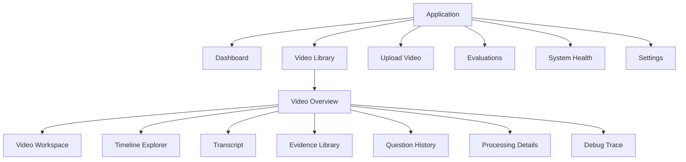
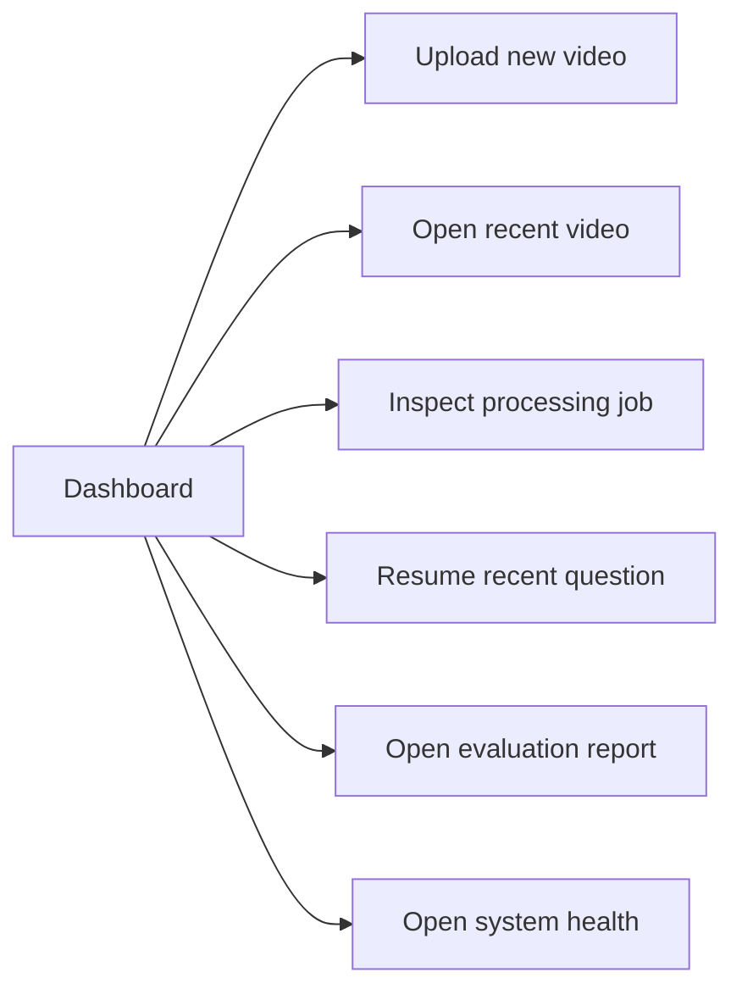
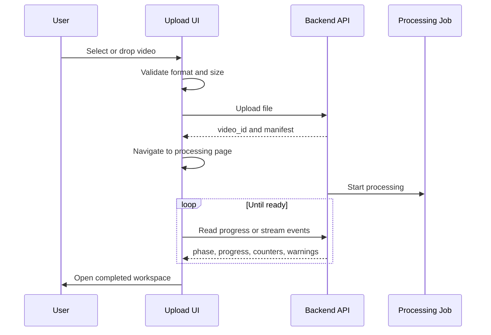
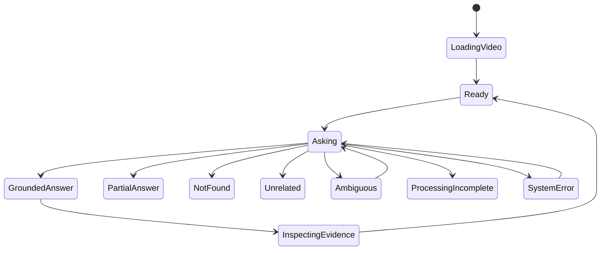
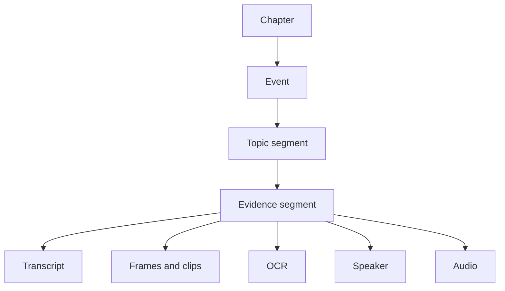
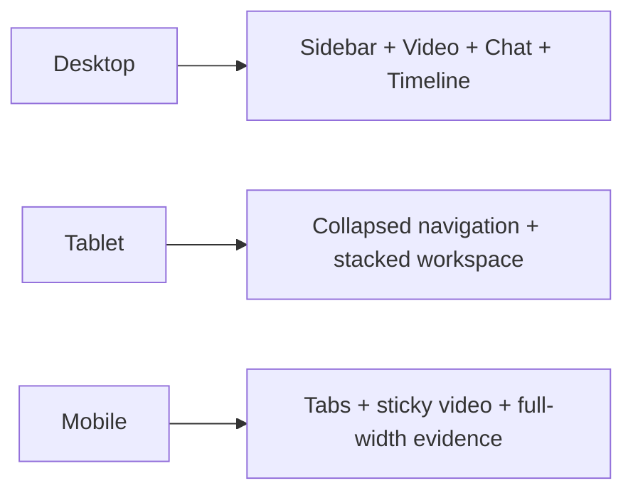
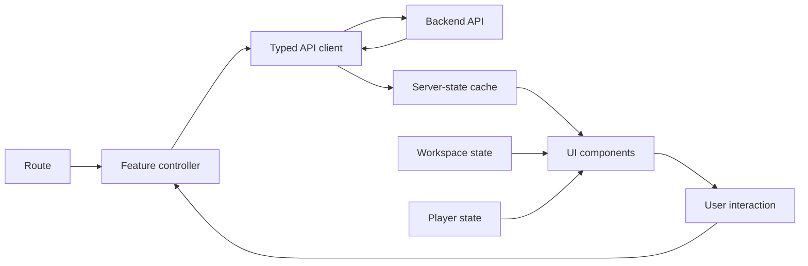

# VideoSceneRAG — Professional Dashboard and UI/UX Architecture

## Complete Product Design, Dashboard, Components, Motion System, Interaction Model, and Frontend Implementation Blueprint

**Project:** VideoSceneRAG  
**Document type:** UI/UX product specification and frontend architecture  
**Target experience:** Modern, evidence-first, responsive, animated, production-grade video intelligence dashboard  
**Primary users:** Students, researchers, developers, knowledge workers, reviewers, and internal retrieval engineers  

---

# 1. Document Purpose

This document defines how the complete VideoSceneRAG frontend should look, behave, animate, and connect to the backend.

It covers:

- product information architecture;
- dashboard design;
- navigation;
- video library;
- upload experience;
- processing progress;
- main video intelligence workspace;
- chat and grounded-answer interface;
- evidence timeline;
- OCR, speaker, visual, audio, transcript, chunk, event, and chapter views;
- retrieval trace and developer-debug experience;
- animation and transition system;
- responsive layouts;
- accessibility;
- component architecture;
- frontend state management;
- API integration;
- performance requirements;
- error and empty states;
- implementation phases;
- testing requirements.

This is an implementation document, not only a visual design brief.

---

# 2. Product Vision

VideoSceneRAG should feel like a combination of:

```text
Video player
+ AI research assistant
+ timeline explorer
+ evidence verification tool
+ retrieval observability console
```

The interface must not resemble a generic chatbot placed beside a video.

The unique value of the product is that every answer can be traced back to:

```text
a precise timeline moment
a transcript segment
a visual frame or short clip
an OCR region
a speaker turn
an audio event
a topic segment
an explanation event
```

The visual design must place evidence, timestamps, and timeline navigation at the center of the experience.

---

# 3. Experience Goals

The UI should make users feel that the system is:

## 3.1 Intelligent

The system understands natural-language questions, vague memories, visible text, speakers, actions, and temporal relationships.

## 3.2 Trustworthy

The UI clearly separates:

```text
grounded answer
partial answer
not found in video
unrelated question
ambiguous question
processing incomplete
conflicting evidence
system failure
```

## 3.3 Fast

The interface responds immediately to clicks, seeks, filters, tabs, questions, and timeline interactions.

## 3.4 Explainable

Users can inspect why a result was returned without reading backend logs.

## 3.5 Cinematic but professional

The interface should feel polished and visual without sacrificing readability or evidence clarity.

---

# 4. Product Design Principles

1. **Evidence before decoration.** Video, answer, timestamp, citation, confidence, and context are primary.
2. **Motion communicates state.** Animation explains navigation, selection, progress, and evidence changes.
3. **Every answer is reversible.** Users can move from answer to citation to exact video evidence.
4. **Use progressive disclosure.** Normal users see evidence; developers may inspect retrieval traces.
5. **Represent uncertainty honestly.** Weak evidence must never look like a successful answer.
6. **Use one timeline coordinate system.** All tracks use the same millisecond truth.
7. **Keep motion subtle.** Avoid excessive parallax, 3D effects, or long blocking transitions.
8. **Preserve user control.** Auto-scroll, auto-seek, and panel movement must be interruptible.

---

# 5. Product Information Architecture

## 5.1 Primary navigation

```text
Overview
Videos
Upload
Recent Questions
Evaluations
System Health
Settings
```

Internal users may additionally see:

```text
Retrieval Lab
Processing Jobs
Model Registry
Index Health
Debug Traces
```

## 5.2 Recommended routes

```text
/
├── dashboard
├── videos
│   ├── new
│   └── {video_id}
│       ├── overview
│       ├── workspace
│       ├── timeline
│       ├── transcript
│       ├── evidence
│       ├── questions
│       ├── processing
│       └── debug
├── evaluations
│   ├── reports
│   └── {report_id}
├── system
│   ├── jobs
│   ├── health
│   └── models
└── settings
```

## 5.3 Route diagram



---

# 6. Global Application Shell

## 6.1 Desktop shell

```text
┌──────────────────────────────────────────────────────────────────────────┐
│ Top bar: search, current video, notifications, profile                  │
├──────────────┬───────────────────────────────────────────────────────────┤
│ Left sidebar │ Main route content                                        │
│ Navigation   │                                                           │
│ Video list   │                                                           │
│ Quick upload │                                                           │
├──────────────┴───────────────────────────────────────────────────────────┤
│ Optional status bar: API, indexing, active processing jobs              │
└──────────────────────────────────────────────────────────────────────────┘
```

## 6.2 Left sidebar

The sidebar contains:

- product logo;
- workspace switcher;
- dashboard;
- videos;
- upload;
- evaluations;
- system health;
- settings;
- recent videos;
- collapse button.

Expanded width:

```text
256px
```

Collapsed width:

```text
76px
```

Animation:

```text
duration: 220ms
easing: cubic-bezier(0.22, 1, 0.36, 1)
```

Text should fade slightly before contraction.

## 6.3 Top bar

The top bar contains:

- global search;
- breadcrumbs;
- selected-video status;
- processing indicator;
- command palette;
- notifications;
- theme switcher;
- profile menu.

## 6.4 Command palette

Open with:

```text
Ctrl/Cmd + K
```

Commands:

```text
Upload a video
Open recent video
Ask current video
Jump to timestamp
Open transcript
Open timeline
Open evaluations
Toggle debug mode
Change theme
```

---

# 7. Visual Design System

## 7.1 Visual direction

```text
Dark neutral canvas
Soft glass-like surfaces
Subtle borders
High-contrast typography
Evidence-specific accents
Large spacing
Minimal gradients
Controlled glow around active evidence
```

A light theme should also be supported.

## 7.2 Surface hierarchy

```text
Level 0: application background
Level 1: primary panels
Level 2: cards and controls
Level 3: popovers, tooltips, menus
Level 4: modal and command palette
```

## 7.3 Border radius

```text
Small controls: 8px
Buttons and inputs: 10px
Cards: 14px
Large panels: 18px
Modal/dialog: 20px
```

## 7.4 Spacing

Use an 8-point spacing system:

```text
4, 8, 12, 16, 24, 32, 40, 48, 64
```

## 7.5 Typography

```text
Display: major result or landing title
Heading 1: screen title
Heading 2: panel title
Heading 3: card title
Body: content
Small: metadata
Mono: timestamps, IDs, trace values
```

Use tabular numerals for timestamps and metrics.

## 7.6 Modality identity

```text
Transcript — document icon
OCR — scan/text-box icon
Visual — image/eye icon
Speaker — microphone/person icon
Audio — waveform icon
Topic — layered-segment icon
Event — activity icon
Chapter — book/section icon
```

Status must never be communicated by color alone.

---

# 8. Motion and Animation System

## 8.1 Motion principles

Animations must be:

- interruptible;
- GPU-friendly;
- short;
- meaningful;
- reduced when the user enables reduced motion.

## 8.2 Duration scale

```text
Micro interaction: 80–140ms
Control transition: 140–200ms
Panel transition: 200–320ms
Page transition: 280–420ms
Large completion animation: maximum 600ms
```

## 8.3 Easing

```text
Enter: cubic-bezier(0.22, 1, 0.36, 1)
Exit: cubic-bezier(0.4, 0, 1, 1)
Standard: cubic-bezier(0.2, 0, 0, 1)
```

## 8.4 Page transitions

```text
old page:
opacity 1 -> 0
translateY 0 -> -6px

new page:
opacity 0 -> 1
translateY 10px -> 0

duration:
240–320ms
```

Do not animate the full application shell.

## 8.5 Card hover

```text
translateY: 0 -> -3px
border contrast: slightly stronger
shadow/glow: subtle increase
thumbnail scale: 1 -> 1.025
duration: 160ms
```

## 8.6 Button interaction

Hover:

```text
contrast increase
directional icon moves 1–2px
```

Press:

```text
scale 1 -> 0.98
duration: 80ms
```

## 8.7 Scroll reveal

Use scroll reveal only on:

- dashboard overview;
- onboarding;
- empty states;
- feature explanations.

Recommended:

```text
opacity 0 -> 1
translateY 18px -> 0
duration 350ms
trigger once
```

Do not apply it to transcripts or timeline rows.

## 8.8 Citation selection animation

When a citation is selected:

1. highlight the evidence interval;
2. seek the player;
3. smoothly center the interval in the timeline;
4. expand its track when needed;
5. cross-fade the evidence inspector.

## 8.9 Reduced motion

Under reduced motion:

- remove parallax;
- use opacity-only page transitions;
- stop looping decorative motion;
- retain progress and selection using static indicators.

---

# 9. Dashboard Overview

## 9.1 Purpose

The dashboard summarizes:

- recent videos;
- active processing jobs;
- questions;
- modality quality;
- system readiness;
- evaluation results.

## 9.2 Desktop layout

```text
┌────────────────────────────────────────────────────────────────────────┐
│ Welcome header                                  Upload Video button    │
├──────────────────────┬──────────────────────┬──────────────────────────┤
│ Total videos         │ Ready videos         │ Processing / failed      │
├─────────────────────────────────────────────┬──────────────────────────┤
│ Recent videos                               │ Active processing jobs   │
├─────────────────────────────────────────────┼──────────────────────────┤
│ Recent questions                            │ Evidence quality         │
├─────────────────────────────────────────────┴──────────────────────────┤
│ Evaluation and retrieval quality summary                               │
└────────────────────────────────────────────────────────────────────────┘
```

## 9.3 Header

Example:

```text
Good afternoon, Harish
Your video intelligence workspace is ready.
```

Actions:

- Upload video;
- open most recent video;
- view system health.

## 9.4 Summary cards

### Videos indexed

```text
total
ready
processing
failed
```

### Searchable duration

```text
total processed hours
new hours this week
```

### Questions answered

```text
question count
grounded-answer rate
abstention rate
```

### Evidence quality

```text
transcript
OCR
speaker
audio
visual
```

## 9.5 Active processing panel

Each job shows:

- filename;
- phase;
- progress;
- elapsed time;
- artifact counters;
- warnings;
- open-details action.

## 9.6 Recent videos

Use responsive cards with:

- thumbnail;
- title;
- duration;
- status;
- upload date;
- question count;
- modality readiness.

Hover actions:

```text
Open
Ask
Timeline
More
```

## 9.7 Recent questions

Each row includes:

- question;
- video;
- outcome;
- primary timestamp;
- confidence;
- date.

## 9.8 Evidence quality

Example:

```text
Transcript  94%
OCR         82%
Speaker     88%
Audio       86%
Visual      80%
```

Treat these as quality/readiness indicators, not absolute model accuracy.

## 9.9 Dashboard flow



---

# 10. Video Library

## 10.1 Layout modes

```text
Grid
List
Compact
```

Persist the chosen view.

## 10.2 Filters

```text
All
Ready
Processing
Ready with warnings
Failed
Stale index
Transcript ready
Visual ready
OCR ready
```

Additional filters:

- upload date;
- duration;
- profile;
- language;
- tags.

## 10.3 Card structure

```text
┌──────────────────────────────┐
│ Thumbnail             Status │
├──────────────────────────────┤
│ Video title                  │
│ 01:42:16 • Uploaded today    │
│ Transcript • OCR • Speakers  │
│ 14 questions        Open →   │
└──────────────────────────────┘
```

Switching between grid and list should use smooth layout animation.

---

# 11. Upload Experience

## 11.1 Layout

```text
┌─────────────────────────────────────────────────────────────┐
│ Upload a video                                              │
│ Convert it into a searchable timeline memory.               │
├──────────────────────────────────┬──────────────────────────┤
│ Drag-and-drop upload             │ Processing configuration │
│ File preview                     │ Profile                  │
│ Validation                       │ OCR language             │
│ Upload progress                  │ Speaker estimate         │
│                                  │ Retention                │
└──────────────────────────────────┴──────────────────────────┘
```

## 11.2 Drag-and-drop

On drag enter:

- activate border;
- slightly raise surface;
- animate upload icon;
- reveal accent background.

On drop:

- transition to file preview;
- show metadata;
- start validation.

## 11.3 Processing profiles

### Balanced

Recommended default.

### Fast transcript

Reduced visual processing.

### Visual detail

Denser frame and OCR processing.

### Archive

Maximum artifact retention.

## 11.4 Upload progress

Separate:

```text
file transfer
backend processing
```

Never combine both into a fake single progress bar.

## 11.5 Upload sequence



---

# 12. Processing Dashboard

## 12.1 Layout

```text
┌────────────────────────────────────────────────────────────────┐
│ Video title             64% complete             Elapsed time  │
├────────────────────────────┬───────────────────────────────────┤
│ Pipeline stages            │ Current stage                      │
│ ✓ Video received           │ Building evidence segments        │
│ ✓ Visual changes           │ Explanation                       │
│ ✓ Audio prepared           │ Live counters                     │
│ ✓ Speech transcribed       │ Recent artifacts                  │
│ ● Building segments        │                                   │
│ ○ Extracting frames        │                                   │
│ ○ Grouping topics          │                                   │
│ ○ Building indexes         │                                   │
├────────────────────────────┴───────────────────────────────────┤
│ Technical details and recovery actions                         │
└────────────────────────────────────────────────────────────────┘
```

## 12.2 Stage states

```text
queued
active
validating
completed
completed_with_warning
failed
```

## 12.3 Counters

```text
81 evidence segments
19 topic segments
10 explanation events
373 representative frames
142 OCR tracks
2 speakers
14 audio events
6 search indexes
```

## 12.4 Failure state

Show:

- failed stage;
- human-readable error;
- preserved artifacts;
- retry capability;
- trace ID;
- technical disclosure.

## 12.5 Completion

At completion:

- progress changes to Ready;
- success glow appears briefly;
- Open Workspace becomes primary;
- modality readiness appears.


# 13. Video Overview Page

## 13.1 Purpose

The overview page summarizes the video before entering the full workspace.

## 13.2 Content

- thumbnail and title;
- duration and metadata;
- processing status;
- short summary when available;
- chapters;
- important events;
- modality readiness;
- question count;
- recent questions;
- open-workspace action;
- open-timeline action.

## 13.3 Video profile

Display:

```text
Duration
Resolution
Frame rate
Language
Speakers
Evidence segments
Topic segments
Events
Index version
Pipeline version
```

## 13.4 Quick actions

```text
Ask a question
Open workspace
Explore timeline
Read transcript
Inspect evidence
Rebuild index
```

---

# 14. Main Video Intelligence Workspace

## 14.1 Core layout

```text
┌────────────────────────────────────────────────────────────────────────────┐
│ Video title | status | search | view controls | share                    │
├───────────────────────────────────┬────────────────────────────────────────┤
│ Video player                      │ Conversation                           │
│                                   │ User question                          │
│                                   │ Answer                                 │
│                                   │ Citations and confidence               │
├───────────────────────────────────┴────────────────────────────────────────┤
│ Evidence timeline: transcript, topics, events, visual, OCR, speakers      │
├────────────────────────────────────────────────────────────────────────────┤
│ Collapsible evidence inspector / transcript detail                        │
└────────────────────────────────────────────────────────────────────────────┘
```

## 14.2 Resizable panels

Users may resize:

- video/chat split;
- timeline height;
- evidence inspector.

Persist sizes locally per device.

## 14.3 Focus modes

### Balanced

Video and conversation visible.

### Video focus

Large player and compact chat drawer.

### Research focus

Expanded transcript, timeline, and evidence.

### Chat focus

Large conversation and compact player.

Use layout transitions between modes.

## 14.4 Workspace state diagram



---

# 15. Video Player

## 15.1 Controls

- play/pause;
- seek;
- volume;
- playback speed;
- fullscreen;
- picture-in-picture when supported;
- captions;
- timestamp display;
- next/previous evidence;
- chapter navigation;
- copy timestamp;
- loop selected interval.

## 15.2 Evidence overlay

Show on the progress bar:

```text
primary evidence anchor
answer context interval
citation markers
chapter boundaries
```

## 15.3 Citation seek behavior

When a citation is clicked:

1. seek to `start_ms / 1000`;
2. show a brief evidence toast;
3. highlight the transcript;
4. center the timeline interval;
5. update the evidence inspector.

## 15.4 Frame preview

Hovering over the scrubber shows:

- frame thumbnail;
- timestamp;
- chapter;
- event.

## 15.5 Player transitions

When switching videos, fade to a neutral surface and fade in the next player. Never animate player dimensions during playback.

---

# 16. Conversation and Question Experience

## 16.1 Conversation panel

Contains:

- message history;
- answer cards;
- outcome notices;
- citations;
- related prompts;
- composer.

## 16.2 Question composer

Controls:

- text input;
- send;
- answer mode;
- attach current moment;
- clear conversation;
- keyboard shortcut.

Placeholder:

```text
Ask about a concept, speaker, slide, action, or moment...
```

## 16.3 Suggested prompts

```text
What is the main idea of this section?
What did the speaker say after this?
What text appears on this slide?
Where is this concept mentioned again?
Summarize this chapter.
```

## 16.4 Sending state

Show meaningful stages:

```text
Understanding question
Searching transcript and visual evidence
Verifying sources
Building grounded answer
```

Do not expose internal agent names by default.

## 16.5 Answer card

A grounded answer includes:

- answer;
- primary timestamp;
- outcome badge;
- confidence;
- citation chips;
- related moments;
- inspect action;
- copy;
- feedback.

Entrance:

```text
opacity 0 -> 1
translateY 8px -> 0
duration 220ms
```

## 16.6 Outcome-specific states

### Grounded answer

Answer, timestamp, citations, and confidence.

### Partial answer

Show supported and unsupported portions separately.

### Video evidence not found

Explain that the topic may be related but evidence is insufficient.

### Unrelated to video

State that the question is outside the selected video. Never show citations or timestamps.

### Ambiguous query

Ask one focused clarification and, when possible, show likely interpretations.

### Conflicting evidence

Show the competing moments side by side.

### Processing incomplete

Identify the missing modality and link to processing status.

### System error

Preserve the question and provide retry plus trace ID.

---

# 17. Citation Design

## 17.1 Citation chip

```text
[S1 · 05:21]
```

Hover:

- source excerpt;
- source type;
- interval.

Click:

- seek video;
- select timeline evidence;
- open inspector.

## 17.2 Citation card

```text
┌─────────────────────────────────────────────────────┐
│ S1   Transcript evidence             05:21–05:34   │
│ “MCP provides a common protocol layer...”           │
│ Topic: Model reasoning layer                        │
│ Quality: Strong                                     │
│ Seek to moment   Inspect evidence                    │
└─────────────────────────────────────────────────────┘
```

## 17.3 Interval types

```text
Evidence anchor — exact supporting moment
Answer context — wider reasoning interval
Source interval — complete atom/chunk/event
```

## 17.4 Hover and selection

Hover should highlight related timeline evidence without seeking.

Selection should:

- apply active outline;
- seek player;
- center timeline;
- update inspector.

---

# 18. Confidence Design

## 18.1 User-facing labels

```text
Strong evidence
Good evidence
Limited evidence
Insufficient evidence
```

## 18.2 Expanded explanation

Example:

```text
Why this answer is strong:
✓ Exact transcript match
✓ Two verified sources
✓ Timestamp agreement
✓ All claims are cited
```

Warnings may include:

```text
Expanded search was required
Visual evidence was unavailable
Fallback generation was used
One unsupported claim was removed
```

Avoid unexplained percentages in the normal interface.

---

# 19. Evidence Timeline

## 19.1 Track hierarchy

```text
Time ruler
Current playhead
Selected answer context
Primary evidence anchor
Chapter track
Event track
Topic track
Transcript track
Visual track
OCR track
Speaker track
Audio track
```

## 19.2 Layout

```text
┌─────────────────────────────────────────────────────────────────────────┐
│ 00:00      05:00      10:00      15:00      20:00                     │
├─────────────────────────────────────────────────────────────────────────┤
│ Chapters    [Introduction────────][Architecture────────────]            │
│ Events      [Event 1][Event 2────][Event 3][Event 4──────]              │
│ Topics      [Topic][Topic][Topic────][Topic][Topic──────]               │
│ Transcript  [atom][atom][atom][atom][atom][atom][atom]                  │
│ Visual      ●   ●     ● ●       ●      ●                                │
│ OCR         [Title────]        [Diagram─────]                            │
│ Speakers    AAAAAAAA BBBB AAAAAAAAAAA                                   │
│ Audio       speech   pause speech music                                 │
└─────────────────────────────────────────────────────────────────────────┘
```

## 19.3 Interactions

- wheel or trackpad zoom;
- drag to pan;
- click to seek;
- drag-select interval;
- hover preview;
- filter tracks;
- collapse tracks;
- keyboard zoom;
- jump to playhead;
- jump to next evidence.

## 19.4 Zoom levels

### Overview

Chapters and events.

### Medium

Topics, speakers, and OCR.

### Detail

Transcript atoms, exact OCR, audio events, and frames.

## 19.5 Hover card

Show:

```text
timestamp
chapter
event
topic
speaker
transcript excerpt
OCR text
audio event
thumbnail
```

## 19.6 Performance

For long videos:

- virtualize intervals;
- fetch visible ranges;
- simplify rendering when zoomed out;
- hide labels without space;
- consider canvas only if DOM rendering becomes insufficient.

---

# 20. Transcript Experience

## 20.1 Layout

```text
Timestamp | Speaker | Transcript
```

## 20.2 Features

- active segment follows playback;
- click to seek;
- search;
- speaker filter;
- copy;
- optional confidence;
- open parent topic/event;
- show citation usage.

## 20.3 Auto-scroll

Auto-scroll should pause when the user manually scrolls and provide a “Return to current moment” action.

## 20.4 Performance

Use list virtualization for long transcripts.

---

# 21. OCR Evidence View

## 21.1 OCR card

Show:

- visible text;
- interval;
- source frame;
- bounding box;
- quality;
- hierarchy links;
- seek.

## 21.2 Frame viewer

Features:

- full frame;
- OCR overlays;
- selected box highlight;
- zoom and pan;
- raw/normalized text in developer mode.

## 21.3 Persistent text

Persistent slide text should appear as one interval rather than repeated markers.

## 21.4 Uncertain OCR

Only show weak OCR when:

- user enables uncertain evidence;
- developer mode is active;
- corrective retrieval requires it.

---

# 22. Speaker View

## 22.1 Speaker track

Display speaker turns as labeled intervals.

## 22.2 Speaker panel

Show:

- label;
- optional custom name;
- speaking duration;
- turn count;
- important events;
- filter action.

## 22.3 Renaming

Allow:

```text
speaker_00 -> Lecturer
speaker_01 -> Student
```

Do not infer real identities without evidence.

## 22.4 Hover

Show transcript excerpt, interval, quality, and overlap status.

---

# 23. Audio Evidence View

## 23.1 Track types

```text
speech
silence
pause
music
applause
laughter
alarm
impact
transition
```

## 23.2 Cards

Show:

- event type;
- interval;
- quality;
- linked atom/event;
- play interval.

A waveform may supplement, but must not replace, semantic event markers.

---

# 24. Topic, Event, and Chapter Views

## 24.1 Chapter navigator

Each chapter shows:

- title;
- interval;
- summary;
- event count;
- suggested questions.

## 24.2 Event card

Show:

- title;
- interval;
- summary;
- key entities;
- transcript preview;
- visual thumbnail;
- open action.

## 24.3 Topic card

Show:

- coherent summary;
- atom count;
- parent event;
- terms;
- seek action.

## 24.4 Hierarchy



---

# 25. Evidence Inspector

## 25.1 Normal view

```text
Primary evidence
Supporting evidence
Timeline context
Transcript
Visual/OCR
Speaker
Audio
Parent topic/event
Quality explanation
```

## 25.2 Placement

Desktop:

- right drawer;
- lower resizable panel;
- full-screen evidence mode.

Tablet/mobile:

- bottom sheet or full route.

## 25.3 Motion

Open:

```text
opacity 0 -> 1
translateX 20px -> 0
duration 240ms
```

Evidence changes should cross-fade without moving the panel.

## 25.4 Temporal context

Show:

```text
What happened before
Primary moment
What happened after
Related later moment
```

---

# 26. Developer Debug Workspace

## 26.1 Access

Permission-gated only.

## 26.2 Layout

```text
┌──────────────────────────────┬──────────────────────────────────┐
│ Query and planner            │ Candidate results                │
├──────────────────────────────┼──────────────────────────────────┤
│ Scope and answerability      │ Evidence verification            │
├──────────────────────────────┼──────────────────────────────────┤
│ Corrective retrieval         │ Claim verification               │
├──────────────────────────────┴──────────────────────────────────┤
│ Final confidence and response contract                          │
└─────────────────────────────────────────────────────────────────┘
```

## 26.3 Panels

### Query understanding

- raw query;
- resolved query;
- types;
- entities;
- temporal hints;
- modalities.

### Scope analysis

- scope score;
- matched entities;
- scope summary;
- rejection reasons.

### Retrieval plan

- retrievers;
- top-K;
- weights;
- context expansion.

### Candidate table

```text
rank
source
type
interval
raw score
fused score
rerank score
verification
rejection reason
```

### Corrective retrieval

- trigger;
- actions;
- before/after candidates;
- improvement.

### Answerability

- outcome;
- sufficiency;
- modality coverage;
- contradiction.

### Claim verification

- claim;
- support;
- citations;
- entailment.

### Confidence

- calibrated score;
- component values;
- penalties.

## 26.4 Trace comparison

Support side-by-side comparison of two traces.

---

# 27. Evaluation Dashboard

## 27.1 Summary metrics

```text
Outcome accuracy
Grounded-answer precision
Negative abstention rate
False rejection rate
Recall@5
MRR
Timestamp hit rate
Citation validity
Unsupported claim rate
OCR quality
Speaker quality
Audio quality
```

## 27.2 Regression table

```text
Metric | Baseline | Current | Difference | Threshold | Status
```

## 27.3 Failed-question explorer

Show:

- query;
- expected;
- actual;
- expected window;
- chosen interval;
- citations;
- trace;
- failure reason.

## 27.4 Release readiness

```text
Ready
Ready with warnings
Blocked
```

List failed release gates.

---

# 28. System Health Dashboard

## 28.1 Health cards

- API;
- relational database;
- object storage;
- vector index;
- model provider;
- GPU worker;
- queue;
- processing jobs.

## 28.2 Jobs table

```text
video
phase
status
progress
worker
started
duration
retry count
error
```

## 28.3 Model health

Show:

- transcription model;
- embedding model;
- OCR model;
- speaker model;
- answer provider;
- fallback readiness;
- versions.


# 29. Settings

## 29.1 User settings

- appearance;
- reduced motion;
- default answer mode;
- processing profile;
- timestamp format;
- auto-seek;
- transcript auto-scroll;
- notifications.

## 29.2 Workspace settings

- retention;
- OCR language;
- speaker defaults;
- processing limits;
- debug access.

## 29.3 Privacy settings

- delete source video;
- delete derived artifacts;
- retention period;
- analytics preference;
- export data.

---

# 30. Responsive Design

## 30.1 Desktop

- persistent sidebar;
- side-by-side player and conversation;
- timeline always available;
- evidence inspector as a panel.

## 30.2 Tablet

- collapsible sidebar;
- player above conversation;
- horizontal timeline;
- evidence drawer.

## 30.3 Mobile

Use tabs:

```text
Chat
Video
Transcript
Evidence
```

The player may remain sticky in Chat and Video tabs.

Do not compress the full desktop layout into unreadable columns.

## 30.4 Responsive diagram



---

# 31. Accessibility

Required:

- complete keyboard navigation;
- visible focus;
- screen-reader labels;
- semantic headings;
- captions and transcript access;
- no color-only statuses;
- reduced-motion support;
- WCAG AA contrast;
- accessible dialogs;
- keyboard timeline control;
- live processing announcements;
- accessible video controls;
- connected error messages.

## 31.1 Timeline keyboard controls

```text
Left/Right: move playhead
Shift + Left/Right: larger movement
Plus/Minus: zoom
Enter: select or seek
Escape: close preview
```

## 31.2 Citation announcement

```text
Citation S1, transcript evidence, from 5 minutes 21 seconds to 5 minutes 34 seconds.
```

---

# 32. Frontend Technical Architecture

## 32.1 Layering

```text
Presentation components
 -> feature controllers
 -> server-state/query layer
 -> typed API client
 -> backend API
```

## 32.2 Suggested structure

```text
web/src/
├── app/
│   ├── dashboard/
│   ├── videos/
│   ├── evaluations/
│   ├── system/
│   └── settings/
├── components/
│   ├── shell/
│   ├── dashboard/
│   ├── videos/
│   ├── upload/
│   ├── processing/
│   ├── workspace/
│   ├── player/
│   ├── conversation/
│   ├── timeline/
│   ├── evidence/
│   ├── transcript/
│   ├── evaluation/
│   ├── debug/
│   └── common/
├── features/
│   ├── upload/
│   ├── processing/
│   ├── ask/
│   ├── timeline/
│   ├── citations/
│   ├── evaluation/
│   └── traces/
├── lib/
│   ├── api/
│   ├── motion/
│   ├── timeline/
│   ├── format/
│   ├── validation/
│   └── permissions/
├── state/
│   ├── workspace/
│   ├── player/
│   ├── conversation/
│   └── preferences/
└── types/
```

## 32.3 State ownership

### Server state

- videos;
- processing;
- transcript;
- events;
- timeline;
- questions;
- traces;
- evaluation reports.

### Workspace state

- player time;
- selected citation;
- selected interval;
- panels;
- zoom;
- active track.

### Conversation state

Scoped by video:

- messages;
- pending query;
- answer mode;
- context references.

### Preferences

- theme;
- sidebar;
- reduced motion;
- layout;
- filters.

## 32.4 Data flow



---

# 33. Component Inventory

## 33.1 Shell

```text
AppShell
Sidebar
TopBar
Breadcrumbs
CommandPalette
NotificationCenter
UserMenu
SystemStatusBar
```

## 33.2 Dashboard

```text
DashboardHeader
MetricCard
RecentVideoGrid
ProcessingJobsPanel
RecentQuestionsTable
EvidenceQualityPanel
EvaluationSummary
```

## 33.3 Upload

```text
VideoDropzone
FilePreview
UploadValidation
ProcessingProfileSelector
OcrLanguageSelector
SpeakerConfiguration
RetentionNotice
TransferProgress
```

## 33.4 Processing

```text
ProcessingHeader
PipelineProgress
PipelineStageRow
ArtifactCounter
ModalityReadiness
ProcessingWarning
ProcessingFailure
TechnicalDisclosure
```

## 33.5 Workspace

```text
VideoWorkspace
WorkspaceToolbar
ResizablePanelGroup
WorkspaceModeSwitcher
PlayerPanel
ConversationPanel
TimelinePanel
EvidenceInspector
```

## 33.6 Player

```text
VideoPlayer
PlayerControls
ChapterMarkers
EvidenceMarkers
FramePreview
CurrentMomentBadge
LoopIntervalControl
```

## 33.7 Conversation

```text
ConversationList
QuestionComposer
UserMessage
AnswerMessage
OutcomeNotice
ConfidenceIndicator
CitationChip
CitationList
RelatedQuestions
RetrievalState
```

## 33.8 Timeline

```text
EvidenceTimeline
TimelineRuler
TimelineViewport
TimelinePlayhead
TimelineSelection
ChapterTrack
EventTrack
TopicTrack
TranscriptTrack
VisualTrack
OcrTrack
SpeakerTrack
AudioTrack
TimelineHoverCard
TimelineFilters
TimelineZoomControls
```

## 33.9 Evidence

```text
EvidenceInspector
EvidenceSummary
EvidenceInterval
TranscriptEvidence
VisualEvidence
OcrEvidence
SpeakerEvidence
AudioEvidence
ParentHierarchy
AdjacentContext
QualityExplanation
```

## 33.10 Evaluation and debug

```text
EvaluationOverview
RegressionComparison
ReleaseGateList
FailedQuestionTable
TraceComparison
QueryUnderstandingPanel
ScopeAnalysisPanel
RetrievalPlanPanel
CandidateTable
EvidenceVerificationPanel
CorrectiveRetrievalPanel
AnswerabilityPanel
ClaimVerificationPanel
ConfidenceBreakdown
```

---

# 34. Loading and Skeleton Design

## 34.1 Load order for workspace

```text
application shell
video metadata
player
conversation history
timeline summary
detailed tracks
debug data only when opened
```

## 34.2 Rules

- use fixed-size skeletons;
- avoid layout shift;
- virtualize transcript placeholders;
- render timeline ruler before track data;
- use meaningful retrieval status instead of a generic spinner.

---

# 35. Empty States

## 35.1 No videos

```text
Your video library is empty.
Upload a lecture, meeting, or tutorial to build your first searchable timeline.
```

## 35.2 No questions

```text
Ask about a concept, slide, speaker, action, or exact moment.
```

## 35.3 No OCR

```text
No stable visible text was detected in this interval.
```

## 35.4 No speaker evidence

```text
Speaker separation is unavailable for this video.
```

## 35.5 No evaluation reports

```text
Run the evaluation suite to measure retrieval and answer quality.
```

---

# 36. Error and Recovery Design

## 36.1 Upload errors

- unsupported format;
- oversized file;
- duplicate source;
- network failure;
- invalid media;
- insufficient storage.

## 36.2 Processing errors

Show:

- failed phase;
- preserved work;
- retry capability;
- rebuild capability;
- trace ID.

## 36.3 Question errors

Handle:

- provider unavailable;
- index unavailable;
- timeout;
- missing modality;
- system error.

Preserve question text.

## 36.4 Reconnect

When offline:

- show persistent status;
- preserve inputs;
- retry safe reads;
- avoid duplicate submissions.

---

# 37. Performance Requirements

Recommended targets:

```text
Initial shell: under 2.5 seconds on broadband
Citation seek: under 100ms after player ready
Control feedback: under 100ms
Cached status refresh: under 500ms
Timeline interaction: 60 FPS
Question acknowledgement: immediate
```

Strategies:

- virtualize transcripts;
- lazy-load debug data;
- fetch timeline by range;
- use thumbnails;
- defer high-resolution frames;
- cache interval layouts;
- abort stale requests;
- cache immutable summaries;
- keep player rendering isolated from chat updates;
- animate only transform and opacity where possible.

---

# 38. Security and Privacy UI

The frontend must:

- never expose secrets;
- never show local file paths;
- use signed media;
- sanitize model, transcript, and OCR text;
- show retention policy;
- support deletion;
- restrict debug traces;
- avoid third-party transcript analytics;
- enforce ownership;
- warn before public sharing.

---

# 39. API Requirements

## 39.1 Existing core APIs

```text
POST   /upload
GET    /status/{video_id}
GET    /manifest/{video_id}
POST   /ask
POST   /ask-debug
GET    /atoms/{video_id}
GET    /semantic-chunks/{video_id}
GET    /events/{video_id}
GET    /frames/{video_id}
```

## 39.2 Production APIs

```text
GET    /videos
GET    /videos/{video_id}
DELETE /videos/{video_id}
POST   /videos/{video_id}/retry
POST   /videos/{video_id}/cancel
GET    /videos/{video_id}/progress/stream
GET    /videos/{video_id}/timeline
GET    /videos/{video_id}/transcript
GET    /videos/{video_id}/questions
POST   /videos/{video_id}/questions
GET    /videos/{video_id}/evidence/{evidence_id}
GET    /videos/{video_id}/traces/{trace_id}
GET    /media/{signed_media_id}
GET    /evaluation/reports
GET    /health/live
GET    /health/ready
```

Use Server-Sent Events for progress where available, with polling fallback.

---

# 40. Frontend Contracts

## 40.1 Outcome

```ts
export type AskOutcome =
  | "grounded_answer"
  | "partial_answer"
  | "video_evidence_not_found"
  | "unrelated_to_video"
  | "ambiguous_query"
  | "conflicting_evidence"
  | "processing_incomplete"
  | "system_error";
```

## 40.2 Citation

```ts
export interface Citation {
  citation_id: string;
  evidence_id: string;
  source_type: string;
  source_id: string;
  start_ms: number;
  end_ms: number;
  text?: string;
  visual_summary?: string;
  quality_score?: number;
  parent_chunk_id?: string;
  parent_event_id?: string;
}
```

## 40.3 Ask response

```ts
export interface AskResponse {
  outcome: AskOutcome;
  answer: string;
  video_id: string;
  query: string;
  primary_timestamp_ms?: number;
  start_ms?: number;
  end_ms?: number;
  confidence: number;
  citations: Citation[];
  trace_id: string;
  warnings: string[];
  answer_quality: {
    grounded: boolean;
    has_timestamp: boolean;
    has_citations: boolean;
    uses_verified_evidence: boolean;
    fallback_used: boolean;
    quality_score: number;
    low_confidence_reason?: string;
  };
}
```

Generate or contract-test frontend types against the backend OpenAPI schema.

---

# 41. Testing Strategy

## 41.1 Visual tests

- dashboard;
- hover effects;
- panels;
- responsive layouts;
- themes;
- reduced motion.

## 41.2 Component tests

- outcome rendering;
- citation formatting;
- confidence labels;
- timeline coordinates;
- processing phases;
- file validation;
- error states.

## 41.3 Integration tests

- upload to processing;
- processing to workspace;
- ask and seek;
- ambiguity;
- unrelated rejection;
- OCR evidence;
- speaker filtering;
- model fallback.

## 41.4 End-to-end tests

- desktop, tablet, mobile;
- keyboard-only;
- long processing;
- seek accuracy;
- reconnect;
- large transcript;
- timeline zoom;
- trace inspection;
- permissions.

## 41.5 Animation tests

- no layout shift;
- no scroll lock;
- reduced motion;
- no blocking;
- smooth timeline;
- stable panels.

---

# 42. Delivery Plan

## F0 — Design system and contract

- tokens;
- typography;
- controls;
- outcome states;
- typed API.

## F1 — Shell and dashboard

- sidebar;
- top bar;
- command palette;
- dashboard;
- system status.

## F2 — Library and upload

- library;
- filters;
- upload;
- validation;
- profiles.

## F3 — Processing

- phase list;
- live counters;
- modality readiness;
- warnings;
- recovery.

## F4 — Main workspace

- player;
- chat;
- outcomes;
- citations;
- confidence;
- resizable panels.

## F5 — Timeline and transcript

- tracks;
- zoom/pan;
- active playhead;
- transcript;
- hierarchy.

## F6 — Evidence inspector

- transcript;
- visual;
- OCR;
- speaker;
- audio;
- context.

## F7 — Debug and evaluation

- retrieval traces;
- candidates;
- claims;
- metrics;
- failure explorer.

## F8 — Responsive and accessibility

- mobile/tablet;
- keyboard;
- reduced motion;
- virtualization;
- performance.

## F9 — Production security

- authentication;
- ownership;
- signed media;
- retention;
- trace permissions.

---

# 43. Definition of Done

The dashboard and UI are complete when:

- videos, jobs, questions, and evaluation health are visible;
- upload and processing are truthful;
- every processing phase has a distinct state;
- the workspace combines video, conversation, timeline, and evidence;
- citations seek the correct moment;
- transcript, topic, event, OCR, speaker, audio, and visual tracks work;
- every answer outcome has a unique treatment;
- confidence is understandable;
- unrelated questions have no fake citations;
- ambiguous questions support clarification;
- evidence inspector connects answers to source records;
- debug traces are permission-gated;
- animations are smooth and meaningful;
- reduced-motion support is complete;
- all responsive layouts are usable;
- long timelines remain performant;
- contracts are typed and tested;
- accessibility and end-to-end tests pass;
- no secrets or local paths are exposed.

---

# 44. Final UI Concept

The complete experience should be:

```text
Upload a video
 -> watch truthful processing
 -> open a structured workspace
 -> ask a natural-language question
 -> receive a grounded answer
 -> click the exact timestamp
 -> inspect transcript, visual, OCR, speaker, and audio evidence
 -> explore the surrounding event and chapter
 -> understand confidence and limitations
 -> debug retrieval when authorized
```

The strongest product identity should come from:

- the synchronized evidence timeline;
- the connection between answer, citation, and video;
- polished but restrained motion;
- smooth transitions;
- responsive panels;
- clear confidence;
- evidence transparency;
- modern dark and light themes.

The UI should not merely display backend output. It should make the backend intelligence understandable, verifiable, and pleasant to use.
