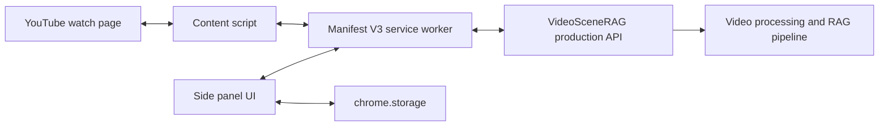

# VideoSceneRAG Chrome Extension Future Architecture

## Document Purpose

This document defines a future Chrome extension that brings VideoSceneRAG into
the YouTube viewing experience.

The extension is not implemented in the current repository. This document
exists to make future development deliberate, secure, policy-aware, and
compatible with the production backend.

---

## 1. Product Vision

While watching a YouTube video, a user opens a VideoSceneRAG side panel and can:

- analyze or attach the current video;
- see processing progress;
- ask questions without leaving YouTube;
- click an answer citation to seek the YouTube player;
- recover vague visual or verbal memories;
- inspect transcript, OCR, speaker, and event evidence;
- continue a conversation tied to the current video.

Example:

```text
User: I remember a diagram about tools and context. Why was it shown?

Extension:
05:21-05:47
The speaker uses the diagram to explain...
[Open moment]
```

---

## 2. Scope

### First release

- YouTube watch pages only;
- Chrome Manifest V3;
- side-panel interface;
- one authenticated VideoSceneRAG account;
- current video detection;
- backend job lookup;
- question answering for already processed videos;
- timestamp seeking;
- processing progress.

### Later releases

- initiate permitted ingestion;
- playlists and video library;
- cross-video questions;
- selected transcript text as question context;
- chapter and event navigation;
- shared team annotations;
- browser context menu;
- optional local companion processing.

### Non-goals

- downloading YouTube videos without a permitted workflow;
- bypassing YouTube controls or access restrictions;
- collecting browsing history unrelated to the user-invoked feature;
- reading authentication cookies;
- injecting remote code;
- replacing the YouTube player.

---

## 3. Policy and Legal Gate

YouTube content handling must be reviewed before implementation.

The extension should not assume that a public YouTube URL grants permission to
download, copy, store, transcribe, or process the audiovisual content.

Before enabling ingestion:

- review the YouTube API Services Terms of Service;
- review YouTube developer policies;
- define which content is processed;
- document retention and deletion;
- obtain required user consent;
- use official APIs where applicable;
- avoid hidden media extraction;
- support only content the user and service are permitted to process.

The safest first release is:

> Detect the YouTube video ID, look up an existing authorized VideoSceneRAG
> processing record, and provide question answering only when that record
> already exists.

Chrome considers website content and browsing activity user data. The extension
must publish a privacy policy and accurately disclose collection, processing,
storage, retention, and sharing.

---

## 4. User Experience

### 4.1 Entry

The user:

1. opens a YouTube watch page;
2. clicks the VideoSceneRAG extension icon;
3. Chrome opens the side panel;
4. the extension detects the current video ID and metadata;
5. the extension asks the backend whether the video is known.

### 4.2 Known video

Show:

- video title and thumbnail;
- "Ready" state;
- question composer;
- recent questions;
- answer and citations;
- open-moment action.

### 4.3 Unknown video

Show one of:

- "This video has not been analyzed";
- "Request analysis" when the deployment supports a permitted ingestion flow;
- "Upload a video you own" link;
- "Connect this video to an existing workspace record";
- policy/permission explanation.

### 4.4 Processing

Use the same phase model as the web frontend:

```text
Video received
Preparing audio
Transcribing speech
Building evidence segments
Extracting visual evidence
Grouping topics
Building search memory
Reading slides and voices
Ready
```

### 4.5 Asking

The side panel should support:

- strict-video mode by default;
- follow-up questions;
- a stop/cancel request action;
- answer outcome states;
- citation cards;
- confidence/limitation display;
- copy answer;
- open full workspace.

### 4.6 Seeking

When a citation is clicked:

1. convert `start_ms` to seconds;
2. send a seek message to the YouTube content script;
3. set the active HTML video element time when permitted;
4. fall back to navigation with a YouTube timestamp URL;
5. keep the side panel open.

---

## 5. Extension Architecture



### Components

| Component | Responsibility |
| --- | --- |
| `manifest.json` | Permissions and extension entry points |
| Service worker | Tab lifecycle, authentication coordination, API messages |
| Content script | Detect YouTube video and control timestamp seeking |
| Side panel | Processing and question-answering UI |
| Options page | API origin, account, privacy, diagnostics |
| Backend | Identity, video lookup, ingestion jobs, RAG, citations |

Manifest V3 service workers are event-driven and are not permanently alive.
Persistent state must live in `chrome.storage` or the backend, not global service
worker variables.

---

## 6. Suggested Directory Structure

```text
extension/
  manifest.json
  package.json
  src/
    background/
      service-worker.ts
      messages.ts
      auth.ts
    content/
      youtube.ts
      player.ts
      metadata.ts
    sidepanel/
      index.html
      App.tsx
      components/
        VideoIdentity.tsx
        ProcessingProgress.tsx
        QuestionComposer.tsx
        Answer.tsx
        CitationCard.tsx
    options/
      index.html
      Options.tsx
    api/
      client.ts
      contracts.ts
    storage/
      keys.ts
      repository.ts
    shared/
      messages.ts
      types.ts
  tests/
```

Reuse frontend contracts and evidence components where practical, but package
all extension JavaScript locally. Manifest V3 does not allow remotely hosted
extension code.

---

## 7. Manifest V3 Baseline

Illustrative manifest:

```json
{
  "manifest_version": 3,
  "name": "VideoSceneRAG for YouTube",
  "version": "0.1.0",
  "description": "Ask grounded questions about the YouTube video you are watching.",
  "permissions": [
    "activeTab",
    "storage",
    "sidePanel"
  ],
  "host_permissions": [
    "https://www.youtube.com/*",
    "https://api.example.com/*"
  ],
  "background": {
    "service_worker": "service-worker.js",
    "type": "module"
  },
  "content_scripts": [
    {
      "matches": ["https://www.youtube.com/watch*"],
      "js": ["youtube-content.js"],
      "run_at": "document_idle"
    }
  ],
  "side_panel": {
    "default_path": "sidepanel.html"
  },
  "action": {
    "default_title": "Open VideoSceneRAG"
  }
}
```

Use the smallest permissions that satisfy the released feature set.

Do not request:

- `cookies`;
- broad all-sites host access;
- browsing history;
- web request interception;
- downloads;
- tab capture;

unless a reviewed feature has a clear need, prominent disclosure, and policy
approval.

---

## 8. YouTube Page Integration

### Video identity

Derive:

- canonical video ID from `watch?v=...`;
- current URL;
- page title;
- channel name when needed;
- current playback time;
- duration when available.

YouTube is a single-page application. The content script must detect navigation
between videos without assuming a full page reload.

Use:

- URL change observation;
- YouTube navigation events where stable;
- bounded DOM observation as a fallback;
- repeated identity validation before sending a question.

Do not make core backend identity depend on fragile CSS class names.

### Player control

Preferred sequence:

1. find the active HTML `<video>` element;
2. set `currentTime = start_ms / 1000`;
3. preserve paused/playing state according to user action;
4. if direct control fails, navigate to a URL containing `t=<seconds>`;
5. for embedded controlled players, use the official IFrame API `seekTo`.

---

## 9. Backend API Additions

The current backend accepts file upload and `video_id` questions. The extension
needs a YouTube identity layer.

### Required

```text
GET  /integrations/youtube/videos/{youtube_video_id}
POST /integrations/youtube/videos/{youtube_video_id}/attach
GET  /videos/{video_id}/status
POST /videos/{video_id}/ask
```

Suggested lookup response:

```json
{
  "youtube_video_id": "abc123",
  "known": true,
  "video_id": "internal-video-id",
  "status": "completed",
  "title": "Video title",
  "duration_ms": 744786,
  "processing": {
    "phase": "completed",
    "progress": 100
  },
  "permissions": {
    "can_view": true,
    "can_process": false,
    "can_delete": false
  }
}
```

### Optional permitted ingestion

```text
POST /integrations/youtube/ingestion-requests
GET  /integrations/youtube/ingestion-requests/{job_id}
```

The ingestion request must record:

- user identity;
- YouTube video ID;
- declared authorization basis;
- selected processing mode;
- consent version;
- retention policy;
- job status;
- source acquisition method.

Do not make the extension send a raw media stream from the page as the default
ingestion architecture.

---

## 10. Message Contracts

```ts
type ExtensionMessage =
  | {
      type: "YOUTUBE_CONTEXT_REQUEST";
    }
  | {
      type: "YOUTUBE_CONTEXT_RESPONSE";
      videoId: string;
      url: string;
      title?: string;
      currentTimeSeconds?: number;
      durationSeconds?: number;
    }
  | {
      type: "SEEK_VIDEO";
      seconds: number;
      autoplay?: boolean;
    }
  | {
      type: "VIDEO_NAVIGATED";
      videoId: string;
    }
  | {
      type: "AUTH_CHANGED";
      signedIn: boolean;
    };
```

Validate all messages:

- verify sender tab and origin;
- validate numeric ranges;
- reject unknown message types;
- never execute code received in a message;
- avoid passing provider secrets through extension messages.

---

## 11. Authentication

Recommended:

- OAuth/OIDC authorization code flow with PKCE;
- short-lived access tokens;
- refresh flow appropriate for Chrome extensions;
- backend validates issuer, audience, expiry, and scopes;
- extension stores the minimum required token material;
- sign-out clears extension state.

Do not:

- embed a shared backend API key;
- embed `GEMINI_API_KEY`;
- read YouTube cookies;
- use page-localStorage credentials;
- trust a `video_id` without authorization.

---

## 12. Privacy

Potentially collected data:

- YouTube video ID and URL;
- video title/channel metadata;
- current playback timestamp;
- user questions;
- answer/citation history;
- processing requests;
- account identifier;
- diagnostics when opted in.

Required product behavior:

- prominent single-purpose description;
- privacy policy;
- Chrome Web Store data-use disclosure;
- HTTPS for all backend traffic;
- retention controls;
- delete history/video controls;
- no unrelated browsing collection;
- no sale or advertising use of browsing/question data;
- no analytics capture of transcript/question content by default;
- explicit disclosure for any server-side video processing.

---

## 13. Security Threat Model

| Threat | Control |
| --- | --- |
| Malicious page sends extension messages | Validate sender/origin and schema |
| XSS in model/OCR text | Render as text; sanitize rich content |
| Stolen token | Short lifetime, PKCE, secure storage, revocation |
| Cross-user video access | Backend tenant and ownership checks |
| Prompt injection in transcript | Treat source as evidence, not instructions |
| Remote code policy violation | Bundle all executable extension code |
| API origin substitution | Allowlist production API origin |
| Overbroad page access | YouTube-only host permission |
| Hidden data collection | Minimal events and accurate privacy disclosure |
| Citation seek abuse | Clamp time to video duration |

---

## 14. Failure States

Handle:

- not a YouTube watch page;
- video navigation in progress;
- no active player;
- private/deleted/age-restricted video;
- unknown backend video;
- processing queued;
- processing failed;
- API unavailable;
- user signed out;
- video permission denied;
- question ambiguous;
- evidence not found;
- provider unavailable with grounded local fallback;
- stale citation for a different video.

The side panel must revalidate the current YouTube video ID before applying a
citation seek.

---

## 15. Development Phases

### E0: Policy and architecture approval

- confirm permitted content workflows;
- privacy review;
- Chrome Web Store disclosure plan;
- backend authentication choice;
- decide first-release ingestion scope.

### E1: Extension shell

- Manifest V3;
- service worker;
- side panel;
- YouTube page detection;
- local message contracts.

### E2: Existing-video lookup

- YouTube ID backend mapping;
- signed-in state;
- known/unknown/processing states;
- no ingestion yet.

### E3: Grounded question answering

- ask API;
- all answer outcomes;
- citations;
- confidence;
- question history.

### E4: Timestamp integration

- citation seek;
- active video revalidation;
- fallback timestamp URL;
- seek tests across YouTube navigation.

### E5: Processing requests

- only after policy approval;
- explicit consent;
- job progress;
- retry/failure states.

### E6: Evidence experience

- OCR frames;
- transcript context;
- event/chunk labels;
- open full web workspace.

### E7: Security and store readiness

- permission audit;
- threat-model tests;
- privacy policy;
- data-use disclosure;
- accessibility;
- store listing assets.

### E8: Beta and release

- allowlisted users;
- telemetry limited to operational metrics;
- staged rollout;
- rollback;
- support process.

---

## 16. Testing

### Unit

- YouTube ID parsing;
- message validation;
- timestamp conversion;
- API contracts;
- auth state;
- outcome rendering.

### Integration

- service worker to content script;
- side panel to backend;
- single-page navigation;
- known/unknown video;
- citation seek;
- token refresh.

### End-to-end

Use a controlled YouTube test video:

- install unpacked extension;
- open watch page;
- open side panel;
- look up video;
- ask question;
- click citation;
- verify player time;
- navigate to another video;
- verify stale state clears.

### Policy

- permission list matches actual use;
- no remote executable code;
- privacy disclosure matches network behavior;
- no unrelated browsing data leaves the browser.

---

## 17. Release Definition of Done

The extension is ready when:

- Manifest V3 validation passes;
- only required permissions are requested;
- the extension works across YouTube SPA navigation;
- the current video is revalidated before every ask/seek action;
- authentication and backend ownership are enforced;
- all `/ask` outcomes render correctly;
- citation seeking is accurate;
- no Gemini or backend secret exists in the package;
- privacy policy and Chrome disclosures are complete;
- YouTube content handling has been reviewed;
- automated and manual Chrome tests pass;
- the backend production deployment is already operational.

---

## 18. Official References

- Chrome Manifest V3:
  https://developer.chrome.com/docs/extensions/develop/migrate/what-is-mv3
- Chrome extension manifest:
  https://developer.chrome.com/docs/extensions/reference/manifest
- Chrome side panel API:
  https://developer.chrome.com/docs/extensions/reference/api/sidePanel
- Chrome Web Store user data policy:
  https://developer.chrome.com/docs/webstore/program-policies/user-data-faq
- YouTube IFrame Player API:
  https://developers.google.com/youtube/iframe_api_reference
- YouTube API Services Terms:
  https://developers.google.com/youtube/terms/api-services-terms-of-service
- YouTube developer policy guide:
  https://developers.google.com/youtube/terms/developer-policies-guide
