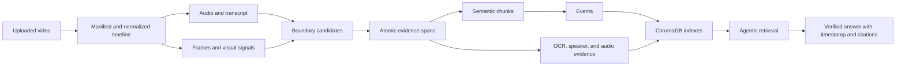
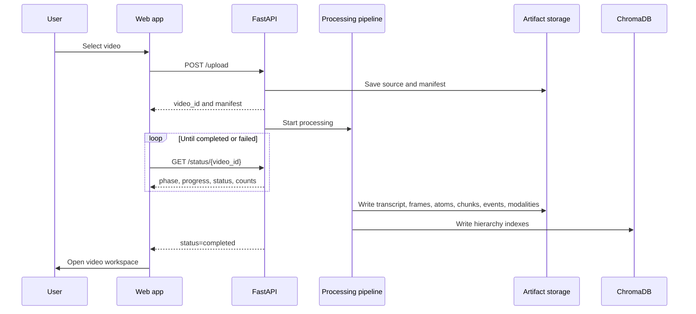

# VideoSceneRAG Frontend Product and Backend Visibility Specification

## Document Purpose

This document is the implementation brief for the frontend team building the
VideoSceneRAG user experience.

It explains:

- what the product does;
- which capabilities are implemented in the backend;
- what happens after a video is uploaded;
- which backend artifacts should be visible to users;
- how questions, timestamps, citations, OCR, speakers, and audio evidence should
  appear in the interface;
- which API endpoints exist now;
- which additional backend endpoints are required for a production frontend;
- the recommended routes, components, states, and delivery phases.

This is a product and engineering contract. It is not a marketing landing-page
brief.

---

## 1. Product Summary

VideoSceneRAG turns a long video into a structured, searchable timeline memory.

A user can upload a lecture, meeting, tutorial, presentation, or technical
video and later ask:

- "What is MCP?"
- "When did the speaker compare MCP with HTTP?"
- "What was written on the opening slide?"
- "What did the speaker explain after introducing the server?"
- "I remember a diagram about tools and context. Where was it?"

The system returns:

- a direct grounded answer;
- the primary timestamp;
- the supporting timeline window;
- citations tied to canonical video evidence;
- the evidence source type;
- confidence and answer-quality metadata;
- an explainable retrieval trace in debug mode.

The central product promise is:

> A user should be able to recover a precise moment from a long video even when
> their memory is incomplete, approximate, visual, or phrased differently from
> the transcript.

---

## 2. Product Capabilities

### 2.1 Implemented backend capabilities

| Capability | Current implementation |
| --- | --- |
| Video upload | FastAPI multipart upload |
| Media inspection | FFprobe-first manifest with OpenCV fallback |
| Stable identity | `video_id`, source SHA-256, pipeline version |
| Timeline normalization | Integer milliseconds |
| Audio extraction | Normalized audio artifact |
| Transcription | Faster Whisper transcript |
| Boundary detection | Duration, sentence, pause, scene, and visual signals |
| Atomic spans | Canonical, non-overlapping evidence intervals |
| Semantic chunks | Coherent groups of adjacent atoms |
| Events | Higher-level explanation/activity groups |
| Frames and clips | Atom-linked visual evidence |
| OCR | Frame-linked text, boxes, confidence, and temporal tracks |
| Speaker evidence | Speaker turns with transcript and atom links |
| Audio evidence | Speech, silence, transition, and audio-event intervals |
| Vector indexing | Hierarchical ChromaDB collections |
| Retrieval planning | Query-specific bounded retrieval plans |
| Retrieval fusion | Weighted reciprocal-rank fusion and reranking |
| Temporal reasoning | Previous/next atoms, chunks, events, repeated moments |
| Answerability | Answer, retry, abstain, clarify, or processing-incomplete |
| Grounded generation | Citation-preserving Gemini or local grounded generation |
| Claim verification | Unsupported claims are revised or removed |
| Confidence | Evidence-derived calibrated confidence |
| Evaluation | 60-question N10 regression and release workflow |

### 2.2 Research foundations already present

The repository also contains foundations for:

- vague-memory query parsing;
- visual/object/action/text memory matching;
- memory candidate ranking;
- knowledge dependency extraction;
- prerequisite learning-path reconstruction.

These should be exposed gradually after the core upload, processing, evidence,
and question-answering experience is stable.

### 2.3 Future capabilities

The following are planned, not complete production features:

- clip-native video-language-model understanding;
- learned semantic event segmentation;
- persistent world memory for entities, objects, actions, and relationships;
- cross-video retrieval;
- team workspaces and shared video libraries;
- production user accounts, quotas, billing, and organization controls;
- YouTube Chrome extension integration.

---

## 3. Audience

### Primary users

| Persona | Main job |
| --- | --- |
| Student | Recover an explanation from a long lecture |
| Researcher | Locate claims, comparisons, diagrams, and repeated concepts |
| Developer | Search technical tutorials and architecture discussions |
| Knowledge worker | Ask questions about recorded meetings or presentations |
| Reviewer | Verify an answer against exact video evidence |

### Internal users

| Persona | Main job |
| --- | --- |
| Pipeline engineer | Inspect stage outputs and processing failures |
| Retrieval engineer | Inspect query plans, candidates, and reranking |
| Evaluator | Compare answers with labeled timeline windows |
| Support engineer | Diagnose a failed upload or weak answer |

---

## 4. Experience Principles

1. **Evidence before decoration.** The video, timestamp, answer, and citation are
   the primary interface.
2. **Make processing understandable.** Show what the backend is building and why
   it matters.
3. **Never present weak evidence as certainty.** Reflect backend outcomes and
   confidence honestly.
4. **One click returns to the source.** Every citation should seek the video to
   the correct moment.
5. **Progress must be real.** Use backend phases and progress values, not a fake
   animation.
6. **Keep advanced diagnostics optional.** Normal users see evidence; developers
   can open a trace inspector.
7. **Preserve the timeline.** Milliseconds are the internal truth; formatted
   timestamps are display values.
8. **Do not hide abstention.** Unrelated, ambiguous, missing, and incomplete are
   distinct product states.

---

## 5. System Mental Model

The frontend should explain the backend as a hierarchy:



### User-facing vocabulary

Use these terms consistently:

| Backend term | Recommended user-facing label |
| --- | --- |
| Manifest | Video profile |
| Atomic span | Evidence segment |
| Semantic chunk | Topic segment |
| Event | Explanation or activity |
| Boundary signal | Segment boundary |
| Chroma collection | Search index |
| Retrieval candidate | Possible evidence |
| Evidence packet | Verified answer context |
| Corrective retrieval | Expanded search |
| Claim verification | Answer verification |

The developer/debug view may show the backend terms.

---

## 6. Video Ingestion Workflow

### 6.1 Request sequence



### 6.2 Current phase-to-UI mapping

The API currently reports a `phase`, `status`, and numeric `progress`.

| Progress | Backend phase | What is happening | Recommended UI label |
| ---: | --- | --- | --- |
| 0 | `uploaded` | Source saved and manifest created | Video received |
| 10 | `scene_detection` | Visual scene and change signals are sampled | Detecting visual changes |
| 20 | `audio_extraction` | Audio is normalized for speech and event analysis | Preparing audio |
| 30 | `transcription` | Speech is converted to timestamped text | Transcribing speech |
| 55 | `chunking_foundation` | Boundaries are merged and atomic spans built | Building evidence segments |
| 70 | `frame_extraction` | Timeline-linked representative frames are extracted | Extracting visual evidence |
| 78 | `evidence_foundation` | Transcript, frames, clips, and atoms become semantic chunks | Grouping topics |
| 84 | `hierarchy_indexing` | Events are built and hierarchy vectors are indexed | Building the search memory |
| 88 | `modality_foundation` | OCR, speaker turns, and audio events are generated | Reading slides and voices |
| 92 | `visual_analysis` | Additional visual enrichment is generated | Understanding visual context |
| 96 | `indexing` | Final compatibility index is written | Finalizing search indexes |
| 100 | `completed` | Required artifacts are available | Ready for questions |
| any | `failed` | A stage failed | Processing needs attention |

### 6.3 Processing screen behavior

The processing screen should contain:

- filename and duration;
- uploaded file size when available;
- current phase;
- real percentage;
- completed phase checklist;
- short explanation of the current phase;
- live artifact counters when returned;
- elapsed processing time;
- cancel button only after a cancel endpoint exists;
- retry button only after a retry endpoint exists;
- expandable technical details;
- clear failure message and recovery instruction.

Do not show every stage as complete merely because progress crossed a visual
threshold. Use the backend `phase` and artifact validation fields.

### 6.4 Counters currently returned during processing

Depending on pipeline progress, `/status/{video_id}` may include:

- `boundary_candidate_count`;
- `atom_count`;
- `atom_validation_passed`;
- `extracted_frame_count`;
- `frame_validation_passed`;
- `semantic_chunk_count`;
- `chunk_validation_passed`;
- `hierarchy_index_collections`;
- `modality_status`;
- `modality_errors`;
- `scope_profile_path`;
- `evidence_registry_path`.

Suggested display:

```text
81 evidence segments
19 topic segments
10 explanation events
373 timeline frames
4 search collections
OCR ready
Speaker timeline ready
Audio timeline ready
```

Do not expose local filesystem paths in the normal user interface.

---

## 7. Information Architecture

### Recommended routes

| Route | Purpose | Current support |
| --- | --- | --- |
| `/` | Redirect to library or upload | Frontend change |
| `/videos` | User video library | Requires list API |
| `/videos/new` | Upload and ingestion setup | `/upload` exists |
| `/videos/{video_id}/processing` | Processing progress | `/status` exists |
| `/videos/{video_id}` | Main video question workspace | `/ask` exists |
| `/videos/{video_id}/timeline` | Transcript/evidence timeline | Artifact APIs exist |
| `/videos/{video_id}/debug` | Retrieval trace inspector | `/ask-debug` exists |
| `/settings` | Model, privacy, and account settings | Future |

The existing `/upload` and `/chat` pages can be refactored into this structure.

---

## 8. Core Screens

## 8.1 Video library

Purpose:

- resume previous work;
- see processing status;
- distinguish ready, processing, failed, and stale videos;
- start a new upload.

Each row should show:

- thumbnail;
- source filename;
- duration;
- upload date;
- status;
- pipeline version;
- last question date;
- artifact readiness;
- overflow menu for retry, rebuild, export, or delete.

Backend addition required:

```text
GET /videos
DELETE /videos/{video_id}
POST /videos/{video_id}/retry
```

## 8.2 Upload screen

Required controls:

- drag-and-drop file input;
- supported-format message;
- source filename and file size;
- optional expected-speaker count;
- optional OCR language;
- processing profile selector;
- privacy/retention acknowledgement;
- upload progress;
- validation errors.

Suggested processing profiles:

| Profile | Description |
| --- | --- |
| Balanced | Atom coverage frames, transcript, OCR, speakers, audio, indexing |
| Fast transcript | Reduced frame and visual work |
| Visual detail | Denser frame sampling and OCR |
| Archive | All-frame extraction; storage intensive |

Only expose profiles after the upload API accepts those configuration fields.

## 8.3 Processing screen

Layout:

- top: video identity and total progress;
- center: vertical pipeline phase list;
- side panel: artifacts produced;
- bottom: technical log disclosure and failure recovery.

Use status colors semantically:

- neutral: queued;
- blue: active;
- green: validated;
- amber: completed with warnings;
- red: failed.

## 8.4 Main video workspace

Recommended desktop layout:

```text
┌──────────────────────────────────────────────────────────────┐
│ Header: video title, status, search, settings               │
├───────────────────────────────┬──────────────────────────────┤
│ Video player                  │ Conversation                 │
│                               │                              │
│ Timeline evidence tracks      │ Answer                      │
│ Transcript / OCR / events     │ Citations and confidence    │
├───────────────────────────────┴──────────────────────────────┤
│ Collapsible evidence inspector                              │
└──────────────────────────────────────────────────────────────┘
```

The workspace must support:

- play/pause and seek;
- click citation to seek;
- active transcript highlighting;
- question history;
- follow-up questions;
- answer outcome state;
- timestamp range;
- citation list;
- evidence source badges;
- confidence explanation;
- opening the evidence inspector;
- copying a timestamped share reference.

## 8.5 Timeline view

Recommended tracks:

| Track | Data |
| --- | --- |
| Transcript | Atomic transcript spans |
| Topics | Semantic chunks |
| Events | Explanation/activity intervals |
| Visual | Representative frames and scene changes |
| OCR | Stabilized visible-text tracks |
| Speakers | Speaker turns |
| Audio | Speech, silence, transitions, and events |

Timeline requirements:

- one shared millisecond coordinate system;
- zoom and pan;
- hover preview;
- click to seek;
- current-playhead marker;
- selected answer context window;
- highlighted primary evidence anchor;
- distinction between answer anchor and expanded context.

## 8.6 Evidence inspector

The evidence inspector should explain why an answer was returned.

Normal view:

- primary citation;
- exact interval;
- transcript excerpt;
- OCR text and source frame;
- frame thumbnail;
- parent topic/event;
- quality score;
- previous and next context.

Developer view:

- query classification;
- scope decision;
- retrieval plan;
- retrievers used;
- candidate counts;
- fused and reranked scores;
- rejected evidence reasons;
- corrective retrieval attempts;
- answerability decision;
- claim verification;
- confidence features;
- provider fallback information.

The developer view reads `/ask-debug`. It should never be enabled for
untrusted public users without authorization because traces may contain
operational details.

---

## 9. Question and Answer Experience

### 9.1 Request contract

```json
{
  "video_id": "mcp_vs_api",
  "query": "How is MCP compared to HTTP standardization?",
  "answer_mode": "strict_video",
  "conversation_context": [],
  "request_id": "optional-client-request-id"
}
```

Supported answer modes:

| Mode | UI behavior |
| --- | --- |
| `strict_video` | Use only selected-video evidence |
| `hybrid_assistant` | May route unrelated questions to general assistance |
| `clarify_when_ambiguous` | Prefer a clarification before retrieval |

The first production UI should default to `strict_video`.

### 9.2 Response contract

Important fields:

```json
{
  "outcome": "grounded_answer",
  "answer": "At around 05:21 ... [S1].",
  "video_id": "mcp_vs_api",
  "query": "How is MCP compared to HTTP standardization?",
  "timestamp": 321.36,
  "start_ms": 321360,
  "end_ms": 347847,
  "source_id": "event_000004",
  "source_type": "event",
  "parent_event_id": "event_000004",
  "confidence": 1.0,
  "citations": [],
  "answer_quality": {},
  "trace_id": "trace_...",
  "warnings": []
}
```

### 9.3 Outcome-to-interface policy

| Outcome | User-facing treatment |
| --- | --- |
| `grounded_answer` | Answer, timestamp, citations, confidence |
| `partial_answer` | Answer supported portion; show limitation |
| `video_evidence_not_found` | Explain that related evidence was insufficient |
| `unrelated_to_video` | State that the question is outside the selected video |
| `ambiguous_query` | Ask a focused clarification |
| `conflicting_evidence` | Show both moments and explain disagreement |
| `processing_incomplete` | Link to missing processing stage |
| `system_error` | Retry action and trace/reference ID |

Do not render every non-answer outcome as a generic red error.

### 9.4 Citation card

Every citation card should display:

- citation ID;
- formatted start and end timestamps;
- source type;
- source excerpt;
- visible-text or visual summary when present;
- quality indicator;
- parent event/topic where available;
- seek button;
- inspect evidence button.

The seek target is `start_ms / 1000`.

The UI should distinguish:

- **Evidence anchor:** exact moment supporting the answer;
- **Answer context:** wider interval used for reasoning;
- **Source interval:** full atom/chunk/event interval.

The public `/ask` response primarily exposes the citation anchor. The debug
trace contains the wider context.

### 9.5 Confidence display

Do not show confidence as an unexplained percentage alone.

Recommended labels:

| Score | Label |
| ---: | --- |
| 0.85-1.00 | Strong evidence |
| 0.65-0.84 | Good evidence |
| 0.45-0.64 | Limited evidence |
| below 0.45 | Insufficient evidence |

Also display reasons when returned:

- multiple verified evidence items;
- transcript and visual agreement;
- exact timestamp match;
- corrective retrieval used;
- fallback generator used;
- missing modality;
- claim verification reduced the answer.

---

## 10. Current API Inventory

| Method | Endpoint | Frontend use |
| --- | --- | --- |
| `POST` | `/upload` | Upload and start processing |
| `GET` | `/status/{video_id}` | Poll processing |
| `GET` | `/manifest/{video_id}` | Video profile and artifact readiness |
| `GET` | `/boundaries/{video_id}` | Boundary debug/timeline |
| `GET` | `/atoms/{video_id}` | Transcript evidence timeline |
| `GET` | `/atom-validation/{video_id}` | Validation debug |
| `GET` | `/frames/{video_id}` | Frame index and thumbnails |
| `GET` | `/frame-validation/{video_id}` | Frame validation debug |
| `GET` | `/visual-artifacts/{video_id}` | Atom visual evidence |
| `GET` | `/semantic-chunks/{video_id}` | Topic timeline |
| `GET` | `/chunk-validation/{video_id}` | Hierarchy validation debug |
| `GET` | `/events/{video_id}` | Event timeline |
| `POST` | `/ask` | Production question answering |
| `POST` | `/ask-debug` | Retrieval and answer trace |
| `GET` | `/data/...` | Development-only artifact/media serving |

### Current API limitations

- processing uses in-process background tasks;
- status is partly held in process memory;
- there is no authenticated video list;
- there is no cancel/retry/delete endpoint;
- there is no Server-Sent Events or WebSocket progress stream;
- local artifact paths may appear in raw debug artifacts;
- CORS is currently limited to local frontend origins;
- `/data` directly serves the local data directory and must not be exposed as-is
  in a multi-user production deployment;
- there is no user or tenant ownership model.

---

## 11. Required Production API Additions

### P0: Required before public frontend release

```text
GET    /health/live
GET    /health/ready
GET    /videos
GET    /videos/{video_id}
DELETE /videos/{video_id}
POST   /videos/{video_id}/retry
POST   /videos/{video_id}/cancel
GET    /videos/{video_id}/progress/stream
GET    /videos/{video_id}/artifacts/summary
GET    /media/{signed_media_id}
```

Required platform behavior:

- authenticated user identity;
- video ownership checks;
- durable job records;
- idempotent upload/processing requests;
- signed media access;
- pagination;
- API versioning;
- request limits;
- structured error codes.

### P1: Strongly recommended

```text
GET  /videos/{video_id}/timeline
GET  /videos/{video_id}/transcript
GET  /videos/{video_id}/citations/{evidence_id}
GET  /videos/{video_id}/traces/{trace_id}
POST /videos/{video_id}/reindex
POST /videos/{video_id}/questions
GET  /videos/{video_id}/questions
```

---

## 12. Frontend Data Models

Suggested TypeScript contracts:

```ts
export type ProcessingPhase =
  | "uploaded"
  | "scene_detection"
  | "audio_extraction"
  | "transcription"
  | "chunking_foundation"
  | "frame_extraction"
  | "evidence_foundation"
  | "hierarchy_indexing"
  | "modality_foundation"
  | "visual_analysis"
  | "indexing"
  | "completed"
  | "failed";

export type AskOutcome =
  | "grounded_answer"
  | "partial_answer"
  | "video_evidence_not_found"
  | "unrelated_to_video"
  | "ambiguous_query"
  | "conflicting_evidence"
  | "processing_incomplete"
  | "system_error";

export interface ProcessingStatus {
  status: string;
  progress: number;
  phase: ProcessingPhase;
  filename?: string;
  error?: string;
  atom_count?: number;
  extracted_frame_count?: number;
  semantic_chunk_count?: number;
  modality_status?: string;
  modality_errors?: string[];
}

export interface Citation {
  citation_id: string;
  evidence_id?: string;
  source_type: string;
  source_id: string;
  video_id?: string;
  start_ms?: number;
  end_ms?: number;
  text?: string;
  visual_summary?: string;
  evidence_anchor: Record<string, unknown>;
  answer_context_window: Record<string, unknown>;
  citation_interval: Record<string, unknown>;
  quality_score?: number;
  parent_chunk_id?: string;
  parent_event_id?: string;
}

export interface AskResponse {
  outcome: AskOutcome;
  answer: string;
  video_id: string;
  query: string;
  answer_mode: string;
  timestamp: number;
  start_ms?: number;
  end_ms?: number;
  source_id?: string;
  source_type: string;
  parent_event_id?: string;
  confidence: number;
  citations: Citation[];
  answer_quality: {
    grounded: boolean;
    has_timestamp: boolean;
    has_citations: boolean;
    uses_verified_evidence: boolean;
    requires_visual_followup: boolean;
    fallback_used: boolean;
    low_confidence_reason?: string;
    quality_score: number;
  };
  trace_id: string;
  warnings: string[];
}
```

The existing `web/src/lib/api.ts` contract is older and must be replaced with
the typed response above.

---

## 13. Component Architecture

Suggested component groups:

```text
web/src/
  app/
    videos/
    settings/
  components/
    upload/
      VideoDropzone
      UploadConfiguration
      UploadProgress
    processing/
      PipelineProgress
      PipelineStageRow
      ArtifactCounter
      ProcessingFailure
    workspace/
      VideoWorkspace
      VideoPlayer
      EvidenceTimeline
      TranscriptTrack
      TopicTrack
      EventTrack
    conversation/
      ConversationPanel
      QuestionComposer
      AnswerMessage
      OutcomeNotice
      ConfidenceIndicator
    evidence/
      CitationCard
      EvidenceInspector
      OcrFrameEvidence
      SpeakerEvidence
      AudioEvidence
    debug/
      QueryUnderstandingPanel
      RetrievalPlanPanel
      CandidateTable
      ClaimVerificationPanel
  lib/
    api/
      client.ts
      contracts.ts
      errors.ts
    timeline/
      format.ts
      coordinates.ts
    state/
      processing.ts
      conversation.ts
```

State ownership:

- server state: use a query/cache layer;
- upload state: local component plus resumable upload state;
- player time: workspace-level state;
- selected citation: workspace-level state;
- conversation history: route/video scoped;
- debug state: lazy-loaded and permission-gated.

---

## 14. Loading, Failure, and Recovery States

### Upload failures

Handle:

- unsupported type;
- empty file;
- network interruption;
- server size limit;
- duplicate source;
- FFprobe failure;
- insufficient storage.

### Processing failures

Show:

- failed phase;
- human-readable error;
- whether previous artifacts remain valid;
- retry-from-phase action when supported;
- support trace/reference ID.

### Question failures

Handle independently:

- request timeout;
- provider unavailable;
- embedding model unavailable;
- index unavailable;
- missing modality;
- weak evidence;
- ambiguous question;
- unrelated question.

The local grounded generator can preserve evidence when Gemini is unavailable.
The UI should not show a provider outage if the final answer is grounded and
verified; an operational warning may appear in the debug view.

---

## 15. Accessibility

Required:

- complete keyboard navigation;
- visible focus states;
- screen-reader labels for icon buttons;
- captions/transcript access;
- no color-only status communication;
- reduced-motion support;
- minimum WCAG AA contrast;
- timeline controls usable without precise pointer input;
- citations announced with start/end time and evidence type;
- error messages connected to their controls;
- dynamic processing updates announced through an appropriate live region.

---

## 16. Responsive Behavior

### Desktop

- video and conversation side by side;
- evidence timeline always available;
- inspector opens as a lower or right panel.

### Tablet

- video above conversation;
- evidence inspector as a drawer;
- timeline remains horizontally scrollable.

### Mobile

- video remains sticky at top when useful;
- tabs: Chat, Transcript, Evidence;
- citation cards use full width;
- timestamp controls remain reachable;
- debug view may be desktop-only.

Do not compress the desktop three-panel interface into unreadable nested cards.

---

## 17. Security and Privacy UI

The frontend must:

- never contain `GEMINI_API_KEY`;
- never expose local filesystem paths;
- never request Chroma credentials directly;
- use authenticated API requests in production;
- use signed URLs for media;
- show retention policy before upload;
- provide video deletion;
- avoid logging transcript/question content to third-party analytics by default;
- sanitize rendered model text;
- treat OCR and transcripts as untrusted text;
- clearly separate user-visible errors from internal traces.

---

## 18. Performance Requirements

Recommended targets:

| Interaction | Target |
| --- | ---: |
| Initial shell load | under 2.5 seconds on broadband |
| Citation seek | under 100 ms after player ready |
| Cached status refresh | under 500 ms |
| Question acknowledgement | immediate |
| First answer token/status | under 1 second if streaming is added |
| Timeline interaction | 60 FPS for normal videos |

Implementation guidance:

- virtualize long transcripts;
- lazy-load debug data;
- request timeline levels by visible range for long videos;
- cache immutable artifact summaries;
- avoid loading full-resolution frames until opened;
- use thumbnails for timeline tracks;
- abort stale question requests;
- preserve question input during network failure.

---

## 19. Testing Strategy

### Component tests

- phase mapping;
- outcome rendering;
- citation timestamp formatting;
- confidence labels;
- processing failure actions;
- transcript active-segment behavior.

### Integration tests

- upload to processing route;
- status polling to completion;
- ask and seek to citation;
- ambiguous question clarification;
- unrelated-question abstention;
- OCR answer opens the correct frame;
- provider fallback still renders citations.

### End-to-end tests

Use Playwright for:

- desktop, tablet, and mobile;
- keyboard-only operation;
- upload and status flow with mocked long-running phases;
- completed `mcp_vs_api` question suite subset;
- no overlapping or clipped interface elements;
- video seek accuracy;
- reconnect after API restart.

### Contract tests

Generate frontend types from the FastAPI OpenAPI schema or validate fixtures
against the Pydantic response models. Do not maintain an independent,
incompatible response shape.

---

## 20. Delivery Phases

### F0: Contract alignment

- replace old frontend API types;
- add a shared error model;
- map all answer outcomes;
- centralize API base URL;
- add contract fixtures.

Done when the frontend can render every current `/ask` outcome.

### F1: Upload and truthful processing

- rebuild upload screen;
- create processing route;
- map actual backend phases;
- expose artifact counters;
- handle failed processing.

Done when a user understands what the backend is doing without opening logs.

### F2: Evidence-first question workspace

- build stable video/chat layout;
- render answer metadata;
- make citations seek the player;
- show confidence and limitations;
- preserve conversation state.

Done when every grounded answer can be verified from the interface.

### F3: Timeline and artifact explorer

- transcript track;
- topic/event tracks;
- frame/OCR evidence;
- speaker/audio tracks;
- zoom, pan, and active playhead.

Done when users can navigate the hierarchy without asking a question.

### F4: Explainability and debug mode

- `/ask-debug` integration;
- retrieval plan;
- candidate and rejection tables;
- claim verification;
- confidence feature view.

Done when an engineer can diagnose a weak answer from the UI.

### F5: Production account experience

- authentication;
- video library;
- ownership;
- quotas;
- deletion and retention;
- retry/cancel;
- audit and support references.

Done when multiple users can safely use one deployment.

---

## 21. Frontend Definition of Done

The frontend is ready for production when:

- upload, progress, completion, and failure are fully represented;
- every backend phase has accurate user-facing copy;
- every `/ask` outcome has a distinct interface state;
- citations seek to the primary evidence anchor;
- transcript, OCR, speaker, audio, chunk, and event evidence can be inspected;
- no secret or local path is exposed;
- the API contract is generated or contract-tested;
- desktop and mobile workflows pass;
- accessibility checks pass;
- video ownership and media authorization are enforced;
- end-to-end tests cover ingestion and grounded question answering;
- the frontend deployment uses HTTPS and the production API origin.

---

## 22. Handoff Checklist

Before design begins:

- [ ] Review the current `/upload`, `/status`, `/ask`, and `/ask-debug` payloads.
- [ ] Agree on the P0 production API additions.
- [ ] Confirm the first supported video formats and maximum size.
- [ ] Confirm retention and deletion policy.
- [ ] Confirm whether speaker count and OCR language are user-configurable.
- [ ] Choose the production authentication provider.
- [ ] Define whether debug mode is internal-only.
- [ ] Decide whether the first release uses local media URLs or object storage.
- [ ] Agree on the timeline performance strategy for videos longer than three hours.
- [ ] Build visual designs around evidence verification, not a marketing dashboard.
