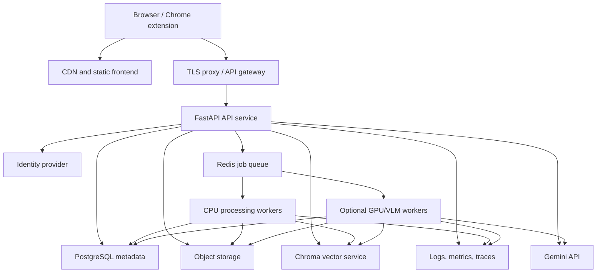

# VideoSceneRAG Production Deployment Runbook

## Document Purpose

This document defines how to deploy VideoSceneRAG as a complete, usable video
RAG service.

It covers:

- the current runtime;
- production-readiness gaps;
- a single-server Docker deployment;
- a scalable cloud deployment;
- storage, ChromaDB, workers, models, secrets, security, backup, monitoring,
  CI/CD, validation, and rollback;
- the minimum work required before public users are allowed to upload videos.

The commands and container definitions in this document describe the target
deployment architecture. The repository does not yet contain the production
Dockerfiles, durable worker queue, authentication, or object-storage adapter.
Those must be implemented before the public-production checklist can pass.

---

## 1. Current Runtime

The current project runs as:

```text
Next.js static frontend
        |
        v
FastAPI / Uvicorn
        |
        +-- in-process video background task
        +-- local JSON artifacts
        +-- local frames, clips, and audio
        +-- local persistent ChromaDB
        +-- local Hugging Face embedding cache
        +-- Gemini API for optional generation/visual enrichment
```

This is appropriate for:

- local development;
- one-machine demonstrations;
- research experiments;
- a trusted single-user pilot.

It is not yet appropriate for untrusted public multi-user traffic because:

- processing jobs run inside the API process;
- active processing status is partly stored in memory;
- a process restart can interrupt a job;
- `/data` exposes local runtime files;
- there is no authentication or tenant isolation;
- uploads do not have production quotas;
- there is no durable retry/cancel mechanism;
- dependencies are not fully pinned;
- there are no production health endpoints;
- embedded Chroma and local artifacts constrain horizontal scaling.

---

## 2. Deployment Profiles

## 2.1 Profile A: Local developer

Use for:

- development;
- tests;
- the `mcp_vs_api` demonstration;
- one user.

Components:

- backend on `127.0.0.1:8001`;
- Next.js dev server on `127.0.0.1:3000`;
- local artifacts;
- embedded ChromaDB.

## 2.2 Profile B: Single-server production pilot

Use for:

- a research lab;
- a small internal team;
- controlled uploads;
- limited concurrent processing.

Components:

- reverse proxy with TLS;
- static frontend container;
- one FastAPI API container;
- one processing-worker container;
- Redis job queue;
- Chroma server container with persistent volume;
- S3-compatible object storage or a protected persistent media volume;
- PostgreSQL for users, videos, jobs, and ownership;
- optional NVIDIA GPU access for the worker.

## 2.3 Profile C: Scalable cloud production

Use for:

- public users;
- multiple organizations;
- concurrent long-video processing;
- autoscaling and high availability.

Components:

- CDN-hosted frontend;
- API service replicas;
- durable queue;
- separate CPU and GPU worker pools;
- object storage;
- managed PostgreSQL;
- managed Chroma or independently scaled Chroma server;
- centralized logs, metrics, and traces;
- identity provider;
- secrets manager;
- WAF, rate limiting, and audit controls.

---

## 3. Target Production Architecture



### Service responsibilities

| Service | Responsibility |
| --- | --- |
| Frontend | Upload, progress, video workspace, evidence UI |
| API | Authentication, authorization, contracts, signed media, questions |
| Worker | Long-running media processing and indexing |
| PostgreSQL | Users, videos, jobs, ownership, status, versions |
| Redis | Durable job dispatch and retry coordination |
| Object storage | Source videos, audio, frames, clips, artifacts |
| Chroma | Atom, chunk, visual, and event vectors |
| Gemini | Optional grounded generation and visual enrichment |
| Observability | Logs, metrics, traces, alerts |

---

## 4. Hardware Planning

### CPU-only pilot

Recommended minimum:

```text
8 CPU cores
32 GB RAM
200 GB SSD
Linux x86_64
```

This supports transcription and indexing but long-video processing may be slow.

### GPU pilot

Recommended:

```text
12+ CPU cores
64 GB RAM
NVIDIA GPU with 12 GB+ VRAM
500 GB NVMe SSD
```

An RTX 3050 6 GB can run the current base pipeline and smaller local models with
careful settings, but it is not a comfortable production target for large
clip-native VLMs. Use hosted Gemini or a larger GPU worker for those models.

### Storage estimation

Budget per uploaded hour:

| Artifact | Approximate range |
| --- | ---: |
| Source video | source dependent |
| Normalized audio | 60-700 MB |
| Atom-coverage frames | 100 MB-2 GB |
| All frames | tens or hundreds of GB |
| Clips | 0.5-5 GB |
| JSON artifacts | 5-100 MB |
| Chroma vectors | 10-500 MB |

Do not enable all-frame extraction as the public default.

---

## 5. Required External Tools

The worker image must contain:

- FFmpeg and FFprobe;
- Tesseract OCR and required language packs;
- Python runtime;
- system libraries required by OpenCV;
- model/runtime libraries from `requirement.txt`;
- optional NVIDIA Container Toolkit support for GPU workers.

Startup checks must verify:

```text
ffmpeg -version
ffprobe -version
tesseract --version
python -c "import cv2, chromadb, sentence_transformers"
```

---

## 6. Environment Variables

### Required application settings

```env
APP_ENV=production
PORT=8001
PUBLIC_WEB_ORIGIN=https://app.example.com
API_PUBLIC_URL=https://api.example.com

GEMINI_API_KEY=secret
GEMINI_MODEL=gemini-3-flash-preview

HIERARCHY_EMBED_MODEL=BAAI/bge-base-en-v1.5
HF_HOME=/models/huggingface
HF_HUB_OFFLINE=1
TRANSFORMERS_OFFLINE=1
TRANSFORMERS_NO_TF=1
USE_TF=0

FFMPEG_PATH=/usr/bin/ffmpeg
FFPROBE_PATH=/usr/bin/ffprobe
TESSERACT_PATH=/usr/bin/tesseract

DATABASE_URL=postgresql+psycopg://...
REDIS_URL=redis://redis:6379/0
CHROMA_HOST=chroma
CHROMA_PORT=8000

OBJECT_STORAGE_ENDPOINT=https://...
OBJECT_STORAGE_BUCKET=videoscenerag
OBJECT_STORAGE_ACCESS_KEY=secret
OBJECT_STORAGE_SECRET_KEY=secret

JWT_ISSUER=https://identity.example.com/
JWT_AUDIENCE=videoscenerag-api
```

### Processing settings

```env
FRAME_EXTRACTION_MODE=atom_coverage
FRAME_INTERVAL_MS=2000
MAX_UPLOAD_BYTES=10737418240
MAX_VIDEO_DURATION_MS=14400000
MAX_CONCURRENT_CPU_JOBS=2
MAX_CONCURRENT_GPU_JOBS=1
ARTIFACT_RETENTION_DAYS=30
TRACE_RETENTION_DAYS=14
```

### Secret rules

- never put secrets in `NEXT_PUBLIC_*` variables;
- never commit `.env`;
- store `GEMINI_API_KEY` only in the backend/worker secret store;
- rotate leaked keys immediately;
- use separate secrets for development, staging, and production;
- scope object-storage credentials to the required bucket;
- encrypt secrets at rest and in transit.

Google's Gemini guidance requires API keys to remain server-side.

---

## 7. Storage Layout

### Local development layout

```text
data/
  uploads/
  processed/
    manifests/
    transcripts/
    boundaries/
    atoms/
    semantic_chunks/
    events/
    frames/
    clips/
    ocr/
    speakers/
    audio_events/
    reports/
    retrieval_traces/
chroma_db/
```

### Production object layout

```text
videos/{tenant_id}/{video_id}/source/{filename}
videos/{tenant_id}/{video_id}/manifest/manifest.json
videos/{tenant_id}/{video_id}/audio/audio.wav
videos/{tenant_id}/{video_id}/transcript/transcript.json
videos/{tenant_id}/{video_id}/timeline/boundaries.json
videos/{tenant_id}/{video_id}/timeline/atoms.json
videos/{tenant_id}/{video_id}/timeline/chunks.json
videos/{tenant_id}/{video_id}/timeline/events.json
videos/{tenant_id}/{video_id}/frames/{frame_id}.jpg
videos/{tenant_id}/{video_id}/clips/{atom_id}.mp4
videos/{tenant_id}/{video_id}/modalities/ocr.json
videos/{tenant_id}/{video_id}/modalities/speakers.json
videos/{tenant_id}/{video_id}/modalities/audio_events.json
videos/{tenant_id}/{video_id}/reports/{report_name}.json
```

The manifest remains the logical source of truth, but production artifact
references should be storage URIs or artifact IDs, not machine-local paths.

---

## 8. Required Code Changes Before Container Deployment

### D0: Dependency lock

- rename or mirror `requirement.txt` as `requirements.txt`;
- pin compatible package versions;
- record Python and Node versions;
- create reproducible lock files;
- verify CPU and GPU dependency variants.

### D1: Runtime configuration

- replace hard-coded CORS origins with environment configuration;
- replace hard-coded local data mount behavior;
- add environment validation;
- add liveness and readiness endpoints;
- add structured JSON logging.

### D2: Durable jobs

- move `process_pipeline` out of FastAPI background tasks;
- introduce a durable job table and queue;
- implement idempotency and leases;
- implement retry, cancel, and resume-from-phase;
- persist every progress update.

### D3: Storage abstraction

- create artifact repository interfaces;
- implement local and object-storage backends;
- use signed media URLs;
- stop exposing `/data` publicly;
- enforce tenant/video ownership.

### D4: Chroma service mode

- make Chroma client configuration environment-driven;
- support `chromadb.HttpClient`;
- persist Chroma data;
- add heartbeat/readiness;
- version collections and rebuild safely.

### D5: Authentication and tenancy

- validate JWTs;
- add `tenant_id` and `owner_id`;
- authorize every video, artifact, trace, and question;
- add quotas and rate limits;
- implement deletion and retention.

### D6: Observability

- request IDs and trace IDs;
- processing job IDs;
- structured phase timings;
- OpenTelemetry;
- metrics and alerts;
- error reporting without transcript leakage.

---

## 9. Container Images

### Backend/worker image requirements

Build from an official Python image rather than the deprecated historical
FastAPI base image.

Target Dockerfile outline:

```dockerfile
FROM python:3.12-slim

ENV PYTHONDONTWRITEBYTECODE=1 \
    PYTHONUNBUFFERED=1 \
    TRANSFORMERS_NO_TF=1 \
    USE_TF=0

RUN apt-get update && apt-get install -y --no-install-recommends \
    ffmpeg \
    tesseract-ocr \
    tesseract-ocr-eng \
    libgl1 \
    libglib2.0-0 \
    && rm -rf /var/lib/apt/lists/*

WORKDIR /app
COPY requirements.txt .
RUN pip install --no-cache-dir -r requirements.txt

COPY . .
CMD ["python", "-m", "uvicorn", "api:app", "--host", "0.0.0.0", "--port", "8001"]
```

Use one Uvicorn process per container when replication is controlled by the
platform. The API should not run media-processing jobs.

### Frontend image

The current Next.js configuration uses `output: "export"`. `npm run build`
creates static files under `web/out`.

Target outline:

```dockerfile
FROM node:20-alpine AS build
WORKDIR /web
COPY web/package*.json ./
RUN npm ci
COPY web/ .
ARG NEXT_PUBLIC_API_BASE_URL
ENV NEXT_PUBLIC_API_BASE_URL=$NEXT_PUBLIC_API_BASE_URL
RUN npm run build

FROM nginx:alpine
COPY --from=build /web/out /usr/share/nginx/html
```

Because the project currently uses a Next.js `basePath`, the reverse proxy and
static paths must preserve:

```text
/RAG-Enhanced-Video-Scene-Understanding
```

The frontend team may remove the base path for a dedicated production domain.

---

## 10. Single-Server Docker Compose Target

Target services:

```yaml
services:
  proxy:
    image: caddy:2
    depends_on: [frontend, api]
    ports: ["80:80", "443:443"]

  frontend:
    build:
      context: .
      dockerfile: deploy/frontend.Dockerfile

  api:
    build:
      context: .
      dockerfile: deploy/backend.Dockerfile
    command: python -m uvicorn api:app --host 0.0.0.0 --port 8001
    depends_on: [postgres, redis, chroma]

  worker:
    build:
      context: .
      dockerfile: deploy/backend.Dockerfile
    command: python -m src.pipeline.jobs.worker
    depends_on: [postgres, redis, chroma]

  postgres:
    image: postgres:17
    volumes: [postgres_data:/var/lib/postgresql/data]

  redis:
    image: redis:7-alpine
    volumes: [redis_data:/data]

  chroma:
    image: chromadb/chroma
    volumes: [chroma_data:/data]

  object-storage:
    image: minio/minio
    command: server /data --console-address ":9001"
    volumes: [object_data:/data]

volumes:
  postgres_data:
  redis_data:
  chroma_data:
  object_data:
```

Production Compose files must add:

- secrets;
- health checks;
- restart policies;
- resource limits;
- private networks;
- backups;
- TLS domain configuration;
- pinned image versions;
- no public ports for PostgreSQL, Redis, Chroma, or object storage.

---

## 11. Deployment Procedure

### 11.1 Prepare

1. Provision a Linux host.
2. Attach persistent SSD storage.
3. Install Docker Engine and Compose.
4. Configure DNS.
5. Configure firewall rules.
6. Install NVIDIA Container Toolkit when using GPU workers.
7. Create production secrets.
8. Create object-storage bucket.
9. Configure database backups.

### 11.2 Build

```bash
git clone https://github.com/fazmina11/temporal-reasoning-and-intelligent-video-understanding-platform.git
cd temporal-reasoning-and-intelligent-video-understanding-platform
git checkout <release-tag>
docker compose build
```

### 11.3 Start dependencies

```bash
docker compose up -d postgres redis chroma object-storage
docker compose ps
```

Verify:

```bash
curl http://chroma:8000/api/v2/heartbeat
```

### 11.4 Initialize

Run one controlled initialization task:

- database migrations;
- bucket validation;
- Chroma collection validation;
- model-cache validation;
- artifact-schema validation.

### 11.5 Start application

```bash
docker compose up -d api worker frontend proxy
docker compose ps
```

### 11.6 Smoke test

Verify:

```text
GET  /health/live
GET  /health/ready
POST /upload
GET  /status/{video_id}
POST /ask
POST /ask-debug (authorized internal user only)
```

Use a small known fixture before accepting user uploads.

---

## 12. Model Preparation

The default hierarchy embedding model is:

```text
BAAI/bge-base-en-v1.5
```

Production choices:

### Pre-baked model image

Advantages:

- predictable startup;
- no runtime download;
- works in restricted networks.

Trade-off:

- larger image.

### Persistent model volume

Advantages:

- smaller application image;
- model can be upgraded independently.

Trade-off:

- first deployment requires controlled download.

Do not let every API replica download its own model at startup.

Recommended release process:

1. download and checksum the approved model;
2. run embedding compatibility tests;
3. record the embedding version in index metadata;
4. build/rebuild indexes when the embedding version changes;
5. set offline mode in production.

---

## 13. ChromaDB Deployment

Development uses local persistent Chroma.

Production options:

| Option | Use |
| --- | --- |
| Embedded persistent client | single-process local development |
| Chroma server container | single-server pilot |
| Managed Chroma/cloud vector service | scalable production |

The official Chroma server image stores data under `/data` and supports an HTTP
client. Production must:

- mount persistent storage;
- keep the service on a private network;
- configure authentication/authorization where supported;
- back up the volume;
- record index versions;
- support safe rebuilds;
- health-check before API readiness.

Do not allow public direct access to Chroma.

---

## 14. Security Controls

### Network

- HTTPS only;
- HSTS;
- private service network;
- WAF/rate limiting;
- restricted admin endpoints;
- no public Redis/PostgreSQL/Chroma ports.

### Application

- JWT validation;
- tenant authorization;
- file type and size validation;
- content-length limits;
- decompression-bomb protection;
- request timeouts;
- safe filenames and generated object keys;
- no shell interpolation of user input;
- prompt-injection-aware evidence handling;
- HTML sanitization in the frontend.

### Data

- encryption at rest;
- signed media URLs;
- retention and deletion;
- tenant-scoped object keys;
- no raw traces for normal users;
- transcript/question redaction in logs;
- immutable audit records for deletion/reindex operations.

### AI providers

- Gemini key is server-side only;
- provider errors do not expose secrets;
- provider requests follow the declared privacy policy;
- local grounded fallback remains evidence-bound;
- unsupported claims are filtered before response.

---

## 15. Backup and Restore

Back up:

- PostgreSQL;
- object storage;
- Chroma persistent data;
- pipeline/version configuration;
- release threshold configuration.

Do not rely on:

- Redis queue state as the only job record;
- local container filesystems;
- retrieval traces as canonical artifacts.

Recommended policy:

| Data | Backup |
| --- | --- |
| PostgreSQL | daily full plus point-in-time recovery |
| Object storage | versioning and lifecycle rules |
| Chroma | scheduled volume snapshot/export |
| Secrets | managed secret-store recovery |
| Configuration | Git release tag |

Restore test:

1. restore database;
2. restore object artifacts;
3. restore or rebuild Chroma;
4. validate manifest-to-artifact references;
5. run hierarchy validation;
6. run a known QA smoke set.

---

## 16. Observability

### Logs

Every log should include:

```text
request_id
trace_id
job_id
video_id
tenant_id
phase
pipeline_version
index_version
duration_ms
outcome
```

### Metrics

Track:

- uploads started/completed/failed;
- processing duration by phase;
- queue depth and oldest job;
- worker CPU/GPU/memory;
- artifact storage growth;
- Chroma latency and failures;
- `/ask` latency by retrieval strategy;
- answer outcomes;
- corrective retrieval rate;
- fallback/provider failure rate;
- citation validity;
- unsupported-claim rate;
- low-confidence rate.

### Alerts

Alert on:

- API not ready;
- queue stalled;
- repeated phase failure;
- storage nearing capacity;
- Chroma unavailable;
- provider error spike;
- fallback-rate spike;
- citation-validity regression;
- backup failure.

---

## 17. CI/CD

### Pull request checks

```text
python -m compileall -q api.py src/pipeline
python -m unittest discover -s tests -v
python -m pytest tests/test_evaluation_integration.py -q
python -m src.pipeline.evaluation.validate_dataset --file data/evaluation/qa_sets/mcp_vs_api_qa.json
cd web && npm ci && npm run typecheck && npm run build
dependency and container vulnerability scan
secret scan
```

### Release checks

```text
N10 release decision = pass
zero mandatory gate failures
database migration dry run
container smoke test
known-video upload and question smoke test
backup verified
rollback image available
```

### Promotion

```text
feature branch
 -> pull request
 -> test environment
 -> staging
 -> N10 and smoke validation
 -> immutable release tag
 -> production canary
 -> full production
```

---

## 18. Rollback

Keep:

- previous API and worker images;
- previous frontend artifact;
- database migration rollback plan;
- previous pipeline/index version;
- immutable object artifacts;
- Chroma rebuild procedure.

Rollback rules:

- frontend can roll back independently;
- API and worker must remain contract compatible;
- never point old code at an incompatible new index without version checks;
- do not delete old artifacts until the rollback window closes;
- stop new jobs before schema rollback;
- allow in-flight jobs to finish only when versions are compatible.

---

## 19. Production Validation

### Infrastructure

- [ ] TLS certificate valid.
- [ ] Private services are not internet-accessible.
- [ ] Persistent volumes survive restart.
- [ ] Backups and restore have been tested.
- [ ] Secrets are loaded from a secret manager.
- [ ] Model cache is present.
- [ ] FFmpeg, FFprobe, and Tesseract pass checks.

### Application

- [ ] Health endpoints pass.
- [ ] Authentication and ownership checks pass.
- [ ] Upload limits work.
- [ ] Processing survives API restart.
- [ ] Worker retry is bounded.
- [ ] Signed media expires.
- [ ] Deletion removes metadata, media, artifacts, and vectors.
- [ ] `/ask-debug` is restricted.

### RAG quality

- [ ] N10 mandatory gates pass.
- [ ] Citation windows seek correctly.
- [ ] OCR questions do not incorrectly return processing-incomplete.
- [ ] Provider failure preserves grounded citations.
- [ ] Unsupported claims are removed.
- [ ] Unrelated questions receive no fake video citation.

---

## 20. Recommended Implementation Sequence

1. Dependency lock and health checks.
2. Storage abstraction.
3. PostgreSQL job/video records.
4. Redis worker separation.
5. Chroma HTTP configuration.
6. Authentication and authorization.
7. Signed media delivery.
8. Dockerfiles and Compose.
9. Observability and backup.
10. Staging deployment.
11. Frontend production integration.
12. N10 plus end-to-end release validation.

---

## 21. Official References

- Next.js static exports:
  https://nextjs.org/docs/app/guides/static-exports
- FastAPI containers:
  https://fastapi.tiangolo.com/deployment/docker/
- Chroma Docker deployment:
  https://docs.trychroma.com/guides/deploy/docker
- Chroma server configuration:
  https://docs.trychroma.com/reference/server-env-vars
- Gemini API key guidance:
  https://ai.google.dev/gemini-api/docs/api-key
