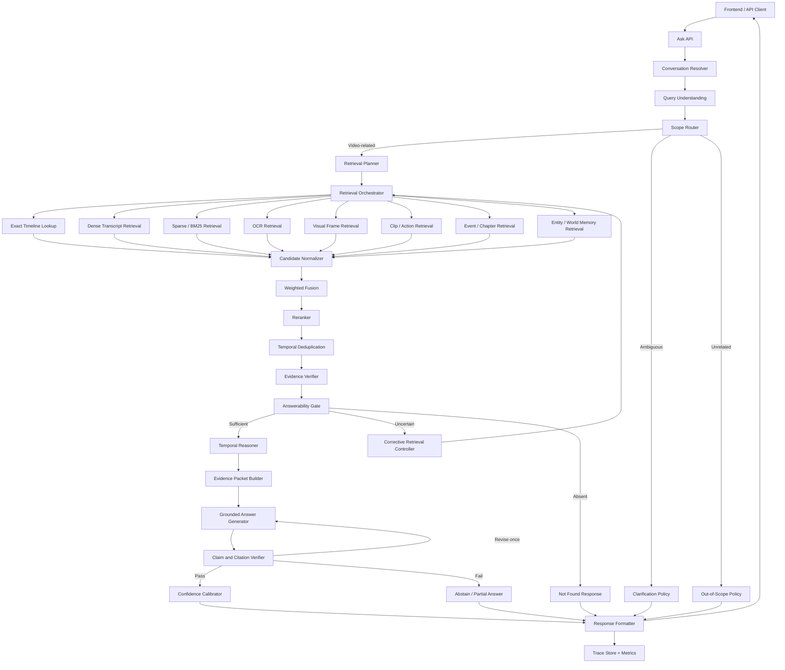

# VideoSceneRAG Production Architecture v2

## Agentic Retrieval, Answerability Detection, Temporal Reasoning, Grounded Answers, and Out-of-Scope Handling

**Document status:** Implementation blueprint  
**Target system:** VideoSceneRAG  
**Primary objective:** Retrieve the correct video evidence, produce citation-grounded answers, and safely handle questions that are missing from or unrelated to the selected video.  
**Recommended implementation style:** Deterministic workflow orchestration with bounded LLM-assisted agents, typed state, persistent traces, and regression evaluation.

---

## 1. Executive Summary

VideoSceneRAG should not behave as a generic chatbot that happens to have a vector database. It should behave as an **evidence-controlled video intelligence system**.

The system must make four decisions in order:

1. **What is the user asking?**
2. **Is the question about the selected video, and is it answerable from available video evidence?**
3. **Which evidence layers and temporal windows should be searched?**
4. **Can the final answer be supported claim-by-claim by retrieved evidence?**

The production flow is:

```text
User Question
  -> Conversation Resolver
  -> Query Understanding
  -> Scope Router
  -> Retrieval Planner
  -> Parallel Multimodal Retrieval
  -> Candidate Fusion
  -> Reranking and Deduplication
  -> Evidence Sufficiency Gate
       -> sufficient: temporal reasoning
       -> uncertain: corrective retrieval loop
       -> absent: video-not-found response
       -> unrelated: configured out-of-scope route
  -> Evidence Packet Builder
  -> Grounded Answer Generator
  -> Claim and Citation Verifier
       -> valid: return answer
       -> invalid: revise once or abstain
  -> Confidence Calibration
  -> API Response and Retrieval Trace
```

The most important architectural change is the introduction of a **pre-generation Answerability and Scope Gate**. The system must not ask the answer model to improvise when retrieval is weak.

---

## 2. Design Principles

### 2.1 Evidence before generation

The answer generator receives only verified evidence. Raw vector search results are not automatically trusted.

### 2.2 Retrieval is hierarchical

Search can operate over:

```text
atomic spans -> semantic chunks -> events -> chapters -> entities/world memory
```

The selected level depends on the query.

### 2.3 Retrieval is multimodal

Keep transcript, OCR, visual, clip, audio-event, entity, and temporal representations separate. Fuse rankings later rather than forcing every modality into one generated caption.

### 2.4 Agents are bounded components

Do not implement every stage as a free-form autonomous LLM agent. Use a typed workflow or state machine. LLMs may classify, rewrite, summarize, or verify, but the orchestrator owns control flow, limits, schemas, and retry rules.

### 2.5 Abstention is a successful outcome

A correct “not found in this video” response is better than a plausible hallucination.

### 2.6 General knowledge must be explicitly labeled

When hybrid assistant mode is enabled, an answer based on general model knowledge must never look like a video-grounded answer. It must have a different source type and no fake video citations.

### 2.7 Every decision is traceable

For every question, store:

- parsed query;
- selected route;
- retrieval plan;
- raw candidates;
- fusion and reranking scores;
- rejected evidence and reasons;
- answerability decision;
- generated claims;
- claim verification;
- final response;
- model and index versions.

---

## 3. System Modes for Unrelated or Unanswerable Questions

The product must support an explicit policy. Do not hide this behavior inside prompts.

### 3.1 Strict video mode

```yaml
out_of_scope_policy: abstain
```

Behavior:

- If the question is unrelated to the video, say that it is outside the selected video.
- If the question is related but evidence is absent, say it could not be found in the video.
- Do not answer from general model knowledge.

Recommended for:

- compliance;
- education assessment;
- evidence review;
- legal or medical video analysis;
- research evaluation.

### 3.2 Hybrid assistant mode

```yaml
out_of_scope_policy: general_answer
```

Behavior:

- First attempt video-grounded retrieval.
- If the query is clearly unrelated, route it to the general assistant.
- Return a visible source label such as `general_knowledge`.
- Never attach video timestamps or video citations to the general answer.

Recommended for:

- consumer video assistants;
- learning applications;
- general-purpose media chat.

### 3.3 Clarification mode

```yaml
out_of_scope_policy: ask_clarification
```

Behavior:

- Use when the query could refer either to the video or to general knowledge.
- Ask one focused clarification.

Example:

```text
User: What is Python?
System: Do you want the explanation given in this video, or a general explanation?
```

### 3.4 Per-request override

The API should allow:

```json
{
  "video_id": "video_001",
  "query": "Who invented Python?",
  "answer_mode": "strict_video"
}
```

Allowed values:

```text
strict_video
hybrid_assistant
clarify_when_ambiguous
```

---

## 4. Question Outcome Taxonomy

Every question must end in exactly one primary outcome.

| Outcome | Meaning | User-facing behavior |
|---|---|---|
| `grounded_answer` | Strong video evidence exists | Answer with timestamps and citations |
| `partial_answer` | Only part of the request is supported | Answer supported part and state limitation |
| `video_evidence_not_found` | Query is about the video but evidence is absent | State that the video does not contain enough reliable evidence |
| `unrelated_to_video` | Query is semantically outside the selected video | Abstain, answer generally, or clarify according to policy |
| `ambiguous_query` | Multiple interpretations or missing reference | Ask one clarification or show likely matches |
| `conflicting_evidence` | Retrieved modalities or moments disagree | Explain uncertainty and show competing moments |
| `processing_incomplete` | Required modality or index is not ready | State which processing stage is incomplete |
| `system_error` | Retrieval/generation failed after fallbacks | Return a safe error contract with trace ID |

Do not use one generic `low_confidence` outcome for all failure types.

---

## 5. High-Level Production Architecture



---

## 6. Typed Workflow State

Use one typed state object passed through the workflow.

```python
from dataclasses import dataclass, field
from typing import Any, Literal

Outcome = Literal[
    "grounded_answer",
    "partial_answer",
    "video_evidence_not_found",
    "unrelated_to_video",
    "ambiguous_query",
    "conflicting_evidence",
    "processing_incomplete",
    "system_error",
]

@dataclass
class AgenticRAGState:
    trace_id: str
    request_id: str
    video_id: str
    raw_query: str
    answer_mode: str

    conversation_context: list[dict[str, Any]] = field(default_factory=list)
    resolved_query: dict[str, Any] | None = None
    query_understanding: dict[str, Any] | None = None
    scope_decision: dict[str, Any] | None = None
    retrieval_plan: dict[str, Any] | None = None

    raw_candidates: list[dict[str, Any]] = field(default_factory=list)
    fused_candidates: list[dict[str, Any]] = field(default_factory=list)
    reranked_candidates: list[dict[str, Any]] = field(default_factory=list)
    verified_evidence: list[dict[str, Any]] = field(default_factory=list)

    corrective_attempt: int = 0
    answerability: dict[str, Any] | None = None
    temporal_context: dict[str, Any] | None = None
    evidence_packet: dict[str, Any] | None = None

    draft_answer: dict[str, Any] | None = None
    claim_verification: dict[str, Any] | None = None
    confidence: dict[str, Any] | None = None

    outcome: Outcome | None = None
    response: dict[str, Any] | None = None
    warnings: list[str] = field(default_factory=list)
    errors: list[dict[str, Any]] = field(default_factory=list)
```

Rules:

- Each node reads and writes only declared fields.
- Validate every LLM output against a schema.
- A failed schema validation triggers one repair attempt, then deterministic fallback.
- The workflow has a maximum number of retrieval and generation loops.

---

## 7. Phase R1: Conversation and Reference Resolution

### Purpose

Resolve follow-ups before query classification.

Example:

```text
Turn 1: Where does he explain MCP?
Turn 2: What does he say after that?
```

The second query must become something like:

```text
What does the speaker say after the previously identified MCP explanation near 00:05:00?
```

### Inputs

- current query;
- last N turns;
- last cited moments;
- selected video ID;
- active entity and topic memory.

### Output

```json
{
  "standalone_query": "What does the speaker say after the MCP explanation near 00:05:00?",
  "resolved_references": {
    "that": {
      "source_id": "chunk_000008",
      "start_ms": 299925,
      "end_ms": 335965
    }
  },
  "resolution_confidence": 0.93,
  "needs_clarification": false
}
```

### Rules

- Do not rewrite a query if no follow-up reference exists.
- Do not silently switch videos.
- If two previous moments are equally likely, mark ambiguity.
- Keep the raw query unchanged in the trace.

---

## 8. Phase R2: Query Understanding

### 8.1 Query type taxonomy

Support multi-label classification:

```text
definition
concept
exact_quote
exact_timestamp
approximate_timestamp
visual_memory
action_memory
ocr_or_slide_text
speaker_question
before_after
cause_effect
comparison
repeated_concept
summary
chapter_summary
entity_tracking
follow_up
cross_video
system_or_help
unrelated_or_general
unsafe_or_disallowed
unknown
```

### 8.2 Extracted query fields

```json
{
  "query_id": "query_001",
  "raw_query": "I remember he drew a blue graph but forgot why",
  "standalone_query": "Why did the speaker draw the blue graph?",
  "query_types": ["visual_memory", "cause_effect"],
  "entities": ["blue graph"],
  "persons": [],
  "objects": ["graph"],
  "attributes": ["blue"],
  "actions": ["draw"],
  "quoted_phrases": [],
  "ocr_hints": [],
  "time_constraints": [],
  "temporal_relations": ["before", "during", "after"],
  "requested_granularity": "event",
  "required_modalities": ["visual", "transcript"],
  "requires_multi_moment_reasoning": true,
  "classification_confidence": 0.91
}
```

### 8.3 Implementation strategy

Use layered parsing:

1. deterministic timestamp and quote parser;
2. lexicon/rule detection for visual, temporal, comparison, and summary cues;
3. lightweight local classifier or LLM structured classification;
4. merge outputs under deterministic precedence rules.

Do not allow classification failure to block retrieval. Unknown queries use a safe broad plan.

---

## 9. Phase R3: Scope Router

The scope router decides whether retrieval should be attempted and whether the question is related to the selected video.

### 9.1 Required signals

- similarity between query and video-level summary;
- similarity between query and chapter/event summaries;
- exact named entity overlap;
- selected video metadata;
- conversation context;
- query type;
- whether the query is a system/help question;
- a lightweight probe retrieval result.

### 9.2 Two-stage scope detection

#### Stage A: Pre-retrieval routing

Classify obvious cases:

```text
"How do I upload another video?" -> system_or_help
"What is today's weather?" -> unrelated_or_general
"What did he say at 3:15?" -> video_related
```

#### Stage B: Post-probe validation

For uncertain queries, run a small probe retrieval over:

- video summary;
- chapter summaries;
- event summaries;
- named entities.

Then classify:

```text
video_related
probably_video_related
ambiguous
unrelated
```

### 9.3 Scope decision schema

```json
{
  "scope": "video_related",
  "confidence": 0.88,
  "reasons": [
    "entity appears in event summaries",
    "query requests speaker action"
  ],
  "policy_action": "retrieve_video"
}
```

### 9.4 Important distinction

These are different:

```text
unrelated_to_video
```

The question is about another subject.

```text
video_evidence_not_found
```

The question appears to concern the video, but no sufficient evidence exists.

The response and evaluation metrics must keep them separate.

---

## 10. Phase R4: Retrieval Planner

The planner creates a bounded executable plan. It must not return arbitrary tool calls.

### 10.1 Plan schema

```json
{
  "plan_id": "plan_001",
  "strategy": "visual_causal_memory_recovery",
  "retrieval_steps": [
    {
      "retriever": "visual_dense",
      "level": "atomic_span",
      "query": "blue graph being drawn",
      "top_k": 30,
      "weight": 1.5
    },
    {
      "retriever": "ocr_sparse",
      "level": "atomic_span",
      "query": "blue graph",
      "top_k": 20,
      "weight": 1.1
    },
    {
      "retriever": "event_dense",
      "level": "event",
      "query": "reason for drawing a blue graph",
      "top_k": 15,
      "weight": 1.2
    },
    {
      "retriever": "transcript_hybrid",
      "level": "semantic_chunk",
      "query": "why graph comparison explanation",
      "top_k": 30,
      "weight": 1.0
    }
  ],
  "context_policy": {
    "direction": "both",
    "max_previous_atoms": 3,
    "max_next_atoms": 4,
    "include_parent_event": true,
    "max_context_ms": 180000
  },
  "requires_reranking": true,
  "requires_temporal_reasoning": true,
  "max_corrective_attempts": 2,
  "answer_mode": "strict_video"
}
```

### 10.2 Fixed strategy templates

Use configuration-backed templates:

| Query type | Primary retrieval | Secondary retrieval | Context |
|---|---|---|---|
| exact timestamp | interval lookup | adjacent atoms | narrow |
| exact quote | BM25/full text | dense transcript | sentence window |
| definition | chunks | events, atoms | parent event |
| visual memory | visual/clip | OCR, events, transcript | before + after |
| action memory | clip/action | visual frames, transcript | action window |
| before/after | event/chunk anchor | adjacency lookup | directional |
| comparison | events/chunks for both entities | chapters | multi-moment |
| summary | chapter/event summaries | representative evidence | broad |
| repeated concept | entity/world memory | event search | multiple moments |

### 10.3 Planner guardrails

- maximum retrievers per request;
- maximum candidates per retriever;
- maximum corrective loops;
- maximum context duration;
- no cross-video search unless explicitly allowed;
- no general-web retrieval in strict video mode;
- deterministic fallback plan if LLM planner fails.

---

## 11. Phase R5: Retrieval Sources

### 11.1 Exact timeline retriever

Use interval lookup before vector search for exact or approximate times.

```sql
SELECT *
FROM atomic_spans
WHERE video_id = :video_id
  AND start_ms <= :target_ms
  AND end_ms >= :target_ms;
```

For approximate timestamps, search a bounded range.

### 11.2 Dense transcript retriever

Search transcript and transcript-aware summaries.

Good for:

- concepts;
- paraphrases;
- explanations;
- semantic memory.

### 11.3 Sparse/BM25 retriever

Good for:

- exact terms;
- names;
- code symbols;
- acronyms;
- quotations;
- OCR text.

### 11.4 OCR retriever

Maintain normalized OCR tokens and raw OCR text.

Store:

- text;
- confidence;
- bounding boxes;
- frame timestamp;
- persistence duration;
- slide/screen identifier.

### 11.5 Visual frame retriever

Use image-text embeddings for objects, colors, scenes, diagrams, and visual attributes.

### 11.6 Clip/action retriever

Use clip-level video-language embeddings or generated action descriptions for motion and temporal actions.

### 11.7 Audio-event retriever

Use for non-speech events:

```text
applause
alarm
music
explosion
barking
footsteps
silence
laughter
```

Do not duplicate transcript embeddings under an “audio” label.

### 11.8 Event and chapter retrievers

Use event-level descriptions for complete explanations and chapter-level descriptions for broad summaries.

### 11.9 Entity and world-memory retriever

Use explicit relationships for repeated people, objects, concepts, and long-range returns.

Example:

```text
entity_blue_graph
  APPEARS_IN event_010
  REPRESENTS concept_feature_comparison
  RETURNS_IN event_014
```

---

## 12. Canonical Candidate Evidence Schema

Normalize every retriever output.

```json
{
  "candidate_id": "cand_000001",
  "video_id": "video_001",
  "source_type": "semantic_chunk",
  "source_id": "chunk_000008",
  "start_ms": 299925,
  "end_ms": 335965,
  "parent_event_id": "event_000004",
  "parent_chapter_id": "chapter_000002",
  "text": "The speaker explains MCP as a protocol layer...",
  "transcript": "...",
  "visual_summary": "A protocol diagram is displayed.",
  "ocr_text": ["MCP", "Tools", "Context"],
  "entities": ["MCP", "tools", "context"],
  "media_refs": {
    "frames": ["..."],
    "clip": "..."
  },
  "retrieval": {
    "retriever": "transcript_dense",
    "raw_score": 0.76,
    "rank": 2,
    "query_variant": "MCP protocol reasoning"
  },
  "versions": {
    "pipeline": "2.0.0",
    "index": "idx_20260722_a1",
    "embedding": "text_v3"
  }
}
```

Never pass backend-specific result formats beyond the retrieval adapter layer.

---

## 13. Query Expansion Without Semantic Drift

Use query expansion selectively.

### 13.1 Safe expansions

- spelling normalization;
- acronym expansion using video entities;
- coreference resolution;
- entity aliases from the video;
- decomposition of comparison and temporal questions;
- visual phrase conversion.

Example:

```text
"blue graph"
-> "blue chart"
-> "blue diagram"
-> "graph drawn in blue"
```

### 13.2 Risky expansions

Hypothetical-answer expansion can introduce facts not present in the video. If used:

- mark it as a retrieval-only query variant;
- never treat the hypothetical text as evidence;
- limit its fusion weight;
- log it in the trace.

### 13.3 Multi-query deduplication

Each retriever may receive several query variants, but results must be collapsed by canonical source ID before fusion.

---

## 14. Fusion, Reranking, and Temporal Deduplication

### 14.1 Weighted Reciprocal Rank Fusion

Do not directly add cosine scores produced by different models.

Use:

\[
RRF(d)=\sum_r \frac{w_r}{k + rank_r(d)}
\]

Recommended starting value:

```yaml
rrf_k: 60
```

Weights come from the retrieval plan.

### 14.2 Optional score normalization

Within each retriever, keep:

- percentile rank;
- min-max normalized score;
- z-score where stable;
- top-score margin.

These become features for answerability calibration, not universal cross-model scores.

### 14.3 Reranking

Use a query-type-specific reranker:

```text
text cross-encoder -> transcript and OCR queries
vision-language reranker -> visual questions
clip-text reranker -> action questions
structured heuristic reranker -> exact timestamp and entity queries
```

### 14.4 Reranker output

```json
{
  "candidate_id": "cand_000001",
  "rerank_score": 0.91,
  "relevance_label": "high",
  "matched_query_aspects": ["blue", "graph", "draw", "reason"],
  "missing_query_aspects": [],
  "contradictions": []
}
```

### 14.5 Temporal duplicate suppression

Use temporal Intersection over Union:

\[
tIoU(A,B)=\frac{|A\cap B|}{|A\cup B|}
\]

Starting policy:

```yaml
merge_tiou_threshold: 0.70
suppress_tiou_threshold: 0.85
```

Also compare semantic similarity. Two overlapping items may be retained when they provide different modalities.

---

## 15. Phase R6: Evidence Verification

Verification has two layers.

### 15.1 Structural verification

Check:

- correct video ID;
- valid timeline;
- current index and pipeline versions;
- valid parent references;
- source artifact exists;
- media paths exist when cited;
- candidate text or visual evidence is non-empty;
- user has access to the source;
- no corrupt or incomplete processing status.

### 15.2 Semantic verification

Check whether each candidate supports at least one required query aspect.

Required aspects for:

```text
"Why did he draw the blue graph?"
```

could be:

```text
object: graph
action: draw
attribute: blue
causal explanation: why/reason
```

A frame showing a blue graph supports the visual memory but not the reason. It should be retained as partial evidence, not mistaken for a complete answer.

### 15.3 Verification schema

```json
{
  "candidate_id": "cand_000001",
  "verified": true,
  "support_level": "partial",
  "supported_aspects": ["graph", "blue", "draw"],
  "unsupported_aspects": ["reason"],
  "evidence_types": ["visual", "ocr"],
  "rejection_reason": null
}
```

### 15.4 Rejection reasons

```text
wrong_video
access_denied
stale_index
invalid_timeline
missing_source
missing_media
empty_evidence
query_mismatch
duplicate_weaker_candidate
contradictory_metadata
processing_incomplete
```

---

## 16. Phase R7: Answerability and Evidence Sufficiency Gate

This is the central reliability component.

### 16.1 Purpose

Decide **before generation** whether the retrieved evidence is sufficient.

### 16.2 Answerability features

#### Retrieval features

- top reranker score;
- score margin between top candidates;
- number of strong candidates;
- number of unique temporal moments;
- retrieval agreement across retrievers;
- query-entity coverage;
- required-aspect coverage.

#### Evidence features

- transcript support;
- visual support;
- OCR support;
- action/clip support;
- event completeness;
- temporal consistency;
- source diversity;
- processing quality.

#### Risk features

- contradictory evidence;
- ambiguous multiple matches;
- low ASR/OCR confidence;
- missing required modality;
- query outside video summary/entities;
- only hypothetical-query matches;
- stale index or fallback retrieval.

### 16.3 Separate scores

Do not use one score for everything.

```json
{
  "scope_score": 0.93,
  "retrieval_coverage": 0.88,
  "evidence_sufficiency": 0.84,
  "ambiguity_risk": 0.12,
  "contradiction_risk": 0.03,
  "answerability_score": 0.86
}
```

### 16.4 Three-zone decision policy

Starting thresholds must be calibrated on your QA set.

```yaml
answerability:
  answer_threshold: 0.72
  retry_threshold: 0.42
```

Policy:

```text
score >= 0.72
  -> answer

0.42 <= score < 0.72
  -> corrective retrieval or clarification

score < 0.42
  -> abstain / route out-of-scope
```

Do not treat these initial values as universal truth.

### 16.5 Answerability output

```json
{
  "decision": "corrective_retrieval",
  "answerability_score": 0.61,
  "missing_aspects": ["causal explanation"],
  "strongest_evidence": ["cand_000014"],
  "ambiguity": false,
  "recommended_action": {
    "expand_after_ms": 90000,
    "search_retrievers": ["transcript_hybrid", "event_dense"],
    "query_variants": ["reason for the graph", "graph used to explain"]
  }
}
```

---

## 17. Phase R8: Corrective Retrieval Controller

Corrective retrieval is a bounded retry, not an infinite agent loop.

### 17.1 Trigger conditions

- missing query aspects;
- weak top-score margin;
- evidence found only in one modality;
- visual anchor found but explanation missing;
- quote found but speaker/context missing;
- multiple conflicting moments;
- event boundary likely too narrow.

### 17.2 Corrective actions

```text
rewrite query using video vocabulary
search missing modality
expand temporal window
search parent event or chapter
search adjacent events
search entity aliases
increase top-k within limits
decompose multi-part question
switch from chunk to event retrieval
switch from event to atomic evidence
```

### 17.3 Retry budget

```yaml
corrective_retrieval:
  max_attempts: 2
  max_total_candidates: 180
  max_total_context_ms: 300000
```

Each retry must have a specific reason and must not repeat an identical plan.

### 17.4 Stop rules

Stop when:

- answerability passes;
- no new canonical evidence is found;
- retry budget is exhausted;
- the missing modality was not processed;
- evidence conflict cannot be resolved.

---

## 18. Phase R9: Temporal Reasoning

### 18.1 Responsibilities

- sort evidence by timeline;
- determine primary and supporting moments;
- expand before/after context according to query;
- group evidence into events;
- connect repeated concepts;
- detect causal setup and consequence;
- distinguish same event from later return;
- create a compact timeline representation.

### 18.2 Query-dependent expansion

| Question | Expansion policy |
|---|---|
| exact quote | sentence atom ± one atom |
| what happened at time | containing atom + parent chunk |
| why | setup before + anchor + explanation after + event |
| what happened next | anchor + next chunks/events |
| compare | best event for each subject |
| repeated concept | all high-confidence entity-linked events |
| summary | chapter/event hierarchy, not raw atoms |

### 18.3 Temporal context schema

```json
{
  "primary_moment": {
    "source_id": "chunk_000008",
    "start_ms": 299925,
    "end_ms": 335965,
    "reason": "contains the direct explanation"
  },
  "setup_moments": [
    {
      "source_id": "atom_000141",
      "start_ms": 287000,
      "end_ms": 299925,
      "reason": "introduces the problem"
    }
  ],
  "followup_moments": [
    {
      "source_id": "atom_000148",
      "start_ms": 335965,
      "end_ms": 349000,
      "reason": "provides the comparison conclusion"
    }
  ],
  "related_later_moments": [],
  "timeline_summary": "The speaker introduces the integration problem, presents MCP as the protocol layer, and then contrasts it with direct API access.",
  "requires_multi_moment_answer": true
}
```

### 18.4 No fabricated causality

Temporal order alone does not prove cause. The reasoner may label:

```text
explicit_cause
strongly_implied
sequence_only
unknown
```

The answer generator must use language matching that level.

---

## 19. Phase R10: Evidence Packet Builder

The answer model receives a compact structured packet.

```json
{
  "question": "Why did he draw the blue graph?",
  "query_types": ["visual_memory", "cause_effect"],
  "answer_mode": "strict_video",
  "answerability": {
    "decision": "answer",
    "score": 0.86
  },
  "timeline": {
    "primary_start_ms": 9676200,
    "primary_end_ms": 9802000,
    "summary": "The graph is introduced, drawn, then interpreted."
  },
  "evidence": [
    {
      "citation_id": "S1",
      "source_id": "atom_000145",
      "source_type": "atomic_span",
      "start_ms": 9676200,
      "end_ms": 9682400,
      "transcript": "We can visualize the difference between these features...",
      "visual_summary": "The lecturer draws a blue graph and points to the curve.",
      "ocr_text": ["Feature Comparison"],
      "supports": ["graph", "blue", "draw", "reason"]
    }
  ],
  "constraints": {
    "use_only_evidence": true,
    "cite_every_factual_claim": true,
    "allow_partial_answer": true,
    "allow_general_knowledge": false
  }
}
```

### Packet size control

- include highest-value evidence first;
- remove duplicate transcript;
- preserve exact timestamps;
- include only relevant OCR;
- include summaries for supporting moments, raw transcript for primary moments;
- maintain token and temporal budgets.

---

## 20. Phase R11: Grounded Answer Generation

### 20.1 Generator rules

The generator must:

- answer directly;
- use only the supplied evidence in strict mode;
- cite every externally verifiable video claim;
- distinguish observation from inference;
- state uncertainty visibly;
- avoid saying “the video says” without a citation;
- not create timestamps;
- not cite evidence IDs absent from the packet;
- return structured JSON.

### 20.2 Output schema

```json
{
  "answer": "The blue graph appears around 02:41:16. The lecturer uses it to visualize how the two groups differ across features, then explains the curve immediately afterward. [S1]",
  "claims": [
    {
      "claim_id": "C1",
      "text": "The blue graph appears around 02:41:16.",
      "citation_ids": ["S1"],
      "claim_type": "visual_observation"
    },
    {
      "claim_id": "C2",
      "text": "It is used to visualize feature differences.",
      "citation_ids": ["S1"],
      "claim_type": "explicit_explanation"
    }
  ],
  "primary_citation_id": "S1",
  "limitations": []
}
```

### 20.3 Generation fallback

If the external LLM is unavailable:

1. use a local structured extractive answer;
2. preserve citations and timestamps;
3. do not reduce evidence rules;
4. mark `generation_mode: local_fallback`;
5. apply a confidence penalty only when the fallback reduces answer completeness.

---

## 21. Phase R12: Claim and Citation Verification

Generation is not the final step.

### 21.1 Claim verification flow

```text
Draft answer
  -> parse claims
  -> verify cited IDs exist
  -> check timestamp consistency
  -> check evidence entailment/support
  -> check unsupported details
  -> check answer addresses query
  -> approve, revise once, or abstain
```

### 21.2 Verification labels

```text
entailed
partially_supported
not_supported
contradicted
not_verifiable
```

### 21.3 Citation checks

- citation exists in evidence packet;
- citation source belongs to selected video;
- timestamps match stored source;
- citation actually supports the adjacent claim;
- no citation is attached only because it shares keywords;
- all central answer claims have support.

### 21.4 Revision policy

One revision is allowed when:

- unsupported optional details can be removed;
- wording is stronger than evidence;
- citation assignment is incomplete;
- the answer omitted a supported limitation.

Abstain or return a partial answer when the core claim is unsupported.

### 21.5 Verification output

```json
{
  "passed": true,
  "claim_results": [
    {
      "claim_id": "C1",
      "label": "entailed",
      "supporting_citations": ["S1"]
    }
  ],
  "citation_precision": 1.0,
  "claim_coverage": 1.0,
  "unsupported_claim_count": 0,
  "revision_required": false
}
```

---

## 22. Phase R13: Confidence and Calibration

### 22.1 Separate confidence dimensions

```json
{
  "scope_confidence": 0.93,
  "retrieval_confidence": 0.88,
  "evidence_confidence": 0.86,
  "temporal_confidence": 0.91,
  "grounding_confidence": 0.95,
  "overall_confidence": 0.89
}
```

### 22.2 Heuristic baseline

Until enough evaluation data exists:

\[
C = 0.20S + 0.20R + 0.25E + 0.10T + 0.25G - P
\]

Where:

- `S`: scope confidence;
- `R`: retrieval confidence;
- `E`: evidence sufficiency;
- `T`: temporal consistency;
- `G`: claim grounding;
- `P`: ambiguity, contradiction, stale-index, or fallback penalties.

### 22.3 Calibrated production model

After collecting labeled queries, train a simple calibration model using features from the retrieval trace:

- logistic regression;
- isotonic regression;
- gradient-boosted classifier.

Predict:

```text
P(final answer is fully supported)
```

Measure:

- Brier score;
- Expected Calibration Error;
- reliability diagrams;
- risk-coverage curve.

### 22.4 User-facing confidence

Use categories:

```text
High
Moderate
Low
```

The API may return numeric confidence for debugging, but the UI should avoid false precision.

---

## 23. Response Contracts

### 23.1 Grounded video answer

```json
{
  "outcome": "grounded_answer",
  "answer": "The speaker introduces MCP as a protocol layer that connects tools and context to the model reasoning layer. [S1]",
  "source_scope": "selected_video",
  "video_id": "mcp_vs_api",
  "primary_moment": {
    "start_ms": 299925,
    "end_ms": 335965,
    "display_timestamp": "00:04:59"
  },
  "citations": [
    {
      "citation_id": "S1",
      "source_id": "chunk_000008",
      "source_type": "semantic_chunk",
      "start_ms": 299925,
      "end_ms": 335965,
      "preview": "The speaker explains MCP as a protocol layer..."
    }
  ],
  "related_moments": [],
  "confidence": {
    "label": "High",
    "score": 0.89
  },
  "trace_id": "trace_20260722_001530_ab12"
}
```

### 23.2 Video-related but not found

```json
{
  "outcome": "video_evidence_not_found",
  "answer": "I could not find reliable evidence in this video that answers that question.",
  "source_scope": "selected_video",
  "video_id": "mcp_vs_api",
  "citations": [],
  "confidence": {
    "label": "Low",
    "score": 0.19
  },
  "reason": "no_verified_evidence_after_corrective_retrieval",
  "suggested_action": "Try different wording or check whether the topic appears in another video.",
  "trace_id": "trace_..."
}
```

### 23.3 Unrelated question in strict mode

```json
{
  "outcome": "unrelated_to_video",
  "answer": "That question does not appear to be related to the selected video, so I cannot answer it from this video's evidence.",
  "source_scope": "selected_video",
  "citations": [],
  "policy": "strict_video",
  "trace_id": "trace_..."
}
```

### 23.4 Unrelated question in hybrid mode

```json
{
  "outcome": "grounded_answer",
  "answer": "Python was created by Guido van Rossum and first released in 1991.",
  "source_scope": "general_knowledge",
  "video_id": null,
  "citations": [],
  "video_retrieval": {
    "attempted": false,
    "reason": "query_classified_as_unrelated"
  },
  "policy": "hybrid_assistant",
  "trace_id": "trace_..."
}
```

The frontend must visually distinguish `general_knowledge` from `selected_video`.

### 23.5 Partial answer

```json
{
  "outcome": "partial_answer",
  "answer": "The video shows the blue graph and explains that it represents feature differences. I could not verify the second part of your question about the training dataset. [S1]",
  "source_scope": "selected_video",
  "citations": ["S1"],
  "unanswered_parts": ["which training dataset was used"],
  "trace_id": "trace_..."
}
```

### 23.6 Ambiguous query

```json
{
  "outcome": "ambiguous_query",
  "answer": "I found two different blue graphs in the video. Do you mean the comparison graph near 02:41 or the evaluation graph near 02:58?",
  "candidate_moments": [
    {"start_ms": 9676000, "label": "comparison graph"},
    {"start_ms": 10720000, "label": "evaluation graph"}
  ],
  "trace_id": "trace_..."
}
```

---

## 24. API Design

### 24.1 Ask endpoint

```http
POST /v2/videos/{video_id}/ask
```

Request:

```json
{
  "query": "Why did he draw the blue graph?",
  "answer_mode": "strict_video",
  "session_id": "session_001",
  "include_related_moments": true,
  "debug": false
}
```

### 24.2 Debug endpoint

```http
POST /v2/videos/{video_id}/ask-debug
```

Returns:

- conversation resolution;
- query understanding;
- scope decision;
- retrieval plan;
- raw retriever outputs;
- fused and reranked candidates;
- verification results;
- answerability features;
- corrective attempts;
- temporal context;
- evidence packet;
- draft answer;
- claim verification;
- confidence features.

### 24.3 Trace endpoint

```http
GET /v2/retrieval-traces/{trace_id}
```

Access must be restricted because traces may contain transcript and user-query data.

### 24.4 Evaluation endpoint

```http
POST /v2/videos/{video_id}/evaluate
```

### 24.5 Processing status

```http
GET /v2/videos/{video_id}/processing-status
```

This allows the answer pipeline to return `processing_incomplete` instead of pretending an absent visual index is a negative result.

---

## 25. Configuration

```yaml
agentic_rag:
  workflow_version: "2.0.0"

  answer_mode_default: strict_video
  out_of_scope_policy: abstain

  conversation:
    max_turns: 6
    reference_resolution_threshold: 0.72

  planner:
    max_retrievers: 6
    max_query_variants: 4
    default_top_k: 30
    max_top_k: 60

  fusion:
    algorithm: weighted_rrf
    rrf_k: 60

  reranking:
    enabled: true
    max_candidates: 50
    final_candidates: 10

  deduplication:
    merge_tiou_threshold: 0.70
    suppress_tiou_threshold: 0.85
    semantic_similarity_threshold: 0.92

  context:
    max_context_ms: 300000
    max_primary_evidence: 4
    max_supporting_evidence: 6

  answerability:
    answer_threshold: 0.72
    retry_threshold: 0.42
    minimum_strong_evidence: 1
    minimum_query_aspect_coverage: 0.70

  corrective_retrieval:
    enabled: true
    max_attempts: 2
    max_total_candidates: 180

  generation:
    max_revision_attempts: 1
    require_structured_output: true
    local_fallback_enabled: true

  citations:
    required_for_video_claims: true
    require_primary_timestamp: true

  tracing:
    enabled: true
    store_prompt_preview: false
    redact_sensitive_text: true
```

All thresholds must be loaded from configuration and reported in evaluation artifacts.

---

## 26. Storage Architecture

### 26.1 Source of truth

Use a relational database for canonical records:

```text
videos
processing_runs
atomic_spans
semantic_chunks
events
chapters
entities
entity_occurrences
temporal_relations
retrieval_traces
qa_evaluations
```

### 26.2 Object storage

Store:

```text
original videos
normalized videos
audio
frames
clips
waveforms
optional thumbnails
```

### 26.3 Vector database

Recommended logical indexes:

```text
timeline_text_dense
timeline_text_sparse
timeline_visual
timeline_clip
timeline_ocr
audio_events
events
chapters
entities
```

Each vector record must include:

```text
video_id
canonical_source_id
source_type
start_ms
end_ms
pipeline_version
index_version
access_scope
quality flags
```

### 26.4 ChromaDB path

ChromaDB is acceptable for the first implementation. Use metadata filtering to restrict by video ID, source type, time range, version, and processing state.

### 26.5 Optional Qdrant migration

Qdrant becomes useful when you want:

- named vectors in one canonical point;
- dense and sparse fusion in the database;
- multi-stage queries;
- grouped results;
- larger-scale filtering and deployment.

Hide the vector database behind repository interfaces so migration does not affect the workflow.

---

## 27. Repository Structure

```text
VideoSceneRAG/
├── api/
│   ├── routes/
│   │   ├── ask.py
│   │   ├── traces.py
│   │   ├── evaluation.py
│   │   └── processing.py
│   ├── schemas/
│   │   ├── requests.py
│   │   └── responses.py
│   └── dependencies.py
│
├── src/
│   ├── agentic_rag/
│   │   ├── workflow.py
│   │   ├── state.py
│   │   ├── policies.py
│   │   ├── conversation_resolver.py
│   │   ├── query_understanding.py
│   │   ├── scope_router.py
│   │   ├── retrieval_planner.py
│   │   ├── retrieval_orchestrator.py
│   │   ├── candidate_fusion.py
│   │   ├── reranker.py
│   │   ├── temporal_deduplicator.py
│   │   ├── evidence_verifier.py
│   │   ├── answerability_gate.py
│   │   ├── corrective_retrieval.py
│   │   ├── temporal_reasoner.py
│   │   ├── evidence_packet.py
│   │   ├── answer_generator.py
│   │   ├── claim_verifier.py
│   │   ├── confidence_calibrator.py
│   │   └── response_formatter.py
│   │
│   ├── retrieval/
│   │   ├── base.py
│   │   ├── timeline.py
│   │   ├── transcript_dense.py
│   │   ├── transcript_sparse.py
│   │   ├── ocr.py
│   │   ├── visual.py
│   │   ├── clip.py
│   │   ├── audio_events.py
│   │   ├── events.py
│   │   ├── chapters.py
│   │   └── entities.py
│   │
│   ├── repositories/
│   │   ├── video_repository.py
│   │   ├── timeline_repository.py
│   │   ├── vector_repository.py
│   │   ├── trace_repository.py
│   │   └── evaluation_repository.py
│   │
│   ├── models/
│   │   ├── query.py
│   │   ├── plan.py
│   │   ├── evidence.py
│   │   ├── answerability.py
│   │   ├── answer.py
│   │   └── trace.py
│   │
│   ├── observability/
│   │   ├── logging.py
│   │   ├── metrics.py
│   │   ├── tracing.py
│   │   └── redaction.py
│   │
│   └── evaluation/
│       ├── dataset.py
│       ├── retrieval_metrics.py
│       ├── answer_metrics.py
│       ├── abstention_metrics.py
│       ├── calibration_metrics.py
│       └── regression_runner.py
│
├── config/
│   ├── agentic_rag.yaml
│   ├── retrieval_profiles.yaml
│   ├── model_registry.yaml
│   └── thresholds.yaml
│
├── data/
│   ├── processed/
│   │   ├── retrieval_traces/
│   │   ├── reports/
│   │   └── evals/
│   └── fixtures/
│
├── tests/
│   ├── unit/
│   ├── integration/
│   ├── regression/
│   ├── contract/
│   └── fixtures/
│
└── docs/
    ├── agentic_retrieval_architecture.md
    ├── response_contracts.md
    ├── evaluation_protocol.md
    └── operations_runbook.md
```

`workflow.py` coordinates stages. It must not contain retrieval, verification, or scoring business logic.

---

## 28. Workflow Pseudocode

```python
async def answer_video_question(request: AskRequest) -> AskResponse:
    state = initialize_state(request)

    state.resolved_query = await conversation_resolver.resolve(state)
    state.query_understanding = await query_understander.parse(state)
    state.scope_decision = await scope_router.route(state)

    if state.scope_decision["policy_action"] == "clarify":
        return response_formatter.clarification(state)

    if state.scope_decision["policy_action"] == "general_answer":
        return await general_answer_route(state)

    if state.scope_decision["policy_action"] == "abstain_unrelated":
        return response_formatter.unrelated(state)

    state.retrieval_plan = await planner.create_plan(state)

    while True:
        new_candidates = await orchestrator.execute(state.retrieval_plan, state)
        state.raw_candidates.extend(new_candidates)

        state.fused_candidates = fusion.fuse(state.raw_candidates, state)
        state.reranked_candidates = await reranker.rank(state.fused_candidates, state)
        state.reranked_candidates = deduplicator.collapse(state.reranked_candidates)
        state.verified_evidence = await verifier.verify(state.reranked_candidates, state)
        state.answerability = await answerability_gate.evaluate(state)

        decision = state.answerability["decision"]

        if decision == "answer":
            break

        if decision == "corrective_retrieval" and state.corrective_attempt < MAX_ATTEMPTS:
            state.corrective_attempt += 1
            state.retrieval_plan = corrective_controller.replan(state)
            continue

        return response_formatter.no_evidence_or_ambiguity(state)

    state.temporal_context = temporal_reasoner.build(state)
    state.evidence_packet = packet_builder.build(state)
    state.draft_answer = await answer_generator.generate(state)
    state.claim_verification = await claim_verifier.verify(state)

    if not state.claim_verification["passed"]:
        if claim_verifier.can_revise(state):
            state.draft_answer = await answer_generator.revise(state)
            state.claim_verification = await claim_verifier.verify(state)

    if not state.claim_verification["passed"]:
        return response_formatter.partial_or_abstain(state)

    state.confidence = confidence_calibrator.score(state)
    state.response = response_formatter.success(state)
    trace_repository.save(state)
    return state.response
```

---

## 29. Conflict Prevention and Reliability

### 29.1 Idempotency

Every processing artifact uses:

```text
video_id
source_hash
pipeline_version
model_version
configuration_hash
```

Do not overwrite a completed artifact from another processing version.

### 29.2 Index consistency

Before retrieval, validate:

- active index exists;
- index version matches canonical metadata;
- all expected collections are available;
- collection counts are plausible;
- processing run status is complete.

### 29.3 Atomic index activation

Build a new index under a temporary version:

```text
idx_20260722_building
```

After validation, atomically mark it active:

```text
idx_20260722_active
```

Never query a partially built index.

### 29.4 Timeouts and retries

Set separate budgets for:

- vector retrieval;
- reranking;
- LLM classification;
- answer generation;
- claim verification.

Retry only transient failures. Do not retry invalid schemas indefinitely.

### 29.5 Circuit breakers

If an external model repeatedly fails:

- open a circuit breaker;
- use local fallback;
- record degraded mode;
- avoid a request storm.

### 29.6 Caching

Cache:

- query embeddings;
- video summaries;
- entity aliases;
- repeated retrieval plans;
- reranker results for identical query/source pairs;
- response only when video/index/pipeline versions match.

### 29.7 Concurrency

- parallelize independent retrievers;
- cap concurrency per GPU and model;
- avoid concurrent index mutation and query;
- use job locks for video processing;
- store request IDs for deduplication.

---

## 30. Observability

### 30.1 Structured logs

Every log event includes:

```text
request_id
trace_id
video_id
session_id
workflow_node
model_version
index_version
latency_ms
outcome
error_code
```

### 30.2 Metrics

#### Retrieval

```text
retriever_latency_ms
retriever_candidate_count
fusion_candidate_count
reranker_latency_ms
verified_evidence_count
corrective_retrieval_rate
```

#### Answer quality

```text
answerability_score
abstention_rate
partial_answer_rate
unsupported_claim_rate
citation_precision
citation_coverage
```

#### Operational

```text
request_p50_latency
request_p95_latency
model_error_rate
fallback_rate
processing_incomplete_rate
trace_write_failure_rate
```

### 30.3 Retrieval trace structure

```json
{
  "trace_id": "trace_...",
  "request": {},
  "versions": {},
  "conversation_resolution": {},
  "query_understanding": {},
  "scope_decision": {},
  "plans": [],
  "retrieval_attempts": [],
  "candidate_fusion": {},
  "reranking": {},
  "verification": {},
  "answerability": {},
  "temporal_reasoning": {},
  "evidence_packet_summary": {},
  "generation": {},
  "claim_verification": {},
  "confidence": {},
  "final_response": {},
  "timings": {},
  "warnings": [],
  "errors": []
}
```

Redact API keys, authentication data, and sensitive user content.

---

## 31. Security and Access Control

- Filter every retrieval by authorized `video_id` or tenant scope.
- Treat transcript, OCR, and frames as potentially sensitive.
- Do not expose raw filesystem paths to clients.
- Use signed media URLs or protected streaming endpoints.
- Sanitize filenames and media metadata.
- Scan uploads and enforce size/type limits.
- Apply prompt-injection defenses to on-screen text and transcript.
- Treat retrieved video text as untrusted data, not system instructions.
- Separate system prompts from evidence payloads.
- Log access to retrieval traces.
- Define retention policies for videos, traces, and conversation history.

Evidence packets should wrap source text as data fields, never concatenate it into privileged instructions.

---

## 32. Evaluation Dataset

Create a labeled QA set per video.

```json
{
  "question_id": "q_001",
  "video_id": "video_001",
  "query": "Why did he draw the blue graph?",
  "category": "visual_causal_memory",
  "answerability": "answerable",
  "scope": "video_related",
  "expected_time_windows": [
    {"start_ms": 9652000, "end_ms": 9802000}
  ],
  "key_evidence_ms": 9676200,
  "required_aspects": ["blue graph", "drawing", "feature comparison"],
  "required_modalities": ["visual", "transcript"],
  "reference_answer": "He uses the graph to visualize feature differences.",
  "requires_timestamp": true,
  "requires_citation": true
}
```

### 32.1 Required categories

```text
exact timestamp
approximate timestamp
exact quote
concept definition
visual object
color/attribute memory
action
OCR/slide text
speaker
before/after
cause/effect
comparison
repeated concept
event summary
chapter summary
follow-up
ambiguous visual memory
partially answerable
video-related but absent
unrelated general question
adversarial keyword overlap
processing-incomplete case
```

### 32.2 Negative query taxonomy

Include difficult negatives:

1. unrelated with no shared terms;
2. unrelated but shares common words;
3. related topic but not discussed in video;
4. false premise about a video event;
5. wrong person/object/color;
6. wrong timestamp;
7. impossible comparison;
8. question requiring missing visual processing;
9. question answerable only from general knowledge;
10. question containing prompt injection in quoted text.

---

## 33. Metrics

### 33.1 Retrieval metrics

- Recall@1, @3, @5, @10;
- Mean Reciprocal Rank;
- nDCG;
- temporal IoU;
- mean timestamp error;
- event hit rate;
- required-aspect coverage;
- modality-specific recall;
- retrieval diversity;
- duplicate candidate ratio.

### 33.2 Answer metrics

- correctness;
- groundedness;
- claim support rate;
- citation precision;
- citation recall;
- citation completeness;
- timestamp correctness;
- partial-answer honesty;
- contradiction rate;
- answer relevance.

### 33.3 Unanswerable and unrelated metrics

- abstention precision;
- abstention recall;
- unanswerable F1;
- false answer rate on absent questions;
- correct out-of-scope routing rate;
- general-answer routing accuracy;
- ambiguity detection accuracy;
- acceptable response rate.

### 33.4 Calibration metrics

- Brier score;
- Expected Calibration Error;
- overconfidence rate;
- risk-coverage curve;
- accuracy by confidence band.

### 33.5 Operational metrics

- indexing time per video minute;
- storage per video hour;
- P50/P95/P99 query latency;
- GPU and RAM use;
- external-model fallback rate;
- corrective retrieval rate;
- successful trace rate.

---

## 34. Required Ablation Experiments

### Retrieval architecture

```text
A. dense transcript only
B. dense + sparse
C. dense + sparse + events
D. multimodal retrieval
E. multimodal + weighted RRF
F. multimodal + RRF + reranker
G. full pipeline + corrective retrieval
```

### Context strategy

```text
A. fixed overlapping chunks
B. canonical chunks only
C. neighbor expansion
D. parent-event expansion
E. query-adaptive expansion
```

### Answer safety

```text
A. generate directly from top-k
B. evidence verification
C. answerability gate
D. answerability + corrective retrieval
E. claim verification and revision
```

### Out-of-scope handling

```text
A. always answer
B. prompt-only abstention
C. pre-retrieval scope router
D. scope router + post-retrieval answerability
E. calibrated routing with negative dataset
```

Report accuracy, abstention performance, latency, and cost for each stage.

---

## 35. Test Plan

### 35.1 Unit tests

- timestamp parsing;
- query type rules;
- scope policy routing;
- plan schema validation;
- RRF fusion;
- tIoU merging;
- verification rejection reasons;
- answerability thresholds;
- citation ID validation;
- response schema completeness.

### 35.2 Contract tests

Every `/ask` outcome must match its JSON schema.

Test:

```text
grounded answer
partial answer
not found
unrelated strict mode
unrelated hybrid mode
ambiguous
processing incomplete
fallback generation
system error
```

### 35.3 Integration tests

- vector database unavailable;
- reranker timeout;
- generator 503/quota failure;
- stale index;
- missing frame;
- incomplete OCR index;
- multiple videos with same entities;
- concurrent requests;
- corrective retrieval loop.

### 35.4 Regression tests

Run the same QA set on every pull request affecting:

```text
chunking
indexing
embeddings
retrieval
reranking
prompts
answerability
response formatting
```

Block merge when critical metrics fall beyond configured tolerances.

---

## 36. Recommended Implementation Phases

### Phase C13: Typed contracts and workflow state

Deliverables:

- Pydantic/dataclass schemas;
- workflow state;
- response outcome schemas;
- trace schema.

Done when all contracts validate.

### Phase C14: Conversation resolver and query understanding

Deliverables:

- reference resolution;
- multi-label query parser;
- deterministic timestamp and quote parser;
- unit tests.

### Phase C15: Scope router and out-of-scope policy

Deliverables:

- pre-route classifier;
- probe retrieval;
- strict/hybrid/clarification policies;
- negative query tests.

### Phase C16: Retrieval planner and adapters

Deliverables:

- bounded plan schema;
- strategy templates;
- retriever interface;
- exact timeline, dense, sparse, event, and visual adapters.

### Phase C17: Fusion, reranking, and deduplication

Deliverables:

- weighted RRF;
- reranker interface;
- tIoU collapse;
- candidate trace.

### Phase C18: Evidence verifier and answerability gate

Deliverables:

- structural and semantic checks;
- aspect coverage;
- three-zone answerability policy;
- no-evidence outcomes.

### Phase C19: Corrective retrieval and temporal reasoning

Deliverables:

- bounded corrective loop;
- query-adaptive context expansion;
- temporal context object;
- conflict handling.

### Phase C20: Evidence packet and grounded generation

Deliverables:

- compact evidence packet;
- structured generator output;
- local fallback;
- citation mapping.

### Phase C21: Claim verifier and answer revision

Deliverables:

- claim extraction;
- support labels;
- citation validation;
- one-pass revision;
- partial-answer route.

### Phase C22: Confidence calibration

Deliverables:

- feature extraction;
- heuristic baseline;
- evaluation-driven thresholds;
- calibration report.

### Phase C23: Evaluation harness

Deliverables:

- QA dataset schema;
- answerable/unanswerable dataset;
- retrieval, answer, abstention, and calibration metrics;
- regression reports.

### Phase C24: Observability and operations

Deliverables:

- structured logs;
- metrics;
- trace viewer;
- circuit breaker and fallback runbook.

### Phase C25: Security and production hardening

Deliverables:

- access filters;
- protected media references;
- prompt-injection handling;
- retention and redaction policies;
- load testing.

---

## 37. Two-Developer Ownership Plan

### Developer 1: Retrieval intelligence

```text
conversation_resolver.py
query_understanding.py
scope_router.py
retrieval_planner.py
retrieval_orchestrator.py
retrieval adapters
candidate_fusion.py
reranker.py
temporal_deduplicator.py
```

### Developer 2: Evidence and answer quality

```text
evidence_verifier.py
answerability_gate.py
corrective_retrieval.py
temporal_reasoner.py
evidence_packet.py
answer_generator.py
claim_verifier.py
confidence_calibrator.py
evaluation harness
```

### Shared integration files

Only one owner at a time:

```text
workflow.py
API response schemas
configuration files
database migrations
README and architecture docs
```

Use small pull requests and contract-first development.

---

## 38. Definition of Done

The architecture is complete when:

- every query receives a typed outcome;
- exact timestamp queries bypass unnecessary semantic retrieval;
- vague visual questions search visual and temporal evidence;
- follow-up references resolve correctly;
- every video claim has a valid citation;
- the system distinguishes unrelated questions from video-related absent content;
- strict mode never answers from general knowledge;
- hybrid mode clearly labels general answers;
- weak evidence triggers corrective retrieval or abstention;
- unsupported claims are removed or cause a partial answer;
- confidence is measured from evidence and calibrated on labeled queries;
- retrieval traces explain every decision;
- regressions are automatically measured;
- model failures do not remove timestamps, citations, or metadata;
- partially built indexes are never queried;
- all API outcomes pass contract tests.

---

## 39. Recommended First Build Order

Implement these first because they provide the largest reliability gain:

1. typed response outcomes;
2. conversation resolution;
3. scope router with strict and hybrid modes;
4. deterministic retrieval planner;
5. dense + sparse + event + visual parallel retrieval;
6. weighted RRF and reranking;
7. evidence aspect verification;
8. answerability gate;
9. one corrective retrieval attempt;
10. structured evidence packet;
11. claim and citation verifier;
12. negative/unanswerable evaluation set.

Do not begin with many autonomous agents. Build a reliable, testable workflow first. Add learned planning only after deterministic strategies and evaluation metrics are stable.

---

## 40. Final Reference Flow

```text
VIDEO PROCESSING
Upload
 -> immutable manifest
 -> normalized timeline
 -> transcript and word alignment
 -> canonical atomic spans
 -> semantic chunks
 -> events and chapters
 -> frames, clips, OCR, visual/action metadata
 -> entities and temporal relations
 -> validated versioned indexes

QUESTION ANSWERING
Question
 -> resolve conversation references
 -> understand intent, entities, modalities, and time
 -> classify video scope
 -> apply strict/hybrid/clarification policy
 -> build bounded retrieval plan
 -> run parallel multimodal retrieval
 -> fuse with weighted RRF
 -> rerank candidates
 -> merge temporal duplicates
 -> structurally and semantically verify evidence
 -> evaluate answerability
 -> corrective retrieval if evidence is incomplete
 -> abstain if evidence remains insufficient
 -> build temporal context
 -> build structured evidence packet
 -> generate grounded claims with citation IDs
 -> verify claims and timestamps
 -> revise once or return a partial answer
 -> calibrate confidence
 -> return typed response
 -> persist trace and metrics
```

---

## 41. References

The following papers and official documentation are useful implementation references:

1. Self-RAG: Learning to Retrieve, Generate, and Critique through Self-Reflection  
   https://arxiv.org/abs/2310.11511

2. Corrective Retrieval Augmented Generation  
   https://arxiv.org/abs/2401.15884

3. Unanswerability Evaluation for Retrieval Augmented Generation  
   https://arxiv.org/abs/2412.12300

4. Chroma metadata filtering documentation  
   https://docs.trychroma.com/docs/querying-collections/metadata-filtering

5. Chroma query and document filtering documentation  
   https://docs.trychroma.com/docs/querying-collections/query-and-get

6. Qdrant hybrid and multi-stage query documentation  
   https://qdrant.tech/documentation/search/hybrid-queries/

7. Qdrant hybrid search and reranking documentation  
   https://qdrant.tech/documentation/tutorials-basics/reranking-hybrid-search/

---

## 42. Final Architecture Decision

The final system should be described as:

> **VideoSceneRAG is a timeline-aware, multimodal, evidence-controlled agentic retrieval system that searches hierarchical video memory, verifies evidence before generation, reasons across temporal context, produces claim-level cited answers, and explicitly handles missing or unrelated questions through calibrated abstention or a clearly separated general-assistant route.**

